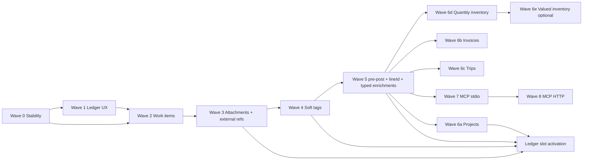

# Ledger Overview, Enrichments, and MCP Implementation Plan

> **For agentic workers:** REQUIRED SUB-SKILL: Use superpowers:subagent-driven-development (recommended) or superpowers:executing-plans to implement this plan task-by-task. Steps use checkbox (`- [ ]`) syntax for tracking.

**Goal:** Ship voucher-grouped ledger overview UX (Modes A/B), an append-only enrichment platform (work items → attachments/external refs → soft tags → lineId/typed enrichments → workflow verticals), and a first-party MCP adapter (stdio then Streamable HTTP) without violating ledger invariants.

**Architecture:** Contracts-first Zod v4 shapes drive domain planners in `packages/domain`, three-store parity (`MemoryLedgerStore`, `PostgresLedgerStore`, `UnavailableLedgerStore`), Hono API routes, `@jpx-accounting/api-client`, and web `/books` components under `apps/web/lib/ledger/` + `components/books/ledger-*`. Post-post mutations append enrichment events via work items or bounded human direct endpoints — never `applyReviewDecision`, never a second `PostedToLedger`. MCP is a thin protocol adapter over existing API routes; human confirmation stays UI-only.

**Tech Stack:** Node ≥24, pnpm 10.29.2, Next.js 16, React 19, Hono, Zod v4, postgres-js, `@modelcontextprotocol/sdk`, Playwright, PG 17 + pgvector (local via `pnpm db:*`).

## Global Constraints

- Append-only ledger events; never rewrite history or event payloads.
- Review queue is the **only** path to `PostedToLedger`; AI/MCP suggest, never mutate or approve.
- Post-post enrichments never call `applyReviewDecision` and never emit a second `PostedToLedger`.
- Store parity: every `LedgerStore` interface change lands atomically in Memory + Postgres + Unavailable (CONVENTIONS rule 6).
- Contracts first: schema → domain → stores → migration (only when a new table/column is required) → API → api-client → web.
- Fail closed in `normal` mode; demo is explicit and labeled.
- i18n parity: every `messages/en.json` key has an `sv.json` twin; at most ONE agent per batch touches `messages/*.json`.
- Seams: `@dnd-kit` only in `sortable-grid.tsx`; `ai`/`@ai-sdk` only under `components/advisor/*` and `services/api/src/advisor/*`; recharts only via reports charts barrel.
- Windows shell: prepend `$env:PATH = "$env:LOCALAPPDATA\corepack-shims;$env:PATH"` before every `pnpm` call; PowerShell uses `;` not `&&`.
- E2E uses `pnpm build:e2e` before every Playwright run (never plain `pnpm build`); use `installConsoleGuard` / `attachConsoleGuard` from `tests/e2e/console-guard.ts`.
- Unit/integration commands: `$env:PATH = "$env:LOCALAPPDATA\corepack-shims;$env:PATH"` then `pnpm exec tsx --test <file>` (never bare `tsx`).
- Visual baselines: review every diff image before `--update-snapshots` ([`scripts/visual-baselines.md`](../../scripts/visual-baselines.md)).
- `JournalEntryProjection.id` stays **required**; `lineId`, `vatCode`, `deductible` are additive from Wave 5 onward.
- MCP: proposal/read tools only; no base64 file transfer; SAS upload flow; no direct tag/external/confirm/approve/post tools.
- Wave 0 stability prerequisite must land/isolate **before** any Wave 1+ feature work.
- `pnpm check` runs typecheck across all workspace packages (11 today; **12 after Wave 7** adds `packages/mcp-server`).
- Spec companion path note: design spec §19 references `2026-08-09-ledger-overview-enrichments-mcp-plan.md`; **this file** is the authoritative plan at `docs/superpowers/plans/2026-08-09-ledger-overview-enrichments-mcp.md`.

---

## File / Responsibility Map

| Path                                                                 | Responsibility                                                                               | First wave                |
| -------------------------------------------------------------------- | -------------------------------------------------------------------------------------------- | ------------------------- |
| `packages/contracts/src/enrichment.ts` (new)                         | Work items, proposals (`noop` baseline), pre-post review intent, event payloads, list rows   | 2, 3, 4, 5, 6             |
| `packages/contracts/src/index.ts`                                    | Re-export enrichment module; extend `eventTypeSchema`; extend `journalEntryProjectionSchema` | 2, 3, 4, 5                |
| `packages/domain/src/store-planning.ts`                              | `planPostPostEnrichmentConfirm()`, `planPrePostEnrichment()` guards                          | 2+                        |
| `packages/domain/src/enrichment-projections.ts` (new)                | Replay external refs, tags, line enrichments from events                                     | 3, 4, 5                   |
| `packages/domain/src/list-projections.ts` (new)                      | Pure list builders + typed row schemas (framework Wave 5; vertical rows 6a–e)                | 5, 6                      |
| `packages/domain/src/projections.ts`                                 | Additive `lineId` on `LedgerLine` / `buildJournal`; legacy projection ids                    | 5                         |
| `packages/domain/src/store.ts`                                       | Extend `LedgerStore`; Memory impl for enrichment + vertical ops                              | 2+                        |
| `packages/persistence-postgres/src/store.ts`                         | Postgres parity for all new `LedgerStore` methods                                            | 2+                        |
| `services/api/src/runtime.ts`                                        | `UnavailableLedgerStore` stubs for new methods                                               | 2+                        |
| `services/api/src/routes/enrichment-work-items.ts` (new)             | Propose/confirm/reject work items                                                            | 2                         |
| `services/api/src/routes/voucher-external-references.ts` (new)       | Bounded human external ref link/unlink                                                       | 3                         |
| `services/api/src/routes/voucher-tags.ts` (new)                      | Bounded human tag append                                                                     | 4                         |
| `services/api/src/routes/mcp-http.ts` (new)                          | Streamable HTTP MCP mount helpers                                                            | 8                         |
| `services/api/src/app.ts`                                            | Wire route modules; retire demo `POST /mcp` in Wave 8                                        | 2–8                       |
| `packages/api-client/src/index.ts`                                   | Client methods for new API routes                                                            | 2+                        |
| `infra/supabase/migrations/0009_enrichment_work_items.sql` (new)     | Work-item persistence table                                                                  | 2 (after store interface) |
| `infra/supabase/migrations/0010_tag_registry.sql` (new)              | Tag dictionary table (table-backed lookup; required for Wave 4 registry)                     | 4                         |
| `infra/supabase/migrations/0011_review_enrichment_intents.sql` (new) | Open-review enrichment intent rows (JSONB proposals keyed by review)                         | 5 (after Wave 4)          |
| `services/api/src/routes/review-enrichment-intents.ts` (new)         | `POST`/`GET /api/reviews/:id/enrichment-intents`                                             | 5                         |
| `services/api/src/routes/review-proposals.ts` (new)                  | Open-review-only enrichment/review proposal API used later by MCP                            | 5                         |
| `apps/web/lib/ledger/group-vouchers.ts` (new)                        | Pure voucher grouping from journal + snapshot                                                | 1                         |
| `apps/web/lib/ledger/ledger-mode-storage.ts` (new)                   | `?ledgerMode=` + localStorage `jpx.accounting.ledgerMode.v1`                                 | 1                         |
| `apps/web/lib/ledger/ledger-voucher-view-model.ts` (new)             | Shared view-model for Mode A/B detail                                                        | 1                         |
| `apps/web/lib/local-data.ts`                                         | Register `ledgerMode` storage key                                                            | 1                         |
| `apps/web/components/books/ledger-voucher-detail.tsx` (new)          | Shared detail shell + disabled enrichment slots                                              | 1                         |
| `apps/web/components/books/ledger-voucher-overview.tsx` (new)        | Mode A ARIA disclosure rows                                                                  | 1                         |
| `apps/web/components/books/ledger-voucher-drawer.tsx` (new)          | Mode B sheet + `useDialogFocusTrap`                                                          | 1                         |
| `apps/web/components/books/enrichment-confirm-shell.tsx` (new)       | Human work-item confirmation UI                                                              | 2                         |
| `apps/web/components/books/journal-view.tsx`                         | Replace flat table with grouped overview                                                     | 1                         |
| `packages/mcp-server/` (new workspace)                               | stdio + HTTP adapters, tool registry                                                         | 7–8                       |
| `docs/MCP_SETUP.md` (new)                                            | Local MCP stdio/HTTP setup                                                                   | 7                         |
| `docs/REPO_MAP.md`                                                   | Route/event inventories for new surfaces                                                     | 2, 7, 8                   |

---

## Wave Dependency Map



**Branch/PR sequence (never one giant PR):**

| PR branch                          | Wave | Merge after                                         |
| ---------------------------------- | ---- | --------------------------------------------------- |
| `wave-0/stability-prerequisite`    | 0    | —                                                   |
| `wave-1/ledger-ux-modes-ab`        | 1    | Wave 0 on `main`                                    |
| `wave-2/enrichment-work-items`     | 2    | Wave 1                                              |
| `wave-3/attachments-external-refs` | 3    | Wave 2                                              |
| `wave-4/soft-tags`                 | 4    | Wave 3 (UI/i18n serialization; data-dep is Wave 2)  |
| `wave-5/lineid-typed-enrichments`  | 5    | Wave 4 (migrations 0009→0010→0011; UI after tags)   |
| `wave-6a/projects`                 | 6a   | Wave 5                                              |
| `wave-6b/invoices-payments`        | 6b   | Wave 6a (serial vertical merge order)               |
| `wave-6c/trips`                    | 6c   | Wave 6b                                             |
| `wave-6d/quantity-inventory`       | 6d   | Wave 6c                                             |
| `wave-6e/valued-inventory`         | 6e   | Wave 6d                                             |
| `wave-7/mcp-stdio`                 | 7    | Wave 5 (MCP package begins here; wraps Wave 5 APIs) |
| `wave-8/mcp-streamable-http`       | 8    | Wave 7                                              |

**Vertical PR story (consistent globally):** After Wave 5 lands, each vertical is a **separate PR from the same foundation**, merged **serially** in approved rollout order: projects → invoice/payment → trips → quantity inventory → valued inventory. Do not parallel-merge verticals that touch `messages/*.json` or `/books`.

**UI/i18n serialization:** Waves 3 → 4 → 5 → 6a → 6b → 6c → 6d → 6e run **sequentially** for `messages/*.json` and `/books` UI (one owner per wave).

---

## Shared Interface Registry

All later tasks consume/produce these exact names. **Wave 2 Task 2.1** defines the baseline; later waves **extend `enrichmentProposalSchema` union additively**. Unknown proposal kinds fail closed (`EnrichmentNotSupportedError`).

```ts
// packages/contracts/src/enrichment.ts

export type EnrichmentWorkItemStatus =
  | "pending_confirmation"
  | "confirmed"
  | "rejected"
  | "superseded";

export type EnrichmentTargetKind = "voucher" | "line";

/** Baseline arm `{ kind: "noop" }` ships Wave 2; Waves 3–6 add arms without removing prior arms. */
export type EnrichmentProposal =
  | { kind: "noop" }
  | { kind: "external_reference_link"; url: string; label?: string }
  | { kind: "external_reference_unlink"; refId: string }
  | { kind: "voucher_tags_add"; tagIds: string[] }
  | { kind: "voucher_tags_remove"; tagIds: string[] }
  | { kind: "project_assignment"; projectId: string; activityCode?: string; objectCode?: string }
  | { kind: "line_enrichment_record"; lineId: string; enrichmentType: string; payload: Record<string, unknown> }
  | { kind: "line_enrichment_supersede"; lineId: string; priorEnrichmentId: string; replacement: Record<string, unknown> };

export type EnrichmentWorkItem = {
  id: string;
  organizationId: string;
  workspaceId: string;
  targetKind: EnrichmentTargetKind;
  targetId: string;
  proposedChange: EnrichmentProposal;
  status: EnrichmentWorkItemStatus;
  source: "ui" | "mcp" | "advisor";
  idempotencyKey: string;
  createdAt: string;
  createdBy: string;
  confirmedAt?: string;
  confirmedBy?: string;
  resultingEventIds?: string[];
  supersededByWorkItemId?: string;
};

export type ProposeEnrichmentWorkItemInput = {
  targetKind: EnrichmentTargetKind;
  targetId: string;
  proposedChange: EnrichmentProposal;
  source: "ui" | "mcp" | "advisor";
  idempotencyKey: string;
};

/** Pre-post intent stored on open reviews until approve (Wave 5 §6.1). */
export type ReviewEnrichmentIntent = {
  reviewId: string;
  voucherId: string;
  proposals: EnrichmentProposal[];
  updatedAt: string;
  updatedBy: string;
};

export type AttachReviewEnrichmentIntentInput = {
  reviewId: string;
  proposals: EnrichmentProposal[];
};

export type ExternalReferenceProjection = {
  id: string;
  voucherId: string;
  url: string;
  label?: string;
  linkedAt: string;
  linkedBy: string;
  removed: boolean;
};

export type VoucherTagProjection = {
  voucherId: string;
  tagId: string;
  tagName: string;
  addedAt: string;
  removed: boolean;
};

export const MAX_TAGS_PER_REQUEST = 10 as const;
export const MAX_TAGS_PER_VOUCHER = 50 as const;

// packages/domain/src/store-planning.ts

export type PostPostEnrichmentConfirmPlan = {
  workItem: EnrichmentWorkItem;
  events: PlannedEvent[]; // MUST NOT include PostedToLedger
};

export type PrePostEnrichmentPlan = {
  companionEvents: PlannedEvent[]; // enrichment events only — PostedToLedger emitted separately
};

export function planPostPostEnrichmentConfirm(input: {
  workItem: EnrichmentWorkItem;
  actorId: string;
  postedVoucherIds: ReadonlySet<string>;
  postedLineIds: ReadonlySet<string>;
}): PostPostEnrichmentConfirmPlan;

export function planPrePostEnrichment(input: {
  review: ReviewTask;
  proposals: EnrichmentProposal[];
  postingLines: readonly LedgerLine[];
  actorId: string;
  organizationId: string;
  workspaceId: string;
}): PrePostEnrichmentPlan; // companionEvents never include PostedToLedger

/**
 * Project binding is deterministic and pre-post only. Eligible means the first
 * posting-order line whose account is neither VAT (26xx) nor settlement
 * (19xx cash/bank, 24xx supplier liability). Throws
 * `ProjectAssignmentLineNotFoundError` before any event append when no line is
 * eligible. `"pending"` and synthetic line ids are forbidden.
 */
export function bindProjectAssignmentToPrimaryCostLine(
  proposal: Extract<EnrichmentProposal, { kind: "project_assignment" }>,
  postingLines: readonly LedgerLine[],
): Extract<EnrichmentProposal, { kind: "line_enrichment_record" }>;

/**
 * Merge approved pre-post companion events into an existing ReviewDecisionPlan.
 * Preserves positional `planReviewDecision(review, voucher, action, input, now?)`.
 * Asserts plan.kind === "apply", exactly one PostedToLedger before/after merge,
 * and that companionEvents contain zero PostedToLedger. Replay/closed plans are
 * returned unchanged (no intent attach, no repost).
 */
export function mergePrePostEnrichmentsIntoReviewDecisionPlan(
  plan: ReviewDecisionPlan,
  companionEvents: PlannedEvent[],
): ReviewDecisionPlan;

export function planVoucherTagsAppend(input: {
  voucherId: string;
  tagIds: string[];
  mode: "add" | "remove";
  existingActiveTagCount: number;
}): { events: PlannedEvent[] };

// packages/domain/src/projections.ts (Wave 5) — ONE identity rule

export type LedgerLine = {
  voucherId: string;
  lineId?: string;
  accountNumber: string;
  accountName: string;
  description: string;
  debit: number;
  credit: number;
  vatCode: string;
  bookedAt: string;
  deductible: boolean;
};

/**
 * Identity rule (locked):
 * - `id` is ALWAYS required `journal_${n}` (1-based index) — never `legacy_*`.
 * - `lineId` = line.lineId when present on the posted/imported payload;
 *   else when `context.eventIdByLineIndex` has the index, projection-only
 *   `legacy_${eventId}_${index}`; else omit.
 * - Old event payloads are NEVER rewritten.
 */
export function buildJournal(
  lines: LedgerLine[],
  context?: { eventIdByLineIndex?: Map<number, string> },
): JournalEntryProjection[];

// packages/domain/src/list-projections.ts (Wave 5 framework)

export type ListProjectionRow = { id: string; kind: string; [key: string]: unknown };
export function buildListProjection(kind: string, events: LedgerEvent[]): ListProjectionRow[];

// packages/domain/src/store.ts — enrichment methods (Wave 2+; extend per vertical in Wave 6)

proposeEnrichmentWorkItem(input: ProposeEnrichmentWorkItemInput & ActorAttribution): Promise<EnrichmentWorkItem>;
getEnrichmentWorkItem(id: string): Promise<EnrichmentWorkItem | undefined>;
confirmEnrichmentWorkItem(id: string, input: ActorAttribution): Promise<EnrichmentWorkItem>;
rejectEnrichmentWorkItem(id: string, input: ActorAttribution): Promise<EnrichmentWorkItem>;
attachReviewEnrichmentIntent(input: AttachReviewEnrichmentIntentInput & ActorAttribution): Promise<ReviewEnrichmentIntent>;
getReviewEnrichmentIntent(reviewId: string): Promise<ReviewEnrichmentIntent | undefined>;
appendVoucherExternalReference(voucherId: string, input: { url: string; label?: string } & ActorAttribution): Promise<ExternalReferenceProjection>;
removeVoucherExternalReference(voucherId: string, refId: string, input: ActorAttribution): Promise<ExternalReferenceProjection>;
appendVoucherTags(voucherId: string, input: { tagIds: string[]; mode: "add" | "remove" } & ActorAttribution): Promise<VoucherTagProjection[]>;

// services/api/src/route-types.ts (Task 2.5) — shared by extracted route modules
export type ApiRouteEnv = {
  Variables: { requestId: string; jwtPayload?: Record<string, unknown> | undefined };
};
export type ApiRouteDeps = {
  getStore: () => LedgerStore;
  deriveActorId: (context: Context<ApiRouteEnv>) => string;
};

// Wave 5 API (Wave 7 MCP tools wrap these; MCP workspace starts in Wave 7)
// POST /api/reviews/:id/enrichment-intents  (jsonValidated(attachReviewEnrichmentIntentInputSchema))
// GET  /api/reviews/:id/enrichment-intents
// POST /api/review-proposals               (open-review guard; 409 when posted/closed)

// Wave 7 tool registry (packages/mcp-server) — first MCP package task:

export const MCP_TOOL_NAMES: readonly [
  "initialize_upload",
  "register_evidence",
  "compose_evidence_packet",
  "extract_evidence",
  "submit_enrichment_proposal",
  "submit_review_proposal",
  "get_review_deep_link",
  "get_evidence",
  "list_reviews",
  "get_journal",
  "get_trial_balance",
  "get_integrity",
  "query_knowledge",
] as const;
```

---

## Wave 0 — Stability Prerequisite

**Do not start Wave 1+ until this wave is merged to `main`.** The working tree currently carries the in-flight stability wave (45 modified files per 2026-08-09 status): domain store/planner hardening, API runtime/advisor, onboarding storage, E2E console guard, integration conformance, `pnpm-lock.yaml`, etc.

### Task 0.1: Isolate stability changes on dedicated branch

**Files:**

- Modify: all currently dirty stability files (see `git status` — excludes `.superpowers/` brainstorm artifacts and this spec/plan)
- Test: existing suites only

**Interfaces:** None (prerequisite hygiene).

- [ ] **Step 1: Create branch from current HEAD**

```powershell
cd C:\git\jpx-accounting
git checkout -b wave-0/stability-prerequisite
```

- [ ] **Step 2: Stage only stability-wave paths (exclude brainstorm artifacts)**

```powershell
git add AGENTS.md CLAUDE.md apps/web packages services/api tests package.json pnpm-lock.yaml scripts tsconfig.base.json docs/archive/superpowers/plans/phase-0-failure-catalog.md
git status
```

Expected: no `.superpowers/brainstorm/**` staged; `docs/superpowers/specs/2026-08-09-ledger-overview-enrichments-mcp-design.md` remains untracked until plan lands separately.

- [ ] **Step 3: Run merge gate**

```powershell
$env:PATH = "$env:LOCALAPPDATA\corepack-shims;$env:PATH"
pnpm check
```

Expected: PASS (lint, i18n, format, typecheck across 11 workspace packages, unit, build).

- [ ] **Step 4: Run non-visual E2E with console guard**

```powershell
$env:PATH = "$env:LOCALAPPDATA\corepack-shims;$env:PATH"
pnpm build:e2e
npx playwright test --grep-invert "visual:"
```

Expected: PASS; no unallowlisted `console.error` / `pageerror`.

- [ ] **Step 5: Commit**

```powershell
git commit -m "fix(stability): land prerequisite wave before ledger enrichments program"
```

### Task 0.2: Wave 0 review gate

**Files:** None (verification only).

- [ ] **Step 1: Run seam check**

```powershell
$env:PATH = "$env:LOCALAPPDATA\corepack-shims;$env:PATH"
pnpm check:seams
```

Expected: PASS (`@dnd-kit`, `ai`/`@ai-sdk`, recharts gates).

- [ ] **Step 2: Open PR `wave-0/stability-prerequisite` → `main`; apply `run-e2e` label; merge only when CI green**

Handoff: Wave 1 branch **`wave-1/ledger-ux-modes-ab` must fork from `main` after Wave 0 merge**, not from dirty pre-merge HEAD.

---

## Wave 1 — Ledger UX Modes A/B (existing data only)

Depends on Wave 0. UI-only over current journal/snapshot fields; honest disabled slots for Waves 2–6.

### Task 1.1: Pure voucher grouping helper

**Files:**

- Create: `apps/web/lib/ledger/group-vouchers.ts`
- Test: `tests/unit/group-vouchers.test.ts`

**Interfaces:**

- Consumes: `JournalEntryProjection[]` from `@jpx-accounting/contracts`
- Produces: `groupJournalByVoucher(entries: JournalEntryProjection[]): VoucherJournalGroup[]` where `VoucherJournalGroup = { voucherId: string; bookedAt: string; lines: JournalEntryProjection[]; totalDebit: number; totalCredit: number }`

- [ ] **Step 1: Write the failing test**

```ts
// tests/unit/group-vouchers.test.ts
import assert from "node:assert/strict";
import { test } from "node:test";
import { groupJournalByVoucher } from "../../apps/web/lib/ledger/group-vouchers.ts";

test("groupJournalByVoucher clusters lines by voucherId preserving line order", () => {
  const groups = groupJournalByVoucher([
    {
      id: "journal_1",
      voucherId: "v1",
      accountNumber: "1930",
      accountName: "Bank",
      description: "A",
      debit: 0,
      credit: 100,
      bookedAt: "2026-03-01T10:00:00.000Z",
    },
    {
      id: "journal_2",
      voucherId: "v1",
      accountNumber: "6110",
      accountName: "Office",
      description: "A",
      debit: 100,
      credit: 0,
      bookedAt: "2026-03-01T10:00:00.000Z",
    },
    {
      id: "journal_3",
      voucherId: "v2",
      accountNumber: "1930",
      accountName: "Bank",
      description: "B",
      debit: 0,
      credit: 50,
      bookedAt: "2026-03-02T10:00:00.000Z",
    },
  ]);
  assert.equal(groups.length, 2);
  assert.equal(groups[0]?.voucherId, "v1");
  assert.equal(groups[0]?.lines.length, 2);
  assert.equal(groups[0]?.totalDebit, 100);
  assert.equal(groups[0]?.totalCredit, 100);
});
```

- [ ] **Step 2: Run test to verify it fails**

```powershell
$env:PATH = "$env:LOCALAPPDATA\corepack-shims;$env:PATH"
pnpm exec tsx --test tests/unit/group-vouchers.test.ts
```

Expected: FAIL — cannot find module `group-vouchers.ts`.

- [ ] **Step 3: Minimal implementation**

```ts
// apps/web/lib/ledger/group-vouchers.ts
import type { JournalEntryProjection } from "@jpx-accounting/contracts";

export type VoucherJournalGroup = {
  voucherId: string;
  bookedAt: string;
  lines: JournalEntryProjection[];
  totalDebit: number;
  totalCredit: number;
};

export function groupJournalByVoucher(entries: JournalEntryProjection[]): VoucherJournalGroup[] {
  const map = new Map<string, VoucherJournalGroup>();
  for (const entry of entries) {
    const existing = map.get(entry.voucherId);
    if (existing) {
      existing.lines.push(entry);
      existing.totalDebit += entry.debit;
      existing.totalCredit += entry.credit;
    } else {
      map.set(entry.voucherId, {
        voucherId: entry.voucherId,
        bookedAt: entry.bookedAt,
        lines: [entry],
        totalDebit: entry.debit,
        totalCredit: entry.credit,
      });
    }
  }
  return [...map.values()].sort(
    (a, b) => a.bookedAt.localeCompare(b.bookedAt) || a.voucherId.localeCompare(b.voucherId),
  );
}
```

- [ ] **Step 4: Run test to verify it passes**

```powershell
$env:PATH = "$env:LOCALAPPDATA\corepack-shims;$env:PATH"
pnpm exec tsx --test tests/unit/group-vouchers.test.ts
```

Expected: PASS

- [ ] **Step 5: Commit**

```powershell
git add apps/web/lib/ledger/group-vouchers.ts tests/unit/group-vouchers.test.ts
git commit -m "feat(web): add pure voucher journal grouping helper"
```

### Task 1.2: Ledger mode preference (`?ledgerMode=` + localStorage + registry + i18n)

**Files:**

- Create: `apps/web/lib/ledger/ledger-mode-storage.ts`
- Modify: `apps/web/lib/local-data.ts`
- Modify: `apps/web/messages/en.json`, `apps/web/messages/sv.json`
- Test: `tests/unit/ledger-mode-storage.test.ts`, `tests/unit/local-data-registry.test.ts`

**Interfaces:**

- Produces: `LEDGER_MODE_STORAGE_KEY = "jpx.accounting.ledgerMode.v1"`, `LedgerMode = "inline" | "drawer"`, `loadLedgerMode()`, `saveLedgerMode(mode)`, `resolveLedgerMode(urlMode)` (URL wins, else stored, default `"inline"`)

- [ ] **Step 1: Write the failing test** (Node localStorage shim — same pattern as `tests/unit/onboarding-storage.test.ts`)

```ts
// tests/unit/ledger-mode-storage.test.ts
import assert from "node:assert/strict";
import { afterEach, describe, it } from "node:test";

import {
  LEDGER_MODE_STORAGE_KEY,
  loadLedgerMode,
  resolveLedgerMode,
  saveLedgerMode,
} from "../../apps/web/lib/ledger/ledger-mode-storage.ts";

type StorageShim = {
  getItem: (key: string) => string | null;
  setItem: (key: string, value: string) => void;
  removeItem: (key: string) => void;
  clear: () => void;
};

function installLocalStorage(): StorageShim {
  const map = new Map<string, string>();
  const localStorage: StorageShim = {
    getItem: (key) => map.get(key) ?? null,
    setItem: (key, value) => {
      map.set(key, String(value));
    },
    removeItem: (key) => {
      map.delete(key);
    },
    clear: () => {
      map.clear();
    },
  };
  (globalThis as { window?: unknown }).window = { localStorage };
  return localStorage;
}

afterEach(() => {
  delete (globalThis as { window?: unknown }).window;
});

describe("ledger-mode-storage", () => {
  it("resolveLedgerMode prefers URL over stored preference", () => {
    const store = installLocalStorage();
    saveLedgerMode("inline");
    assert.equal(store.getItem(LEDGER_MODE_STORAGE_KEY), "inline");
    assert.equal(resolveLedgerMode("drawer"), "drawer");
    assert.equal(loadLedgerMode(), "inline");
    assert.equal(
      (globalThis as { window: { localStorage: StorageShim } }).window.localStorage.getItem(LEDGER_MODE_STORAGE_KEY),
      "inline",
    );
  });

  it("resolveLedgerMode defaults to inline when unset", () => {
    const store = installLocalStorage();
    assert.equal(resolveLedgerMode(null), "inline");
    assert.equal(store.getItem(LEDGER_MODE_STORAGE_KEY), null);
    assert.equal(
      (globalThis as { window: { localStorage: StorageShim } }).window.localStorage.getItem(LEDGER_MODE_STORAGE_KEY),
      null,
    );
  });
});
```

- [ ] **Step 2: Run test to verify it fails**

```powershell
$env:PATH = "$env:LOCALAPPDATA\corepack-shims;$env:PATH"
pnpm exec tsx --test tests/unit/ledger-mode-storage.test.ts
```

Expected: FAIL — cannot find module `ledger-mode-storage.ts`.

- [ ] **Step 3: Implement storage module**

```ts
// apps/web/lib/ledger/ledger-mode-storage.ts
export const LEDGER_MODE_STORAGE_KEY = "jpx.accounting.ledgerMode.v1";
export type LedgerMode = "inline" | "drawer";
const DEFAULT_MODE: LedgerMode = "inline";

function storage(): Storage | undefined {
  return typeof window !== "undefined" ? window.localStorage : undefined;
}

export function loadLedgerMode(): LedgerMode {
  const raw = storage()?.getItem(LEDGER_MODE_STORAGE_KEY);
  return raw === "drawer" ? "drawer" : DEFAULT_MODE;
}

export function saveLedgerMode(mode: LedgerMode): LedgerMode {
  storage()?.setItem(LEDGER_MODE_STORAGE_KEY, mode);
  return mode;
}

export function resolveLedgerMode(urlMode: LedgerMode | null): LedgerMode {
  if (urlMode === "inline" || urlMode === "drawer") return urlMode;
  return loadLedgerMode();
}
```

- [ ] **Step 4: Register in `LOCAL_DATA_REGISTRY`**

```ts
{
  id: "ledgerMode",
  storage: "localStorage",
  key: "jpx.accounting.ledgerMode.v1",
  match: "exact",
  clearedOnSignOut: true,
  sources: ["apps/web/lib/ledger/ledger-mode-storage.ts"],
},
```

Update pinned fixture in `tests/unit/local-data-registry.test.ts`:

```ts
import { LEDGER_MODE_STORAGE_KEY } from "../../apps/web/lib/ledger/ledger-mode-storage.ts";

// in "registry keys match..." test:
assert.equal(entry("ledgerMode").key, LEDGER_MODE_STORAGE_KEY);

// in pinned list (insert after onboarding row):
"localStorage|jpx.accounting.ledgerMode.v1|exact|cleared",
```

Add i18n disclosure strings (local-data registry) **and** Wave 1 slot copy including `vatDeductibility` (slots render disabled in Task 1.4):

```json
// apps/web/messages/en.json
"settings": { "retention": { "localData": { "entries": {
  "ledgerMode": "Ledger journal overview mode preference (inline disclosure vs drawer)."
}}}},
"books": { "ledger": { "slots": {
  "workItemConfirm": "Work-item confirmation is not available yet.",
  "externalRefs": "External references are not available yet.",
  "tags": "Soft tags are not available yet.",
  "lineId": "Stable line IDs are not available yet.",
  "vatDeductibility": "VAT code and deductibility columns are not available yet.",
  "workflows": "Workflow badges are not available yet."
}}}

// apps/web/messages/sv.json — matching keys
"ledgerMode": "Läge för journalöversikt i Bokföring (inline vs låda).",
"vatDeductibility": "Momskod och avdragsrätt visas ännu inte."
```

- [ ] **Step 5: Run tests to verify they pass**

```powershell
$env:PATH = "$env:LOCALAPPDATA\corepack-shims;$env:PATH"
pnpm exec tsx --test tests/unit/ledger-mode-storage.test.ts tests/unit/local-data-registry.test.ts
```

Expected: PASS

- [ ] **Step 6: Commit**

```powershell
git add apps/web/lib/ledger/ledger-mode-storage.ts apps/web/lib/local-data.ts apps/web/messages/en.json apps/web/messages/sv.json tests/unit/ledger-mode-storage.test.ts tests/unit/local-data-registry.test.ts
git commit -m "feat(web): ledger mode preference with registry and i18n disclosure"
```

### Task 1.3: Shared voucher view-model (all evidenceIds, disabled slots)

**Files:**

- Create: `apps/web/lib/ledger/ledger-voucher-view-model.ts`
- Test: `tests/unit/ledger-voucher-view-model.test.ts`

**Interfaces:**

- Consumes: `VoucherJournalGroup`, `Pick<WorkspaceSnapshot,"vouchers"|"packets">`, `VoucherLookup` from `buildVoucherLookup`
- Produces: `buildLedgerVoucherViewModel(...) => LedgerVoucherViewModel`

- [ ] **Step 1: Write the failing test** (valid contract shapes; relative imports for `tests/tsconfig.json`)

```ts
// tests/unit/ledger-voucher-view-model.test.ts
import assert from "node:assert/strict";
import { test } from "node:test";

import type { EvidencePacket, Voucher, WorkspaceSnapshot } from "@jpx-accounting/contracts";
import { buildVoucherLookup } from "../../apps/web/components/reports/voucher-link.tsx";
import { buildLedgerVoucherViewModel } from "../../apps/web/lib/ledger/ledger-voucher-view-model.ts";

const voucher: Voucher = {
  id: "voucher_1",
  organizationId: "org_jpx",
  workspaceId: "workspace_main",
  evidencePacketId: "packet_1",
  voucherNumber: "A-1",
  status: "approved",
  accountingMethod: "invoice",
  extractedFields: [],
  voucherFields: { supplierName: "Acme AB", currency: "SEK" },
  createdAt: "2026-03-01T10:00:00.000Z",
  createdBy: "user:demo",
};

const packet: EvidencePacket = {
  id: "packet_1",
  evidenceIds: ["evidence_a", "evidence_b"],
};

const snapshot: Pick<WorkspaceSnapshot, "vouchers" | "packets"> = {
  vouchers: [voucher],
  packets: [packet],
};

test("view-model lists every evidenceIds entry on the packet", () => {
  const lookup = buildVoucherLookup(snapshot);
  const vm = buildLedgerVoucherViewModel(
    {
      voucherId: "voucher_1",
      bookedAt: "2026-03-01T10:00:00.000Z",
      lines: [],
      totalDebit: 0,
      totalCredit: 0,
    },
    snapshot,
    lookup,
  );
  assert.deepEqual(vm.evidenceIds, ["evidence_a", "evidence_b"]);
  assert.equal(vm.slots.lineId, "disabled");
});
```

- [ ] **Step 2: Run test to verify it fails**

```powershell
$env:PATH = "$env:LOCALAPPDATA\corepack-shims;$env:PATH"
pnpm exec tsx --test tests/unit/ledger-voucher-view-model.test.ts
```

Expected: FAIL — module not found.

- [ ] **Step 3: Minimal implementation** (relative imports inside web package; tests import via relative paths)

```ts
// apps/web/lib/ledger/ledger-voucher-view-model.ts
import type { WorkspaceSnapshot } from "@jpx-accounting/contracts";
import type { VoucherLookup } from "../../components/reports/voucher-link";
import type { VoucherJournalGroup } from "./group-vouchers";

export type LedgerSlotState = "disabled" | "active";
export type LedgerVoucherViewModel = {
  voucherId: string;
  voucherNumber: string;
  supplierName: string;
  bookedAt: string;
  lines: VoucherJournalGroup["lines"];
  evidenceIds: string[];
  provenanceSummary: string;
  slots: Record<
    "workItemConfirm" | "externalRefs" | "tags" | "lineId" | "vatDeductibility" | "workflows",
    LedgerSlotState
  >;
};

export function buildLedgerVoucherViewModel(
  group: VoucherJournalGroup,
  snapshot: Pick<WorkspaceSnapshot, "vouchers" | "packets"> | undefined,
  lookup: VoucherLookup,
): LedgerVoucherViewModel {
  const voucher = lookup.vouchersById.get(group.voucherId);
  const packet = voucher ? lookup.packetsById.get(voucher.evidencePacketId) : undefined;
  return {
    voucherId: group.voucherId,
    voucherNumber: voucher?.voucherNumber ?? group.voucherId,
    supplierName: voucher?.voucherFields.supplierName ?? "",
    bookedAt: group.bookedAt,
    lines: group.lines,
    evidenceIds: packet?.evidenceIds ?? [],
    provenanceSummary: "",
    slots: {
      workItemConfirm: "disabled",
      externalRefs: "disabled",
      tags: "disabled",
      lineId: "disabled",
      vatDeductibility: "disabled",
      workflows: "disabled",
    },
  };
}
```

- [ ] **Step 4: Run test to verify it passes**

```powershell
$env:PATH = "$env:LOCALAPPDATA\corepack-shims;$env:PATH"
pnpm exec tsx --test tests/unit/ledger-voucher-view-model.test.ts
```

Expected: PASS

- [ ] **Step 5: Commit**

```powershell
git add apps/web/lib/ledger/ledger-voucher-view-model.ts tests/unit/ledger-voucher-view-model.test.ts
git commit -m "feat(web): ledger voucher view-model with full evidenceIds list"
```

### Task 1.4: `LedgerVoucherDetail` shared component + disabled slots

**Files:**

- Create: `apps/web/components/books/ledger-voucher-detail.tsx`
- Modify: `apps/web/messages/en.json`, `apps/web/messages/sv.json`

**Interfaces:**

- Consumes: `LedgerVoucherViewModel`
- Produces: React component rendering lines table, evidence link list (`/capture/evidence/:id`), provenance, and `<UnavailableState>` / disabled sections for each slot with keys under `books.ledger.slots.*`

- [ ] **Step 1: Confirm i18n keys exist** from Task 1.2 — `books.ledger.slots.workItemConfirm|externalRefs|tags|lineId|vatDeductibility|workflows` in **both** `en.json` and `sv.json`. Run:

```powershell
$env:PATH = "$env:LOCALAPPDATA\corepack-shims;$env:PATH"
pnpm check:i18n
```

Expected: PASS.

- [ ] **Step 2: Implement component** with `data-testid="ledger-voucher-detail"` and per-slot `data-testid="ledger-slot-<name>-disabled"` using `UnavailableState` + slot copy. No `lineId` / VAT columns rendered yet (Wave 5 activates).

```tsx
export function LedgerVoucherDetail({ vm }: { vm: LedgerVoucherViewModel }) {
  return (
    <section data-testid="ledger-voucher-detail">
      <table>
        <thead>
          <tr>
            <th>{t("books.account")}</th>
            <th>{t("books.debit")}</th>
            <th>{t("books.credit")}</th>
          </tr>
        </thead>
        <tbody>
          {vm.lines.map((line) => (
            <tr key={line.id}>
              <td>
                {line.accountNumber} {line.accountName}
              </td>
              <td>{line.debit}</td>
              <td>{line.credit}</td>
            </tr>
          ))}
        </tbody>
      </table>
      <ul>
        {vm.evidenceIds.map((id) => (
          <li key={id}>
            <Link href={`/capture/evidence/${encodeURIComponent(id)}`}>{id}</Link>
          </li>
        ))}
      </ul>
      {(["workItemConfirm", "externalRefs", "tags", "lineId", "vatDeductibility", "workflows"] as const).map((slot) =>
        vm.slots[slot] === "disabled" ? (
          <UnavailableState
            key={slot}
            data-testid={`ledger-slot-${slot}-disabled`}
            title={t(`books.ledger.slots.${slot}.title`)}
            description={t(`books.ledger.slots.${slot}.description`)}
          />
        ) : null,
      )}
    </section>
  );
}
```

- [ ] **Step 3: Typecheck the web package**

```powershell
$env:PATH = "$env:LOCALAPPDATA\corepack-shims;$env:PATH"
pnpm --filter @jpx-accounting/web typecheck
```

Expected: PASS

- [ ] **Step 4: Commit**

```powershell
git add apps/web/components/books/ledger-voucher-detail.tsx apps/web/messages/en.json apps/web/messages/sv.json
git commit -m "feat(books): shared ledger voucher detail with honest disabled slots"
```

### Task 1.5: Mode A — inline ARIA disclosure overview

**Files:**

- Create: `apps/web/components/books/ledger-voucher-overview.tsx`
- Test: `tests/e2e/ledger-overview.spec.ts` (new)

**Interfaces:**

- Consumes: `LedgerVoucherViewModel[]`, `expandedVoucherId: string | null`, `onToggle(voucherId)`
- Produces: `<button aria-expanded>` + `aria-controls` disclosure rows per [WAI-ARIA disclosure pattern](https://www.w3.org/WAI/ARIA/apg/patterns/disclosure/)

- [ ] **Step 1: E2E failing test**

```ts
// tests/e2e/ledger-overview.spec.ts
import { expect, test } from "@playwright/test";
import { installConsoleGuard } from "./console-guard";
import { activateControl } from "./test-helpers";

test("journal Mode A expands voucher inline", async ({ page, isMobile }) => {
  const guard = await installConsoleGuard(page);
  await page.goto("/books?view=journal&ledgerMode=inline");
  const firstToggle = page.getByTestId("ledger-voucher-toggle").first();
  await activateControl(firstToggle, isMobile);
  await expect(page.getByTestId("ledger-voucher-detail")).toBeVisible();
  await expect(firstToggle).toHaveAttribute("aria-expanded", "true");
  guard.assertClean();
});
```

- [ ] **Step 2: Run E2E to verify it fails**

```powershell
$env:PATH = "$env:LOCALAPPDATA\corepack-shims;$env:PATH"
pnpm build:e2e
npx playwright test tests/e2e/ledger-overview.spec.ts --grep "Mode A"
```

Expected: FAIL — missing testids.

- [ ] **Step 3: Implement overview** using `<LedgerVoucherDetail>` in expanded panel; each row `data-testid="ledger-voucher-toggle"` with `aria-expanded` / `aria-controls`.

- [ ] **Step 4: Run E2E — PASS**

```powershell
$env:PATH = "$env:LOCALAPPDATA\corepack-shims;$env:PATH"
pnpm build:e2e
npx playwright test tests/e2e/ledger-overview.spec.ts --grep "Mode A"
```

Expected: PASS

- [ ] **Step 5: Commit**

```powershell
git add apps/web/components/books/ledger-voucher-overview.tsx tests/e2e/ledger-overview.spec.ts
git commit -m "feat(books): Mode A inline ledger voucher disclosure"
```

### Task 1.6: Mode B — drawer/sheet with focus trap

**Files:**

- Create: `apps/web/components/books/ledger-voucher-drawer.tsx`
- Uses: `useDialogFocusTrap` from `apps/web/lib/focus-trap.ts`

**Interfaces:**

- Consumes: `open: boolean`, `viewModel: LedgerVoucherViewModel | null`, `onClose()`
- Produces: fixed sheet respecting `.workspace-canvas` mobile bottom clearance

- [ ] **Step 1: E2E test Mode B + Escape closes**

```ts
test("journal Mode B opens drawer and Escape closes", async ({ page, isMobile }) => {
  const guard = await installConsoleGuard(page);
  await page.goto("/books?view=journal&ledgerMode=drawer");
  const firstToggle = page.getByTestId("ledger-voucher-toggle").first();
  await activateControl(firstToggle, isMobile);
  await expect(page.getByTestId("ledger-voucher-drawer")).toBeVisible();
  await page.keyboard.press("Escape");
  await expect(page.getByTestId("ledger-voucher-drawer")).toHaveCount(0);
  guard.assertClean();
});
```

- [ ] **Step 2: Run E2E to verify it fails**

```powershell
$env:PATH = "$env:LOCALAPPDATA\corepack-shims;$env:PATH"
pnpm build:e2e
npx playwright test tests/e2e/ledger-overview.spec.ts --grep "Mode B"
```

Expected: FAIL — drawer testid missing.

- [ ] **Step 3: Implement drawer** with `useDialogFocusTrap`; wire `?voucher=` deep link in `JournalView`

- [ ] **Step 4: Run E2E — PASS**

- [ ] **Step 5: Commit**

```powershell
git add apps/web/components/books/ledger-voucher-drawer.tsx apps/web/components/books/journal-view.tsx tests/e2e/ledger-overview.spec.ts
git commit -m "feat(books): Mode B ledger voucher drawer with focus trap"
```

### Task 1.7: Integrate grouped overview into `JournalView`

**Files:**

- Modify: `apps/web/components/books/journal-view.tsx` (nuqs: `ledgerMode`, `voucher`, `q`)
- Test: `tests/e2e/books-drilldown.spec.ts` (must stay green), `tests/e2e/ledger-overview.spec.ts`

**Interfaces:**

- Consumes: `groupJournalByVoucher`, `resolveLedgerMode`/`saveLedgerMode`, `buildLedgerVoucherViewModel`, Mode A/B components
- Produces: replaces flat `<Table>` body with mode switch; search `q` filters groups by description/supplier/voucher number

- [ ] **Step 1: Write failing integration assertion in E2E** — with `?q=` matching one voucher, only that group’s toggle is visible; `?supplier=` chip behavior from `books-drilldown.spec.ts` unchanged.

- [ ] **Step 2: Run — FAIL then implement**

```powershell
$env:PATH = "$env:LOCALAPPDATA\corepack-shims;$env:PATH"
pnpm build:e2e
npx playwright test tests/e2e/ledger-overview.spec.ts tests/e2e/books-drilldown.spec.ts
```

Expected initially: FAIL on new `q` assertion; after wiring Mode A/B + filters: PASS. No feature flag — existing snapshot data only.

- [ ] **Step 3: Persist mode** — URL `ledgerMode` wins; on change call `saveLedgerMode` and write nuqs.

- [ ] **Step 4: Run — PASS** (same Playwright command). Expected: PASS

- [ ] **Step 5: Commit**

```powershell
git add apps/web/components/books/journal-view.tsx tests/e2e/ledger-overview.spec.ts
git commit -m "feat(books): voucher-grouped journal overview with mode switch"
```

### Task 1.8: Wave 1 visual regression + docs

**Files:**

- Modify: `tests/e2e/visual-regression.spec.ts` (add `/books?view=journal&ledgerMode=inline` shot if not covered)
- Modify: `docs/REPO_MAP.md` (ledger mode URL params)

- [ ] **Step 1: Run visual suite**

```powershell
$env:PATH = "$env:LOCALAPPDATA\corepack-shims;$env:PATH"
pnpm build:e2e
npx playwright test tests/e2e/visual-regression.spec.ts --grep books
```

Expected: FAIL or intentional diffs vs baselines after UI change.

- [ ] **Step 2: Human-review every diff** per `scripts/visual-baselines.md`; re-baseline **only** after review (never blind `--update-snapshots`).

- [ ] **Step 3: Re-run visual suite to verify** — Expected: PASS

- [ ] **Step 4: Update REPO_MAP** with `?ledgerMode=`, `?voucher=`, `?q=`

- [ ] **Step 5: Commit**

```powershell
git add tests/e2e/visual-regression.spec.ts docs/REPO_MAP.md tests/e2e/*-snapshots* 2>$null; git add -u
git commit -m "docs(books): document ledger overview modes and refresh books visuals"
```

### Task 1.9: Wave 1 review gate

- [ ] **Step 1:** `$env:PATH = "$env:LOCALAPPDATA\corepack-shims;$env:PATH"; pnpm check`
- [ ] **Step 2:** `$env:PATH = "$env:LOCALAPPDATA\corepack-shims;$env:PATH"; pnpm build:e2e; npx playwright test tests/e2e/ledger-overview.spec.ts tests/e2e/books-drilldown.spec.ts`
- [ ] **Step 3:** `$env:PATH = "$env:LOCALAPPDATA\corepack-shims;$env:PATH"; pnpm check:seams`
- [ ] **Step 4:** `$env:PATH = "$env:LOCALAPPDATA\corepack-shims;$env:PATH"; pnpm check:i18n`
- [ ] **Step 5:** PR `wave-1/ledger-ux-modes-ab` → `main` with `run-e2e` label

---

## Wave 2 — Post-Post Enrichment Work-Item Foundation

Depends on Wave 0 + Wave 1. Establishes contracts, planner guards, 3-store parity, API, confirmation UI shell. **No enrichment event types beyond noop/placeholder until Waves 3–5 extend planner.**

### Task 2.1: Contracts — enrichment work item schemas

**Files:**

- Create: `packages/contracts/src/enrichment.ts`
- Modify: `packages/contracts/src/index.ts`
- Test: `tests/unit/enrichment-contracts.test.ts`

**Interfaces:** Shared Interface Registry types (`EnrichmentWorkItem`, `ProposeEnrichmentWorkItemInput`, Zod schemas)

- [ ] **Step 1: Write the failing test**

```ts
// tests/unit/enrichment-contracts.test.ts
import assert from "node:assert/strict";
import { test } from "node:test";
import { enrichmentWorkItemSchema, proposeEnrichmentWorkItemInputSchema } from "@jpx-accounting/contracts";

test("enrichmentWorkItemSchema parses pending voucher proposal", () => {
  const parsed = enrichmentWorkItemSchema.parse({
    id: "ewi_1",
    organizationId: "org_jpx",
    workspaceId: "workspace_main",
    targetKind: "voucher",
    targetId: "voucher_1",
    proposedChange: { kind: "noop" },
    status: "pending_confirmation",
    source: "mcp",
    idempotencyKey: "mcp:prop:1",
    createdAt: "2026-08-09T10:00:00.000Z",
    createdBy: "user:abc",
  });
  assert.equal(parsed.status, "pending_confirmation");
});

test("proposeEnrichmentWorkItemInputSchema strips client actorId if present", () => {
  const parsed = proposeEnrichmentWorkItemInputSchema.parse({
    targetKind: "voucher",
    targetId: "voucher_1",
    proposedChange: { kind: "noop" },
    source: "ui",
    idempotencyKey: "ui:1",
    actorId: "user:forged-client",
  });
  assert.equal(parsed.source, "ui");
  assert.equal(Object.hasOwn(parsed, "actorId"), false);
  assert.equal((parsed as { actorId?: string }).actorId, undefined);
});
```

- [ ] **Step 2: Run test to verify it fails**

```powershell
$env:PATH = "$env:LOCALAPPDATA\corepack-shims;$env:PATH"
pnpm exec tsx --test tests/unit/enrichment-contracts.test.ts
```

Expected: FAIL — `enrichmentWorkItemSchema` not exported.

- [ ] **Step 3: Implement Zod schemas in `enrichment.ts`** including `enrichmentProposalSchema` with `{ kind: "noop" }` baseline union arm for Wave 2; re-export from `index.ts`. Request schemas MUST omit `actorId` so Zod unknown-key stripping drops client-supplied attribution (same pattern as `evidenceCreateInputSchema` / `reviewDecisionInputSchema`):

```ts
// packages/contracts/src/enrichment.ts
export const enrichmentProposalSchema = z.discriminatedUnion("kind", [z.object({ kind: z.literal("noop") })]);
export const proposeEnrichmentWorkItemInputSchema = z.object({
  targetKind: z.enum(["voucher", "line"]),
  targetId: z.string().min(1),
  proposedChange: enrichmentProposalSchema,
  source: z.enum(["ui", "mcp", "advisor"]),
  idempotencyKey: z.string().min(1),
  // NO actorId — client key must not survive parse()
});
```

- [ ] **Step 4: Run test to verify it passes**

```powershell
$env:PATH = "$env:LOCALAPPDATA\corepack-shims;$env:PATH"
pnpm exec tsx --test tests/unit/enrichment-contracts.test.ts
```

Expected: PASS

- [ ] **Step 5: Commit**

```powershell
git add packages/contracts/src/enrichment.ts packages/contracts/src/index.ts tests/unit/enrichment-contracts.test.ts
git commit -m "feat(contracts): add enrichment work item schemas"
```

### Task 2.2: Domain planner `planPostPostEnrichmentConfirm` (noop baseline)

**Files:**

- Modify: `packages/domain/src/store-planning.ts`
- Modify: `packages/domain/src/index.ts` (export errors)
- Test: `tests/unit/enrichment-planning.test.ts`

**Interfaces:** `planPostPostEnrichmentConfirm`, `EnrichmentTargetNotPostedError`, `EnrichmentNotSupportedError`

- [ ] **Step 1: Write the failing test**

```ts
// tests/unit/enrichment-planning.test.ts
import assert from "node:assert/strict";
import { test } from "node:test";
import {
  EnrichmentNotSupportedError,
  EnrichmentTargetNotPostedError,
  planPostPostEnrichmentConfirm,
} from "@jpx-accounting/domain";

const baseWorkItem = {
  id: "ewi_1",
  organizationId: "org_jpx",
  workspaceId: "workspace_main",
  targetKind: "voucher" as const,
  targetId: "voucher_posted",
  proposedChange: { kind: "noop" as const },
  status: "pending_confirmation" as const,
  source: "ui" as const,
  idempotencyKey: "k1",
  createdAt: "2026-08-09T10:00:00.000Z",
  createdBy: "user:abc",
};

test("planPostPostEnrichmentConfirm rejects unposted voucher targets", () => {
  assert.throws(
    () =>
      planPostPostEnrichmentConfirm({
        workItem: { ...baseWorkItem, targetId: "voucher_missing" },
        actorId: "user:abc",
        postedVoucherIds: new Set(["voucher_posted"]),
        postedLineIds: new Set(),
      }),
    EnrichmentTargetNotPostedError,
  );
});

test("planPostPostEnrichmentConfirm never emits PostedToLedger for noop", () => {
  const plan = planPostPostEnrichmentConfirm({
    workItem: baseWorkItem,
    actorId: "user:abc",
    postedVoucherIds: new Set(["voucher_posted"]),
    postedLineIds: new Set(),
  });
  assert.ok(plan.events.every((event) => event.eventType !== "PostedToLedger"));
  assert.equal(plan.events.length, 0);
});

test("unknown proposal kinds fail closed at runtime", () => {
  // Wave 2 union is noop-only; planner must fail closed when a future/unknown
  // kind reaches confirm (e.g. stale row). Cast through EnrichmentWorkItem —
  // never `as never`.
  const staleKindWorkItem = {
    ...baseWorkItem,
    proposedChange: { kind: "external_reference_link", url: "https://example.com" },
  } as EnrichmentWorkItem;
  assert.throws(
    () =>
      planPostPostEnrichmentConfirm({
        workItem: staleKindWorkItem,
        actorId: "user:abc",
        postedVoucherIds: new Set(["voucher_posted"]),
        postedLineIds: new Set(),
      }),
    EnrichmentNotSupportedError,
  );
});
```

- [ ] **Step 2: Run test to verify it fails**

```powershell
$env:PATH = "$env:LOCALAPPDATA\corepack-shims;$env:PATH"
pnpm exec tsx --test tests/unit/enrichment-planning.test.ts
```

Expected: FAIL — `planPostPostEnrichmentConfirm` not exported.

- [ ] **Step 3: Implement planner** — Wave 2 handles `{ kind: "noop" }` only; all other kinds throw `EnrichmentNotSupportedError`:

```ts
// packages/domain/src/store-planning.ts
export function planPostPostEnrichmentConfirm(input: {
  workItem: EnrichmentWorkItem;
  actorId: string;
  postedVoucherIds: ReadonlySet<string>;
  postedLineIds: ReadonlySet<string>;
}): PostPostEnrichmentConfirmPlan {
  const { workItem } = input;
  if (workItem.targetKind === "voucher" && !input.postedVoucherIds.has(workItem.targetId)) {
    throw new EnrichmentTargetNotPostedError(workItem.targetId);
  }
  if (workItem.proposedChange.kind !== "noop") {
    throw new EnrichmentNotSupportedError(workItem.proposedChange.kind);
  }
  return { workItem, events: [] }; // noop confirm appends zero ledger events
}
```

- [ ] **Step 4: Run test to verify it passes**

```powershell
$env:PATH = "$env:LOCALAPPDATA\corepack-shims;$env:PATH"
pnpm exec tsx --test tests/unit/enrichment-planning.test.ts
```

Expected: PASS

- [ ] **Step 5: Commit**

```powershell
git add packages/domain/src/store-planning.ts packages/domain/src/index.ts tests/unit/enrichment-planning.test.ts
git commit -m "feat(domain): post-post enrichment confirm planner with guards"
```

### Task 2.3: Extend `LedgerStore` + Memory + Postgres + Unavailable (**single atomic commit**)

**Chosen path (no unresolved fork):** One atomic store-parity commit updates the `LedgerStore` interface, `MemoryLedgerStore`, `PostgresLedgerStore`, and `UnavailableLedgerStore` together. Unit tests in this task use **Memory only**. Postgres SQL targets `ledger.enrichment_work_items` (created in Task 2.4); do **not** invent an in-memory Postgres feature flag. Same PR sequencing: commit Task 2.3 → commit Task 2.4 migration → run `pnpm db:test` in Task 2.7 before merge. Typecheck must pass after Task 2.3 (Postgres methods compile against SQL that lands next commit).

**Files:**

- Modify: `packages/domain/src/store.ts` (interface + Memory)
- Modify: `packages/persistence-postgres/src/store.ts`
- Modify: `services/api/src/runtime.ts` (`UnavailableLedgerStore`)
- Test: `tests/unit/enrichment-work-item-store.test.ts`

**Interfaces:** `proposeEnrichmentWorkItem`, `getEnrichmentWorkItem`, `confirmEnrichmentWorkItem`, `rejectEnrichmentWorkItem`

- [ ] **Step 1: Write failing unit test** (Memory path; fixture matches `createEvidence` + `applyReviewDecision` shapes used in `tests/unit/reject-review-proposal.test.ts`)

```ts
// tests/unit/enrichment-work-item-store.test.ts
import assert from "node:assert/strict";
import { test } from "node:test";
import { MemoryLedgerStore } from "@jpx-accounting/domain/store";

test("confirmEnrichmentWorkItem is idempotent for noop and never adds a second PostedToLedger", async () => {
  const store = new MemoryLedgerStore();
  const created = await store.createEvidence({
    actorId: "user:test",
    title: "Invoice",
    originalFilename: "inv.pdf",
    mimeType: "application/pdf",
    modalities: ["upload"],
    extractedText: "Invoice body",
  });
  await store.applyReviewDecision(created.review.id, "approve", { actorId: "user:test" });
  const before = (await store.getEvents()).filter((e) => e.eventType === "PostedToLedger").length;
  assert.equal(before, 1);
  const proposed = await store.proposeEnrichmentWorkItem({
    actorId: "user:test",
    targetKind: "voucher",
    targetId: created.voucher.id,
    proposedChange: { kind: "noop" },
    source: "ui",
    idempotencyKey: "ui:noop:1",
  });
  const first = await store.confirmEnrichmentWorkItem(proposed.id, { actorId: "user:test" });
  const second = await store.confirmEnrichmentWorkItem(proposed.id, { actorId: "user:test" });
  assert.deepEqual(second.resultingEventIds, first.resultingEventIds);
  const after = (await store.getEvents()).filter((e) => e.eventType === "PostedToLedger").length;
  assert.equal(after, 1);
});
```

- [ ] **Step 2: Run — FAIL**

```powershell
$env:PATH = "$env:LOCALAPPDATA\corepack-shims;$env:PATH"
pnpm exec tsx --test tests/unit/enrichment-work-item-store.test.ts
```

Expected: FAIL — `proposeEnrichmentWorkItem` missing on `LedgerStore`.

- [ ] **Step 3: Implement interface + Memory + Postgres + Unavailable in one commit**

```ts
// packages/domain/src/store.ts — add to LedgerStore interface
proposeEnrichmentWorkItem(input: ProposeEnrichmentWorkItemInput & ActorAttribution): Promise<EnrichmentWorkItem>;
getEnrichmentWorkItem(id: string): Promise<EnrichmentWorkItem | undefined>;
confirmEnrichmentWorkItem(id: string, input: ActorAttribution): Promise<EnrichmentWorkItem>;
rejectEnrichmentWorkItem(id: string, input: ActorAttribution): Promise<EnrichmentWorkItem>;

// Memory: private Map<string, EnrichmentWorkItem>; confirm calls planPostPostEnrichmentConfirm
// Postgres: INSERT/SELECT ledger.enrichment_work_items (table from Task 2.4) inside sql.begin + lockWorkspaceTail
// UnavailableLedgerStore: each new method calls this.fail()
```

- [ ] **Step 4: Run — PASS**

```powershell
$env:PATH = "$env:LOCALAPPDATA\corepack-shims;$env:PATH"
pnpm exec tsx --test tests/unit/enrichment-work-item-store.test.ts
pnpm --filter @jpx-accounting/domain typecheck
pnpm --filter @jpx-accounting/persistence-postgres typecheck
pnpm --filter @jpx-accounting/api typecheck
```

Expected: PASS (all three stores compile).

- [ ] **Step 5: Commit**

```powershell
git add packages/domain/src/store.ts packages/persistence-postgres/src/store.ts services/api/src/runtime.ts tests/unit/enrichment-work-item-store.test.ts
git commit -m "feat(store): enrichment work item methods with 3-store parity"
```

### Task 2.4: Migration `0009_enrichment_work_items.sql`

**Files:**

- Create: `infra/supabase/migrations/0009_enrichment_work_items.sql`

- [ ] **Step 1: Write idempotent migration**

```sql
-- infra/supabase/migrations/0009_enrichment_work_items.sql
create table if not exists ledger.enrichment_work_items (
  id text primary key,
  organization_id text not null,
  workspace_id text not null,
  target_kind text not null,
  target_id text not null,
  proposed_change jsonb not null,
  status text not null,
  source text not null,
  idempotency_key text not null,
  created_at timestamptz not null,
  created_by text not null,
  confirmed_at timestamptz,
  confirmed_by text,
  resulting_event_ids jsonb,
  superseded_by_work_item_id text,
  unique (organization_id, workspace_id, idempotency_key)
);
do $$ begin
  alter table ledger.enrichment_work_items
    add constraint enrichment_work_items_status_check
    check (status in ('pending_confirmation','confirmed','rejected','superseded'));
exception when duplicate_object then null; end $$;
```

- [ ] **Step 2: Apply migration**

```powershell
$env:PATH = "$env:LOCALAPPDATA\corepack-shims;$env:PATH"
pnpm db:up
pnpm db:migrate
```

Expected: migrate applies `0009` without error.

- [ ] **Step 3: Commit**

```powershell
git add infra/supabase/migrations/0009_enrichment_work_items.sql
git commit -m "feat(db): add enrichment_work_items table"
```

### Task 2.5: API routes `services/api/src/routes/enrichment-work-items.ts`

**Files:**

- Create: `services/api/src/route-types.ts`
- Create: `services/api/src/routes/enrichment-work-items.ts`
- Modify: `services/api/src/app.ts`
- Test: `tests/unit/enrichment-work-items-route.test.ts`

**Interfaces:**

- `POST /api/enrichment-work-items` → propose (`jsonValidated(proposeEnrichmentWorkItemInputSchema)`; derive actor from JWT)
- `GET /api/enrichment-work-items/:id`
- `POST /api/enrichment-work-items/:id/confirm`
- `POST /api/enrichment-work-items/:id/reject`

- [ ] **Step 1: Write failing route test**

```ts
// tests/unit/enrichment-work-items-route.test.ts
import assert from "node:assert/strict";
import { test } from "node:test";
import { MemoryLedgerStore } from "@jpx-accounting/domain/store";
import { createApp } from "../../services/api/src/app";
import { createApiRuntimeDependencies } from "../../services/api/src/runtime";

function createTestApp(store: MemoryLedgerStore) {
  const dependencies = createApiRuntimeDependencies({
    port: 0,
    runtimeMode: "demo",
    allowTestReset: false,
    corsPolicy: { kind: "wildcard" },
    azureOpenAi: {},
    database: { poolMode: "direct", poolMax: 10 },
    azureStorage: {},
    azureDocumentIntelligence: {},
    auth: {},
    advisor: {
      toolApprovalSecret: "test-advisor-approval-secret",
      maxOutputTokens: 2048,
      streamTimeoutMs: 90_000,
    },
  });
  return createApp({ ...dependencies, store, allowTestReset: false });
}

test("POST /api/enrichment-work-items rejects unposted voucher with 409", async () => {
  const store = new MemoryLedgerStore();
  const created = await store.createEvidence({
    actorId: "user:test",
    title: "Open review",
    originalFilename: "open.pdf",
    mimeType: "application/pdf",
    modalities: ["upload"],
  });
  const response = await createTestApp(store).request("http://localhost/api/enrichment-work-items", {
    method: "POST",
    headers: { "content-type": "application/json", "x-request-id": "ewi-unposted" },
    body: JSON.stringify({
      targetKind: "voucher",
      targetId: created.voucher.id,
      proposedChange: { kind: "noop" },
      source: "ui",
      idempotencyKey: "route-test:unposted",
      actorId: "spoofed-client",
    }),
  });
  assert.equal(response.status, 409);
  const body = (await response.json()) as { code: string; error: string; requestId: string };
  assert.equal(body.code, "enrichment_target_not_posted");
  assert.match(body.error, /posted/i);
  assert.equal(body.requestId, "ewi-unposted");
});

test("propose, GET, confirm, and idempotent confirm use the demo actor", async () => {
  const store = new MemoryLedgerStore();
  const created = await store.createEvidence({
    actorId: "user:test",
    title: "Posted voucher",
    originalFilename: "posted.pdf",
    mimeType: "application/pdf",
    modalities: ["upload"],
  });
  await store.applyReviewDecision(created.review.id, "approve", { actorId: "user:test" });
  const app = createTestApp(store);
  const proposed = await app.request("http://localhost/api/enrichment-work-items", {
    method: "POST",
    headers: { "content-type": "application/json" },
    body: JSON.stringify({
      targetKind: "voucher",
      targetId: created.voucher.id,
      proposedChange: { kind: "noop" },
      source: "ui",
      idempotencyKey: "route-test:posted",
      actorId: "spoofed-client",
    }),
  });
  assert.equal(proposed.status, 201);
  const item = (await proposed.json()) as { id: string; createdBy: string; status: string };
  assert.equal(item.createdBy, "user_founder");
  assert.equal(item.status, "pending_confirmation");

  const fetched = await app.request(`http://localhost/api/enrichment-work-items/${item.id}`);
  assert.equal(fetched.status, 200);
  assert.equal(((await fetched.json()) as { id: string }).id, item.id);

  const confirmed = await app.request(`http://localhost/api/enrichment-work-items/${item.id}/confirm`, {
    method: "POST",
  });
  assert.equal(confirmed.status, 200);
  const confirmedBody = (await confirmed.json()) as { status: string; resultingEventIds: string[] };
  assert.equal(confirmedBody.status, "confirmed");
  assert.deepEqual(confirmedBody.resultingEventIds, []);

  const replay = await app.request(`http://localhost/api/enrichment-work-items/${item.id}/confirm`, {
    method: "POST",
  });
  assert.equal(replay.status, 200);
  assert.deepEqual((await replay.json()) as unknown, confirmedBody);
});
```

- [ ] **Step 2: Run — FAIL**

```powershell
$env:PATH = "$env:LOCALAPPDATA\corepack-shims;$env:PATH"
pnpm exec tsx --test tests/unit/enrichment-work-items-route.test.ts
```

Expected: FAIL — route module/registration is missing.

- [ ] **Step 3: Implement routes** with `jsonValidated`, server-derived actor, wire in `app.ts` under `/api/*` auth + rate-limit stack:

```ts
// services/api/src/routes/enrichment-work-items.ts
export function registerEnrichmentWorkItemRoutes(app: Hono<ApiRouteEnv>, deps: ApiRouteDeps) {
  app.post("/api/enrichment-work-items", jsonValidated(proposeEnrichmentWorkItemInputSchema), async (c) => {
    const body = c.req.valid("json");
    const item = await deps.getStore().proposeEnrichmentWorkItem({
      ...body,
      actorId: deps.deriveActorId(c),
    });
    return c.json(item, 201);
  });
  app.get("/api/enrichment-work-items/:id", async (c) => {
    const item = await deps.getStore().getEnrichmentWorkItem(c.req.param("id"));
    if (!item) throw new HTTPException(404, { message: "Enrichment work item not found" });
    return c.json(item);
  });
  app.post("/api/enrichment-work-items/:id/confirm", async (c) =>
    c.json(await deps.getStore().confirmEnrichmentWorkItem(c.req.param("id"), { actorId: deps.deriveActorId(c) })),
  );
  app.post("/api/enrichment-work-items/:id/reject", async (c) =>
    c.json(await deps.getStore().rejectEnrichmentWorkItem(c.req.param("id"), { actorId: deps.deriveActorId(c) })),
  );
}
```

Add dedicated `app.onError` mappings: `EnrichmentTargetNotPostedError` → `409` with
`code: "enrichment_target_not_posted"`; `EnrichmentWorkItemNotFoundError` → `404`
with `code: "enrichment_work_item_not_found"`; invalid state → `409` with
`code: "enrichment_work_item_conflict"`. Use the existing `jsonError(...)` helper
so `error`, `runtimeMode`, `requestId`, and `x-request-id` stay contract-consistent.

- [ ] **Step 4: Run — PASS**

```powershell
$env:PATH = "$env:LOCALAPPDATA\corepack-shims;$env:PATH"
pnpm exec tsx --test tests/unit/enrichment-work-items-route.test.ts
```

Expected: PASS

- [ ] **Step 5: Commit**

```powershell
git add services/api/src/route-types.ts services/api/src/routes/enrichment-work-items.ts services/api/src/app.ts tests/unit/enrichment-work-items-route.test.ts
git commit -m "feat(api): enrichment work item propose/confirm/reject routes"
```

### Task 2.6: api-client methods

**Files:**

- Modify: `packages/api-client/src/index.ts`
- Test: `tests/unit/api-client-enrichment.test.ts`

**Interfaces:**

- Produces: `apiClient.proposeEnrichmentWorkItem(input)`, `getEnrichmentWorkItem(id)`, `confirmEnrichmentWorkItem(id)`, `rejectEnrichmentWorkItem(id)`

- [ ] **Step 1: Write failing test**

```ts
import assert from "node:assert/strict";
import { test } from "node:test";
import { createApiClient } from "@jpx-accounting/api-client";

test("proposeEnrichmentWorkItem posts to /api/enrichment-work-items", async () => {
  const calls: { path: string; body: unknown }[] = [];
  const client = createApiClient({
    baseUrl: "http://example.test",
    fetch: async (input, init) => {
      calls.push({ path: String(input), body: init?.body ? JSON.parse(String(init.body)) : undefined });
      return new Response(JSON.stringify({ id: "ewi_1", status: "pending_confirmation" }), { status: 201 });
    },
  } as ConstructorParameters<typeof createApiClient>[0]);
  await client.proposeEnrichmentWorkItem({
    targetKind: "voucher",
    targetId: "v1",
    proposedChange: { kind: "noop" },
    source: "ui",
    idempotencyKey: "ui:1",
  });
  assert.match(calls[0]?.path ?? "", /\/api\/enrichment-work-items$/);
});
```

- [ ] **Step 2: Run — FAIL**

```powershell
$env:PATH = "$env:LOCALAPPDATA\corepack-shims;$env:PATH"
pnpm exec tsx --test tests/unit/api-client-enrichment.test.ts
```

Expected: FAIL — method missing.

- [ ] **Step 3: Add client methods** mirroring other POST helpers in `packages/api-client/src/index.ts`.

- [ ] **Step 4: Run — PASS**

```powershell
$env:PATH = "$env:LOCALAPPDATA\corepack-shims;$env:PATH"
pnpm exec tsx --test tests/unit/api-client-enrichment.test.ts
```

Expected: PASS

- [ ] **Step 5: Commit**

```powershell
git add packages/api-client/src/index.ts tests/unit/api-client-enrichment.test.ts
git commit -m "feat(api-client): enrichment work item client methods"
```

### Task 2.7: Integration conformance scenario

**Files:**

- Modify: `tests/integration/helpers/ledger-store-conformance.ts`
- Modify: `tests/integration/ledger-store-conformance.test.ts`

- [ ] **Step 1: Write failing conformance scenario**

```ts
export async function scenarioEnrichmentWorkItemConfirmNeverPosts(h: ConformanceHarness) {
  const created = await h.store.createEvidence({
    actorId: h.actorId,
    title: "Enrichment",
    originalFilename: "e.pdf",
    mimeType: "application/pdf",
    modalities: ["upload"],
  });
  await h.store.applyReviewDecision(created.review.id, "approve", { actorId: h.actorId });
  const item = await h.store.proposeEnrichmentWorkItem({
    actorId: h.actorId,
    targetKind: "voucher",
    targetId: created.voucher.id,
    proposedChange: { kind: "noop" },
    source: "ui",
    idempotencyKey: `ui:noop:${created.voucher.id}`,
  });
  await h.store.confirmEnrichmentWorkItem(item.id, { actorId: h.actorId });
  const posted = (await h.store.getEvents()).filter((e) => e.eventType === "PostedToLedger");
  assert.equal(posted.length, 1);
}
```

- [ ] **Step 2: Run — FAIL then implement wiring in conformance runner**

```powershell
$env:PATH = "$env:LOCALAPPDATA\corepack-shims;$env:PATH"
pnpm db:test
```

Expected initially: FAIL (scenario not wired). After wiring: PASS for Memory + Postgres.

- [ ] **Step 3: Commit**

```powershell
git add tests/integration/helpers/ledger-store-conformance.ts tests/integration/ledger-store-conformance.test.ts
git commit -m "test(integration): enrichment work item store conformance"
```

### Task 2.8: Human confirmation UI shell (inert until Waves 3–5)

**Files:**

- Create: `apps/web/components/books/enrichment-confirm-shell.tsx`
- Modify: `apps/web/components/books/ledger-voucher-detail.tsx`
- Modify: `apps/web/messages/en.json`, `apps/web/messages/sv.json`
- Test: `tests/e2e/enrichment-confirm-shell.spec.ts`

- [ ] **Step 1: Write failing E2E**

```ts
import { expect, test } from "@playwright/test";
import { installConsoleGuard } from "./console-guard";

test("enrichment confirm shell renders for deep-linked work item", async ({ page }) => {
  const guard = await installConsoleGuard(page);
  await page.goto("/books?view=journal&enrichmentWorkItem=ewi_demo");
  await expect(page.getByTestId("enrichment-confirm-shell")).toBeVisible();
  guard.assertClean();
});
```

- [ ] **Step 2: Run — FAIL**

```powershell
$env:PATH = "$env:LOCALAPPDATA\corepack-shims;$env:PATH"
pnpm build:e2e
npx playwright test tests/e2e/enrichment-confirm-shell.spec.ts
```

Expected: FAIL — missing testid.

- [ ] **Step 3: Implement shell** — lists pending item, Confirm calls `apiClient.confirmEnrichmentWorkItem`, Article 50 marker when `source !== "ui"`, focus trap via `useDialogFocusTrap`, activate `workItemConfirm` slot.

- [ ] **Step 4: Run — PASS** (same Playwright command). Expected: PASS

- [ ] **Step 5: Commit**

```powershell
git add apps/web/components/books/enrichment-confirm-shell.tsx apps/web/components/books/ledger-voucher-detail.tsx apps/web/messages/en.json apps/web/messages/sv.json tests/e2e/enrichment-confirm-shell.spec.ts
git commit -m "feat(books): enrichment work item confirmation shell"
```

### Task 2.9: Wave 2 review gate

- [ ] **Step 1:** `$env:PATH = "$env:LOCALAPPDATA\corepack-shims;$env:PATH"; pnpm check` — Expected: PASS
- [ ] **Step 2:** `$env:PATH = "$env:LOCALAPPDATA\corepack-shims;$env:PATH"; pnpm db:test` — Expected: PASS
- [ ] **Step 3:** `$env:PATH = "$env:LOCALAPPDATA\corepack-shims;$env:PATH"; pnpm build:e2e; npx playwright test --grep-invert "visual:"` — Expected: PASS
- [ ] **Step 4:** Focused visual on confirmation shell — review every diff before any `--update-snapshots`
- [ ] **Step 5:** Update `docs/REPO_MAP.md` with `/api/enrichment-work-items`; PR `wave-2/enrichment-work-items` → `main` with `run-e2e` label

---

## Wave 3 — Multi-Attachment UI + Structured External References

Depends on Wave 2. Activates external-ref slot; extends `enrichmentProposalSchema` with `external_reference_link` / `external_reference_unlink`. External refs are **event-sourced** (no dedicated refs table). Bounded human direct API (§6.3.2); AI/MCP always use work items.

### Task 3.1: Contracts — external reference events + projections

**Files:**

- Modify: `packages/contracts/src/enrichment.ts`, `packages/contracts/src/index.ts` (`eventTypeSchema` += `ExternalReferenceLinked`, `ExternalReferenceRemoved`)
- Test: `tests/unit/external-reference-contracts.test.ts`

**Interfaces:**

- Produces: `externalReferenceLinkedPayloadSchema`, `externalReferenceRemovedPayloadSchema`, extended `enrichmentProposalSchema` arms, `ExternalReferenceProjection` schema

- [ ] **Step 1: Write the failing test**

```ts
// tests/unit/external-reference-contracts.test.ts
import assert from "node:assert/strict";
import { test } from "node:test";
import {
  enrichmentProposalSchema,
  eventTypeSchema,
  externalReferenceLinkedPayloadSchema,
} from "@jpx-accounting/contracts";

test("eventTypeSchema includes external reference events", () => {
  assert.ok(eventTypeSchema.options.includes("ExternalReferenceLinked"));
  assert.ok(eventTypeSchema.options.includes("ExternalReferenceRemoved"));
});

test("externalReferenceLinkedPayloadSchema requires https URL fields", () => {
  const payload = externalReferenceLinkedPayloadSchema.parse({
    refId: "eref_1",
    voucherId: "voucher_1",
    url: "https://example.com/invoice/1",
    label: "Supplier portal",
  });
  assert.equal(payload.refId, "eref_1");
});

test("enrichmentProposalSchema accepts external_reference_link arm", () => {
  const parsed = enrichmentProposalSchema.parse({
    kind: "external_reference_link",
    url: "https://example.com/x",
  });
  assert.equal(parsed.kind, "external_reference_link");
});
```

- [ ] **Step 2: Run test to verify it fails**

```powershell
$env:PATH = "$env:LOCALAPPDATA\corepack-shims;$env:PATH"
pnpm exec tsx --test tests/unit/external-reference-contracts.test.ts
```

Expected: FAIL — schemas/event types missing.

- [ ] **Step 3: Minimal implementation**

```ts
// packages/contracts/src/enrichment.ts — extend discriminatedUnion
z.object({ kind: z.literal("external_reference_link"), url: z.string().url(), label: z.string().optional() }),
z.object({ kind: z.literal("external_reference_unlink"), refId: z.string().min(1) }),

export const externalReferenceLinkedPayloadSchema = z.object({
  refId: z.string().min(1),
  voucherId: z.string().min(1),
  url: z.string().url(),
  label: z.string().optional(),
});
export const externalReferenceRemovedPayloadSchema = z.object({
  refId: z.string().min(1),
  voucherId: z.string().min(1),
});
// eventTypeSchema in index.ts: add "ExternalReferenceLinked", "ExternalReferenceRemoved"
```

- [ ] **Step 4: Run test to verify it passes**

```powershell
$env:PATH = "$env:LOCALAPPDATA\corepack-shims;$env:PATH"
pnpm exec tsx --test tests/unit/external-reference-contracts.test.ts
```

Expected: PASS

- [ ] **Step 5: Commit**

```powershell
git add packages/contracts/src/enrichment.ts packages/contracts/src/index.ts tests/unit/external-reference-contracts.test.ts
git commit -m "feat(contracts): external reference event types"
```

### Task 3.2: Domain replay `buildExternalReferencesFromEvents`

**Files:**

- Create: `packages/domain/src/enrichment-projections.ts`
- Modify: `packages/domain/src/index.ts`
- Test: `tests/unit/external-reference-projections.test.ts`

**Interfaces:**

- Produces: `buildExternalReferencesFromEvents(events: Array<Pick<LedgerEvent,"eventType"|"payload"|"occurredAt"|"actorId">>): ExternalReferenceProjection[]`

- [ ] **Step 1: Write the failing test**

```ts
import assert from "node:assert/strict";
import { test } from "node:test";
import { buildExternalReferencesFromEvents } from "@jpx-accounting/domain";

test("unlink marks projection removed without deleting history", () => {
  const rows = buildExternalReferencesFromEvents([
    {
      eventType: "ExternalReferenceLinked",
      occurredAt: "2026-08-01T10:00:00.000Z",
      actorId: "user:abc",
      payload: { refId: "eref_1", voucherId: "v1", url: "https://example.com/a" },
    },
    {
      eventType: "ExternalReferenceRemoved",
      occurredAt: "2026-08-02T10:00:00.000Z",
      actorId: "user:abc",
      payload: { refId: "eref_1", voucherId: "v1" },
    },
  ]);
  assert.equal(rows.length, 1);
  assert.equal(rows[0]?.removed, true);
  assert.equal(rows[0]?.url, "https://example.com/a");
});
```

- [ ] **Step 2: Run — FAIL**

```powershell
$env:PATH = "$env:LOCALAPPDATA\corepack-shims;$env:PATH"
pnpm exec tsx --test tests/unit/external-reference-projections.test.ts
```

Expected: FAIL — export missing.

- [ ] **Step 3: Implement replay** in `packages/domain/src/enrichment-projections.ts` (Map by refId; Removed sets `removed: true`).

- [ ] **Step 4: Run — PASS**

```powershell
$env:PATH = "$env:LOCALAPPDATA\corepack-shims;$env:PATH"
pnpm exec tsx --test tests/unit/external-reference-projections.test.ts
```

Expected: PASS

- [ ] **Step 5: Commit**

```powershell
git add packages/domain/src/enrichment-projections.ts packages/domain/src/index.ts tests/unit/external-reference-projections.test.ts
git commit -m "feat(domain): external reference event replay projection"
```

### Task 3.3: Planner + store `appendVoucherExternalReference` (https-only)

**Files:**

- Modify: `packages/domain/src/store-planning.ts`, `packages/domain/src/store.ts`, `packages/persistence-postgres/src/store.ts`, `services/api/src/runtime.ts`, `services/api/src/app.ts`
- Create: `services/api/src/routes/voucher-external-references.ts`
- Test: `tests/unit/external-reference-store.test.ts`

**Interfaces:**

- `appendVoucherExternalReference(voucherId, { url, label? } & ActorAttribution)`
- `removeVoucherExternalReference(voucherId, refId, ActorAttribution)`
- Planner: `planExternalReferenceLink` validates `url.startsWith("https:")` — **no server fetch/HEAD**
- Work-item confirm for `external_reference_*` emits the same events

- [ ] **Step 1: Write the failing test**

```ts
import assert from "node:assert/strict";
import { test } from "node:test";
import { MemoryLedgerStore } from "@jpx-accounting/domain/store";

test("appendVoucherExternalReference rejects http URLs", async () => {
  const store = new MemoryLedgerStore();
  const created = await store.createEvidence({
    actorId: "user:test",
    title: "Inv",
    originalFilename: "i.pdf",
    mimeType: "application/pdf",
    modalities: ["upload"],
  });
  await store.applyReviewDecision(created.review.id, "approve", { actorId: "user:test" });
  await assert.rejects(
    () =>
      store.appendVoucherExternalReference(created.voucher.id, {
        url: "http://insecure.example",
        actorId: "user:test",
      }),
    /https/i,
  );
});

test("appendVoucherExternalReference never emits PostedToLedger", async () => {
  const store = new MemoryLedgerStore();
  const created = await store.createEvidence({
    actorId: "user:test",
    title: "Inv",
    originalFilename: "i.pdf",
    mimeType: "application/pdf",
    modalities: ["upload"],
  });
  await store.applyReviewDecision(created.review.id, "approve", { actorId: "user:test" });
  await store.appendVoucherExternalReference(created.voucher.id, {
    url: "https://example.com/ok",
    actorId: "user:test",
  });
  const posted = (await store.getEvents()).filter((e) => e.eventType === "PostedToLedger");
  assert.equal(posted.length, 1);
});
```

- [ ] **Step 2: Run — FAIL**

```powershell
$env:PATH = "$env:LOCALAPPDATA\corepack-shims;$env:PATH"
pnpm exec tsx --test tests/unit/external-reference-store.test.ts
```

Expected: FAIL — method missing.

- [ ] **Step 3: Implement** store methods (atomic Memory+Postgres+Unavailable), planner https refine, routes:

```ts
// POST /api/vouchers/:id/external-references  jsonValidated(linkBodySchema) — body { url, label? } NO actorId
// POST /api/vouchers/:id/external-references/:refId/unlink
// Extend planPostPostEnrichmentConfirm for external_reference_* kinds
```

- [ ] **Step 4: Run — PASS**

```powershell
$env:PATH = "$env:LOCALAPPDATA\corepack-shims;$env:PATH"
pnpm exec tsx --test tests/unit/external-reference-store.test.ts
```

Expected: PASS

- [ ] **Step 5: Commit**

```powershell
git add packages/domain/src/store-planning.ts packages/domain/src/store.ts packages/persistence-postgres/src/store.ts services/api/src/runtime.ts services/api/src/routes/voucher-external-references.ts services/api/src/app.ts tests/unit/external-reference-store.test.ts
git commit -m "feat(enrichment): append-only external references with https-only validation"
```

### Task 3.4: Web — list all evidence + blob vs external badge

**Files:**

- Modify: `apps/web/components/books/ledger-voucher-detail.tsx`, `apps/web/lib/ledger/ledger-voucher-view-model.ts`
- Create: `apps/web/components/books/external-reference-list.tsx`
- Modify: `apps/web/messages/en.json`, `apps/web/messages/sv.json`
- Test: `tests/unit/ledger-voucher-view-model.test.ts` (extend)

**Interfaces:**

- Consumes: `ExternalReferenceProjection[]` from snapshot/events
- Produces: slot `externalRefs: "active"`; `books.ledger.externalBadge` / `books.ledger.blobBadge`

- [ ] **Step 1: Write failing unit assertion**

```ts
test("view-model activates externalRefs slot when Wave 3 data path enabled", () => {
  const vm = buildLedgerVoucherViewModel(group, snapshot, lookup, { activateExternalRefs: true });
  assert.equal(vm.slots.externalRefs, "active");
});
```

- [ ] **Step 2: Run — FAIL**

```powershell
$env:PATH = "$env:LOCALAPPDATA\corepack-shims;$env:PATH"
pnpm exec tsx --test tests/unit/ledger-voucher-view-model.test.ts
```

Expected: FAIL — options arg / slot still disabled.

- [ ] **Step 3: Implement UI** — all `evidenceIds` as `/capture/evidence/:id` links; external list with `rel="noopener noreferrer"` `target="_blank"`; human confirm dialog before direct link API; i18n keys in en+sv.

- [ ] **Step 4: Run — PASS** + `pnpm check:i18n`. Expected: PASS

- [ ] **Step 5: Commit**

```powershell
git add apps/web/components/books/ledger-voucher-detail.tsx apps/web/components/books/external-reference-list.tsx apps/web/lib/ledger/ledger-voucher-view-model.ts apps/web/messages/en.json apps/web/messages/sv.json tests/unit/ledger-voucher-view-model.test.ts
git commit -m "feat(books): multi-attachment list and external reference UI"
```

### Task 3.5: E2E external reference happy path

**Files:**

- Create: `tests/e2e/external-references.spec.ts`

- [ ] **Step 1: Write failing E2E**

```ts
import { expect, test } from "@playwright/test";
import { installConsoleGuard } from "./console-guard";
import { activateControl } from "./test-helpers";

test("link https external reference on posted voucher then unlink", async ({ page, isMobile }) => {
  const guard = await installConsoleGuard(page);
  // Preconditions: demo has a posted voucher OR create+approve via UI/API helpers used in other e2e
  await page.goto("/books?view=journal&ledgerMode=inline");
  await activateControl(page.getByTestId("ledger-voucher-toggle").first(), isMobile);
  await activateControl(page.getByTestId("external-ref-add"), isMobile);
  await page.getByTestId("external-ref-url").fill("https://example.com/doc");
  await activateControl(page.getByTestId("external-ref-confirm"), isMobile);
  await expect(page.getByTestId("external-ref-row")).toContainText("example.com");
  await activateControl(page.getByTestId("external-ref-unlink").first(), isMobile);
  await activateControl(page.getByTestId("external-ref-unlink-confirm"), isMobile);
  await expect(page.getByTestId("external-ref-row")).toHaveCount(0);
  guard.assertClean();
});
```

- [ ] **Step 2: Run — FAIL**

```powershell
$env:PATH = "$env:LOCALAPPDATA\corepack-shims;$env:PATH"
pnpm build:e2e
npx playwright test tests/e2e/external-references.spec.ts
```

Expected: FAIL — missing testids.

- [ ] **Step 3: Wire E2E selectors** + optional work-item propose→confirm path in a second test.

- [ ] **Step 4: Run — PASS** (same Playwright command). Expected: PASS

- [ ] **Step 5: Commit**

```powershell
git add tests/e2e/external-references.spec.ts apps/web/components/books/external-reference-list.tsx
git commit -m "test(e2e): external reference link and work item confirm"
```

### Task 3.6: Wave 3 review gate

- [ ] **Step 1:** `$env:PATH = "$env:LOCALAPPDATA\corepack-shims;$env:PATH"; pnpm check` — PASS
- [ ] **Step 2:** `$env:PATH = "$env:LOCALAPPDATA\corepack-shims;$env:PATH"; pnpm db:test` — PASS
- [ ] **Step 3:** `$env:PATH = "$env:LOCALAPPDATA\corepack-shims;$env:PATH"; pnpm build:e2e; npx playwright test tests/e2e/external-references.spec.ts` — PASS
- [ ] **Step 4:** Visual `/books` — review every diff before `--update-snapshots`; `pnpm check:i18n`; `pnpm check:seams`
- [ ] **Step 5:** PR `wave-3/attachments-external-refs` → `main`

---

## Wave 4 — Append-Only Soft Tags

Depends on Wave 2 for data; **merge after Wave 3** for UI/i18n serialization (branch table). Migration `0010_tag_registry.sql` is table-backed.

### Task 4.1: Contracts + events `VoucherTagsAdded` / `VoucherTagsRemoved`

**Files:**

- Modify: `packages/contracts/src/enrichment.ts`, `packages/contracts/src/index.ts` (`eventTypeSchema`)
- Test: `tests/unit/voucher-tags-contracts.test.ts`

**Interfaces:**

- Produces: `voucherTagsAddedPayloadSchema`, `voucherTagsRemovedPayloadSchema`

- [ ] **Step 1: Write the failing test**

```ts
import assert from "node:assert/strict";
import { test } from "node:test";
import { eventTypeSchema, voucherTagsAddedPayloadSchema } from "@jpx-accounting/contracts";

test("eventTypeSchema includes voucher tag events", () => {
  assert.ok(eventTypeSchema.options.includes("VoucherTagsAdded"));
  assert.ok(eventTypeSchema.options.includes("VoucherTagsRemoved"));
});

test("voucherTagsAddedPayloadSchema requires tagIds array", () => {
  const payload = voucherTagsAddedPayloadSchema.parse({
    voucherId: "v1",
    tagIds: ["tag_travel"],
    actorId: "user:abc",
  });
  assert.deepEqual(payload.tagIds, ["tag_travel"]);
});
```

- [ ] **Step 2: Run test to verify it fails**

```powershell
$env:PATH = "$env:LOCALAPPDATA\corepack-shims;$env:PATH"
pnpm exec tsx --test tests/unit/voucher-tags-contracts.test.ts
```

- [ ] **Step 3: Add event types + payload schemas** (no SQL migration — JSONB events only)

- [ ] **Step 4: Run test to verify it passes**

```powershell
$env:PATH = "$env:LOCALAPPDATA\corepack-shims;$env:PATH"
pnpm exec tsx --test tests/unit/voucher-tags-contracts.test.ts
```

- [ ] **Step 5: Commit** `feat(contracts): voucher tag append-only event schemas`

### Task 4.2: Tag registry (bounded)

**Files:**

- Create: `infra/supabase/migrations/0010_tag_registry.sql`
- Modify: `packages/domain/src/enrichment-projections.ts`
- Test: `tests/unit/tag-registry.test.ts`

**Interfaces:**

- Produces: `TagDefinition = { id: string; name: string; color?: string }`, `MAX_TAGS_PER_REQUEST = 10`, `MAX_TAGS_PER_VOUCHER = 50`

- [ ] **Step 1: Failing test for bounded append**

```ts
test("planVoucherTagsAppend rejects more than 10 tagIds", () => {
  const tooMany = Array.from({ length: 11 }, (_, i) => `tag_${i}`);
  assert.throws(() => planVoucherTagsAppend({ voucherId: "v1", tagIds: tooMany, mode: "add" }), /bounded/i);
});
```

- [ ] **Step 2: Run — FAIL**

```powershell
$env:PATH = "$env:LOCALAPPDATA\corepack-shims;$env:PATH"
pnpm exec tsx --test tests/unit/tag-registry.test.ts
```

Expected: FAIL — `planVoucherTagsAppend` / bounds missing.

- [ ] **Step 3: Migration + planner**

```sql
-- infra/supabase/migrations/0010_tag_registry.sql
create table if not exists ledger.tag_definitions (
  id text primary key,
  organization_id text not null,
  workspace_id text not null,
  name text not null,
  color text,
  unique (organization_id, workspace_id, name)
);
```

```ts
export function planVoucherTagsAppend(input: {
  voucherId: string;
  tagIds: string[];
  mode: "add" | "remove";
  existingActiveTagCount: number;
}): { events: PlannedEvent[] } {
  if (input.tagIds.length > MAX_TAGS_PER_REQUEST) throw new Error("bounded: max 10 tagIds per request");
  if (input.mode === "add" && input.existingActiveTagCount + input.tagIds.length > MAX_TAGS_PER_VOUCHER) {
    throw new Error("bounded: max 50 tags per voucher");
  }
  // return PlannedEvent[] for VoucherTagsAdded | VoucherTagsRemoved
}
```

Memory seeds default tag definitions; Postgres reads `ledger.tag_definitions`.

- [ ] **Step 4: Run — PASS**

```powershell
$env:PATH = "$env:LOCALAPPDATA\corepack-shims;$env:PATH"
pnpm db:up; pnpm db:migrate
pnpm exec tsx --test tests/unit/tag-registry.test.ts
```

Expected: PASS

- [ ] **Step 5: Commit**

```powershell
git add infra/supabase/migrations/0010_tag_registry.sql packages/domain/src/store-planning.ts packages/domain/src/enrichment-projections.ts tests/unit/tag-registry.test.ts
git commit -m "feat(enrichment): bounded tag registry"
```

### Task 4.3: Store + API `POST /api/vouchers/:id/tags`

**Files:**

- Create: `services/api/src/routes/voucher-tags.ts`
- Modify: `packages/domain/src/store-planning.ts`, `packages/domain/src/store.ts`, `packages/persistence-postgres/src/store.ts`, `services/api/src/runtime.ts`, `services/api/src/app.ts`
- Modify: `packages/contracts/src/enrichment.ts` — add `voucher_tags_add` / `voucher_tags_remove` proposal arms if not already present
- Test: `tests/unit/voucher-tags-store.test.ts`

**Interfaces:**

- Produces: `appendVoucherTags(voucherId, { tagIds, mode } & ActorAttribution)` on `LedgerStore`
- API body schema: `{ tagIds: string[]; mode: "add" | "remove" }` — **no `actorId`**

- [ ] **Step 1: Write failing store test**

```ts
test("appendVoucherTags add emits VoucherTagsAdded and never a second PostedToLedger", async () => {
  const store = new MemoryLedgerStore();
  const created = await store.createEvidence({
    actorId: "user:test",
    title: "T",
    originalFilename: "t.pdf",
    mimeType: "application/pdf",
    modalities: ["upload"],
  });
  await store.applyReviewDecision(created.review.id, "approve", { actorId: "user:test" });
  await store.appendVoucherTags(created.voucher.id, { tagIds: ["tag_travel"], mode: "add", actorId: "user:test" });
  const events = await store.getEvents();
  assert.equal(events.filter((e) => e.eventType === "VoucherTagsAdded").length, 1);
  assert.equal(events.filter((e) => e.eventType === "PostedToLedger").length, 1);
});
```

- [ ] **Step 2: Run — FAIL**

```powershell
$env:PATH = "$env:LOCALAPPDATA\corepack-shims;$env:PATH"
pnpm exec tsx --test tests/unit/voucher-tags-store.test.ts
```

Expected: FAIL — method missing.

- [ ] **Step 3: Implement** Memory+Postgres+Unavailable + route with `jsonValidated`; extend work-item confirm for tag proposal kinds.

- [ ] **Step 4: Run — PASS**

```powershell
$env:PATH = "$env:LOCALAPPDATA\corepack-shims;$env:PATH"
pnpm exec tsx --test tests/unit/voucher-tags-store.test.ts
```

Expected: PASS

- [ ] **Step 5: Commit**

```powershell
git add packages/domain/src/store.ts packages/persistence-postgres/src/store.ts services/api/src/runtime.ts services/api/src/routes/voucher-tags.ts services/api/src/app.ts tests/unit/voucher-tags-store.test.ts
git commit -m "feat(enrichment): append-only voucher tags with direct human API"
```

### Task 4.4: Web — tag chips + `?tag=` filter

**Files:**

- Modify: `apps/web/components/books/journal-view.tsx`, `ledger-voucher-detail.tsx`, `ledger-voucher-view-model.ts`
- Modify: `apps/web/messages/en.json`, `apps/web/messages/sv.json`
- Test: `tests/e2e/voucher-tags.spec.ts`

- [ ] **Step 1: Write failing E2E**

```ts
test("add tag with confirm then filter journal by ?tag=", async ({ page, isMobile }) => {
  const guard = await installConsoleGuard(page);
  await page.goto("/books?view=journal&ledgerMode=inline");
  await activateControl(page.getByTestId("ledger-voucher-toggle").first(), isMobile);
  await activateControl(page.getByTestId("tag-add"), isMobile);
  await activateControl(page.getByTestId("tag-option-travel"), isMobile);
  await activateControl(page.getByTestId("tag-confirm"), isMobile);
  await expect(page.getByTestId("tag-chip-travel")).toBeVisible();
  await page.goto("/books?view=journal&tag=travel");
  await expect(page.getByTestId("ledger-voucher-toggle").first()).toBeVisible();
  guard.assertClean();
});
```

- [ ] **Step 2: Run — FAIL**

```powershell
$env:PATH = "$env:LOCALAPPDATA\corepack-shims;$env:PATH"
pnpm build:e2e
npx playwright test tests/e2e/voucher-tags.spec.ts
```

Expected: FAIL — missing testids.

- [ ] **Step 3: Implement** chips + nuqs `?tag=` + activate `tags: "active"` + en/sv keys `books.ledger.tags.*`.

- [ ] **Step 4: Run — PASS** (same Playwright command). Expected: PASS

- [ ] **Step 5: Commit**

```powershell
git add apps/web/components/books/journal-view.tsx apps/web/components/books/ledger-voucher-detail.tsx apps/web/lib/ledger/ledger-voucher-view-model.ts apps/web/messages/en.json apps/web/messages/sv.json tests/e2e/voucher-tags.spec.ts
git commit -m "feat(books): voucher tag chips and journal tag filter"
```

### Task 4.5: Wave 4 review gate

- [ ] **Step 1:** `$env:PATH = "$env:LOCALAPPDATA\corepack-shims;$env:PATH"; pnpm check` — PASS
- [ ] **Step 2:** `$env:PATH = "$env:LOCALAPPDATA\corepack-shims;$env:PATH"; pnpm db:test` — PASS
- [ ] **Step 3:** `$env:PATH = "$env:LOCALAPPDATA\corepack-shims;$env:PATH"; pnpm build:e2e; npx playwright test tests/e2e/voucher-tags.spec.ts` — PASS
- [ ] **Step 4:** Visual `/books` — human diff review before re-baseline; `pnpm check:i18n`; `pnpm check:seams`
- [ ] **Step 5:** PR `wave-4/soft-tags` → `main`

---

## Wave 5 — Pre-Post Enrichment, `lineId`, Typed Enrichments, List Framework

Depends on **Wave 4** (UI/i18n serialization + migrations `0009`→`0010`→`0011`). Data-plane also requires Wave 2 work items. **No user-facing list routes** — `list-projections.ts` framework only. Task 5.10 is API/domain open-review guard only; MCP package/tool wiring begins in Wave 7.

**Integration choice (locked):** keep positional `planReviewDecision(review, voucher, action, input, now?)` unchanged. Stores call `planPrePostEnrichment` then `mergePrePostEnrichmentsIntoReviewDecisionPlan(plan, companionEvents)` so companions land in the same `events[]` as exactly one `PostedToLedger`. Posted/closed/replay plans never create intent or repost.

### Task 5.1: Contracts — pre-post review enrichment intent

**Files:**

- Modify: `packages/contracts/src/enrichment.ts`, `packages/contracts/src/index.ts`
- Test: `tests/unit/review-enrichment-intent-contracts.test.ts`

**Interfaces:** `ReviewEnrichmentIntent`, `AttachReviewEnrichmentIntentInput`, `reviewEnrichmentIntentSchema`, `attachReviewEnrichmentIntentInputSchema`

- [ ] **Step 1: Write failing test**

```ts
import assert from "node:assert/strict";
import { test } from "node:test";
import { attachReviewEnrichmentIntentInputSchema, reviewEnrichmentIntentSchema } from "@jpx-accounting/contracts";

test("reviewEnrichmentIntentSchema stores proposals on open review", () => {
  const row = reviewEnrichmentIntentSchema.parse({
    reviewId: "review_1",
    voucherId: "voucher_1",
    proposals: [{ kind: "noop" }],
    updatedAt: "2026-08-09T10:00:00.000Z",
    updatedBy: "user:abc",
  });
  assert.equal(row.proposals.length, 1);
});

test("attachReviewEnrichmentIntentInputSchema strips client actorId", () => {
  const parsed = attachReviewEnrichmentIntentInputSchema.parse({
    reviewId: "review_1",
    proposals: [{ kind: "noop" }],
    actorId: "user:forged-client",
  });
  assert.equal(parsed.reviewId, "review_1");
  assert.equal(Object.hasOwn(parsed, "actorId"), false);
});
```

- [ ] **Step 2: Run — FAIL**

```powershell
$env:PATH = "$env:LOCALAPPDATA\corepack-shims;$env:PATH"
pnpm exec tsx --test tests/unit/review-enrichment-intent-contracts.test.ts
```

Expected: FAIL — schemas not exported.

- [ ] **Step 3: Implement schemas** (no `actorId` on request schema; re-export from `index.ts`).

- [ ] **Step 4: Run — PASS**

```powershell
$env:PATH = "$env:LOCALAPPDATA\corepack-shims;$env:PATH"
pnpm exec tsx --test tests/unit/review-enrichment-intent-contracts.test.ts
```

Expected: PASS

- [ ] **Step 5: Commit**

```powershell
git add packages/contracts/src/enrichment.ts packages/contracts/src/index.ts tests/unit/review-enrichment-intent-contracts.test.ts
git commit --trailer "Co-authored-by: Cursor <cursoragent@cursor.com>" -m "feat(contracts): pre-post review enrichment intent schemas"
```

### Task 5.2: Domain — `planPrePostEnrichment` + merge into `planReviewDecision` batch

**Files:**

- Modify: `packages/domain/src/store-planning.ts`, `packages/domain/src/index.ts`, `packages/domain/src/store.ts` (Memory `applyReviewDecision` calls merge)
- Test: `tests/unit/pre-post-enrichment-planning.test.ts`

**Interfaces (exact — Shared Interface Registry):**

- `planPrePostEnrichment({ review, proposals, postingLines, actorId, organizationId, workspaceId }) => { companionEvents }`
- `mergePrePostEnrichmentsIntoReviewDecisionPlan(plan, companionEvents) => ReviewDecisionPlan`
- Positional API unchanged: `planReviewDecision(review, voucher, action, input, now?)`

- [ ] **Step 1: Write failing test** using real fixtures (same shapes as `tests/unit/posting-balance.test.ts`)

```ts
import assert from "node:assert/strict";
import { test } from "node:test";
import type { AccountingSuggestion, ReviewTask, Voucher } from "@jpx-accounting/contracts";
import {
  mergePrePostEnrichmentsIntoReviewDecisionPlan,
  planPrePostEnrichment,
  planReviewDecision,
} from "@jpx-accounting/domain";

const voucher: Voucher = {
  id: "v1",
  organizationId: "org_jpx",
  workspaceId: "workspace_main",
  evidencePacketId: "p1",
  voucherNumber: "V-v1",
  status: "needs-review",
  accountingMethod: "invoice",
  extractedFields: [],
  voucherFields: { grossAmount: 125, netAmount: 100, vatAmount: 25, currency: "SEK", description: "Pre-post" },
  createdAt: "2026-05-01T00:00:00.000Z",
  createdBy: "user:test",
};

const suggestion: AccountingSuggestion = {
  id: "s_v1",
  voucherId: "v1",
  accountNumber: "6540",
  accountName: "IT-tjanster",
  vatCode: "VAT25",
  confidence: 0.9,
  reasoning: "r",
  kind: "recommendation",
  citations: [],
  ruleHits: [],
};

const review: ReviewTask = {
  id: "r1",
  voucherId: "v1",
  title: "Pre-post fixture",
  status: "needs-review",
  suggestedAction: "approve",
  suggestion,
  provenanceTimeline: [],
};

test("planPrePostEnrichment never emits PostedToLedger", () => {
  const plan = planPrePostEnrichment({
    review,
    proposals: [{ kind: "noop" }],
    postingLines: [],
    actorId: "user:abc",
    organizationId: voucher.organizationId,
    workspaceId: voucher.workspaceId,
  });
  assert.ok(plan.companionEvents.every((e) => e.eventType !== "PostedToLedger"));
});

test("merge keeps exactly one PostedToLedger and appends companions", () => {
  const base = planReviewDecision(review, voucher, "approve", { actorId: "user:abc" }, "2026-08-09T12:00:00.000Z");
  assert.equal(base.kind, "apply");
  const companions = planPrePostEnrichment({
    review,
    proposals: [{ kind: "noop" }],
    postingLines: base.kind === "apply" ? (base.lines ?? []) : [],
    actorId: "user:abc",
    organizationId: voucher.organizationId,
    workspaceId: voucher.workspaceId,
  }).companionEvents;
  const merged = mergePrePostEnrichmentsIntoReviewDecisionPlan(base, companions);
  assert.equal(merged.kind, "apply");
  assert.equal(merged.events.filter((e) => e.eventType === "PostedToLedger").length, 1);
  assert.ok(merged.events.length >= base.events.length);
});

test("replay/closed plan is unchanged and does not repost", () => {
  const closed: ReviewTask = { ...review, status: "approved" };
  const replay = planReviewDecision(closed, { ...voucher, status: "approved" }, "approve", { actorId: "user:abc" });
  assert.equal(replay.kind, "replay");
  const strayCompanion = {
    organizationId: voucher.organizationId,
    workspaceId: voucher.workspaceId,
    aggregateType: "ledger" as const,
    aggregateId: voucher.id,
    eventType: "LineEnrichmentRecorded" as const,
    actorId: "user:abc",
    occurredAt: "2026-08-09T12:00:00.000Z",
    payload: { lineId: "ln_1" },
  };
  const merged = mergePrePostEnrichmentsIntoReviewDecisionPlan(replay, [strayCompanion]);
  assert.equal(merged.kind, "replay");
  assert.equal("events" in merged ? merged.events?.length : 0, 0);
});
```

- [ ] **Step 2: Run — FAIL**

```powershell
$env:PATH = "$env:LOCALAPPDATA\corepack-shims;$env:PATH"
pnpm exec tsx --test tests/unit/pre-post-enrichment-planning.test.ts
```

Expected: FAIL — merge helper / planPrePostEnrichment missing.

- [ ] **Step 3: Implement**

```ts
export function planPrePostEnrichment(input: {
  review: ReviewTask;
  proposals: EnrichmentProposal[];
  postingLines: readonly LedgerLine[];
  actorId: string;
  organizationId: string;
  workspaceId: string;
}): PrePostEnrichmentPlan {
  if (input.review.status !== "needs-review") {
    throw new EnrichmentIntentClosedError(input.review.id);
  }
  const companionEvents: PlannedEvent[] = [];
  for (const proposal of input.proposals) {
    if (proposal.kind === "noop") continue;
    if (proposal.kind !== "line_enrichment_record") {
      throw new EnrichmentNotSupportedError(proposal.kind);
    }
    if (!input.postingLines.some((line) => line.lineId === proposal.lineId)) {
      throw new EnrichmentLineNotFoundError(proposal.lineId);
    }
    companionEvents.push({
      organizationId: input.organizationId,
      workspaceId: input.workspaceId,
      aggregateType: "ledger",
      aggregateId: input.review.voucherId,
      eventType: "LineEnrichmentRecorded",
      actorId: input.actorId,
      occurredAt: nowIso(),
      payload: proposal,
    });
  }
  return { companionEvents };
}

export function mergePrePostEnrichmentsIntoReviewDecisionPlan(
  plan: ReviewDecisionPlan,
  companionEvents: PlannedEvent[],
): ReviewDecisionPlan {
  if (plan.kind !== "apply") return plan;
  if (companionEvents.some((e) => e.eventType === "PostedToLedger")) {
    throw new Error("companionEvents must not include PostedToLedger");
  }
  const posted = plan.events.filter((e) => e.eventType === "PostedToLedger");
  if (companionEvents.length === 0) return plan;
  if (posted.length !== 1) throw new Error("pre-post enrichments require exactly one PostedToLedger");
  return { ...plan, events: [...plan.events, ...companionEvents] };
}

// MemoryLedgerStore.applyReviewDecision:
//   const plan = planReviewDecision(review, voucher, action, input, now);
//   const intent = await this.getReviewEnrichmentIntent(review.id);
//   if (intent && plan.kind === "apply" && action !== "reject") {
//     const { companionEvents } = planPrePostEnrichment({ review, proposals: intent.proposals, postingLines: plan.lines ?? [], actorId: input.actorId, organizationId: voucher.organizationId, workspaceId: voucher.workspaceId });
//     const merged = mergePrePostEnrichmentsIntoReviewDecisionPlan(plan, companionEvents);
//     for (const event of merged.events) this.appendEvent(event);
//     this.reviewEnrichmentIntents.delete(review.id);
//   }
```

- [ ] **Step 4: Run — PASS**

```powershell
$env:PATH = "$env:LOCALAPPDATA\corepack-shims;$env:PATH"
pnpm exec tsx --test tests/unit/pre-post-enrichment-planning.test.ts
```

Expected: PASS

- [ ] **Step 5: Commit**

```powershell
git add packages/domain/src/store-planning.ts packages/domain/src/index.ts packages/domain/src/store.ts tests/unit/pre-post-enrichment-planning.test.ts
git commit --trailer "Co-authored-by: Cursor <cursoragent@cursor.com>" -m "feat(domain): pre-post enrichment frozen at approve batch"
```

### Task 5.3: Store + API — attach intent on open review; 409 when posted

**Files:**

- Modify: `packages/domain/src/store.ts`, `packages/persistence-postgres/src/store.ts`, `services/api/src/runtime.ts`, `services/api/src/app.ts`, `packages/api-client/src/index.ts`
- Create: `infra/supabase/migrations/0011_review_enrichment_intents.sql`
- Create: `services/api/src/routes/review-enrichment-intents.ts`
- Test: `tests/unit/review-enrichment-intent-store.test.ts`, `tests/unit/review-enrichment-intent-route.test.ts`

**Routes (exact):**

- `POST /api/reviews/:id/enrichment-intents` — `jsonValidated(attachReviewEnrichmentIntentInputSchema)`
- `GET /api/reviews/:id/enrichment-intents`

- [ ] **Step 1: Write failing store test**

```ts
test("attachReviewEnrichmentIntent succeeds on open review and 409s after approve", async () => {
  const store = new MemoryLedgerStore();
  const created = await store.createEvidence({
    actorId: "user:test",
    title: "Intent",
    originalFilename: "i.pdf",
    mimeType: "application/pdf",
    modalities: ["upload"],
  });
  const intent = await store.attachReviewEnrichmentIntent({
    actorId: "user:test",
    reviewId: created.review.id,
    proposals: [{ kind: "noop" }],
  });
  assert.equal(intent.reviewId, created.review.id);
  await store.applyReviewDecision(created.review.id, "approve", { actorId: "user:test" });
  await assert.rejects(
    () =>
      store.attachReviewEnrichmentIntent({
        actorId: "user:test",
        reviewId: created.review.id,
        proposals: [{ kind: "noop" }],
      }),
    /409|closed|posted|not open/i,
  );
});
```

- [ ] **Step 2: Run — FAIL**

```powershell
$env:PATH = "$env:LOCALAPPDATA\corepack-shims;$env:PATH"
pnpm exec tsx --test tests/unit/review-enrichment-intent-store.test.ts
```

Expected: FAIL — method missing.

- [ ] **Step 3: Migration + 3-store + routes**

```sql
-- infra/supabase/migrations/0011_review_enrichment_intents.sql
create table if not exists ledger.review_enrichment_intents (
  review_id text primary key,
  organization_id text not null,
  workspace_id text not null,
  voucher_id text not null,
  proposals jsonb not null,
  updated_at timestamptz not null,
  updated_by text not null
);
```

```ts
// services/api/src/routes/review-enrichment-intents.ts
export function registerReviewEnrichmentIntentRoutes(app: Hono<ApiRouteEnv>, deps: ApiRouteDeps) {
  app.post("/api/reviews/:id/enrichment-intents", jsonValidated(attachReviewEnrichmentIntentInputSchema), async (c) => {
    const body = c.req.valid("json");
    const reviewId = c.req.param("id");
    if (body.reviewId !== reviewId) {
      throw new HTTPException(400, { message: "Body reviewId must match route review id." });
    }
    const row = await deps.getStore().attachReviewEnrichmentIntent({
      ...body,
      reviewId,
      actorId: deps.deriveActorId(c),
    });
    return c.json(row, 200);
  });
  app.get("/api/reviews/:id/enrichment-intents", async (c) => {
    const row = await deps.getStore().getReviewEnrichmentIntent(c.req.param("id"));
    if (!row) throw new HTTPException(404, { message: "Review enrichment intent not found" });
    return c.json(row);
  });
}
```

Map `EnrichmentIntentClosedError` in `app.onError` to status `409` and
`code: "review_not_open"` via `jsonError`; do not catch it ad hoc in the route.

- [ ] **Step 4: Run — PASS**

```powershell
$env:PATH = "$env:LOCALAPPDATA\corepack-shims;$env:PATH"
pnpm db:up; pnpm db:migrate
pnpm exec tsx --test tests/unit/review-enrichment-intent-store.test.ts tests/unit/review-enrichment-intent-route.test.ts
```

Expected: PASS

- [ ] **Step 5: Commit**

```powershell
git add infra/supabase/migrations/0011_review_enrichment_intents.sql packages/domain/src/store.ts packages/persistence-postgres/src/store.ts services/api/src/runtime.ts services/api/src/routes/review-enrichment-intents.ts services/api/src/app.ts packages/api-client/src/index.ts tests/unit/review-enrichment-intent-store.test.ts tests/unit/review-enrichment-intent-route.test.ts
git commit --trailer "Co-authored-by: Cursor <cursoragent@cursor.com>" -m "feat(enrichment): pre-post review enrichment intent attach API"
```

### Task 5.4: Contracts + projection schema — `lineId`, `vatCode`, `deductible`

**Files:**

- Modify: `packages/contracts/src/index.ts` (`journalEntryProjectionSchema`)
- Modify: `packages/contracts/src/enrichment.ts` (`LineEnrichmentRecorded` / `LineEnrichmentSuperseded` + proposal arms)
- Test: `tests/unit/journal-projection-schema.test.ts`

- [ ] **Step 1: Write failing test**

```ts
import assert from "node:assert/strict";
import { test } from "node:test";
import { journalEntryProjectionSchema } from "@jpx-accounting/contracts";

test("journalEntryProjectionSchema requires id and allows optional lineId vatCode deductible", () => {
  const row = journalEntryProjectionSchema.parse({
    id: "journal_1",
    voucherId: "v1",
    accountNumber: "1930",
    accountName: "Bank",
    description: "x",
    debit: 0,
    credit: 1,
    bookedAt: "2026-03-01T00:00:00.000Z",
    lineId: "ln_1",
    vatCode: "VAT25",
    deductible: true,
  });
  assert.equal(row.id, "journal_1");
  assert.equal(row.lineId, "ln_1");
});
```

- [ ] **Step 2: Run — FAIL**

```powershell
$env:PATH = "$env:LOCALAPPDATA\corepack-shims;$env:PATH"
pnpm exec tsx --test tests/unit/journal-projection-schema.test.ts
```

Expected: FAIL — optional fields rejected or missing.

- [ ] **Step 3: Extend schema** — `lineId: z.string().optional()`, `vatCode: z.string().optional()`, `deductible: z.boolean().optional()`; add line enrichment event types.

- [ ] **Step 4: Run — PASS**. Expected: PASS

- [ ] **Step 5: Commit**

```powershell
git add packages/contracts/src/index.ts packages/contracts/src/enrichment.ts tests/unit/journal-projection-schema.test.ts
git commit --trailer "Co-authored-by: Cursor <cursoragent@cursor.com>" -m "feat(contracts): journal projection optional lineId and VAT fields"
```

### Task 5.5: Posting lines assign stable `lineId: createId('ln')`

**Files:**

- Modify: `packages/domain/src/store-shared.ts`, `packages/domain/src/store-planning.ts`
- Test: `tests/unit/line-id-posting.test.ts`

- [ ] **Step 1: Write failing test**

```ts
test("approve emits posting lines with stable lineId prefix ln_", async () => {
  const store = new MemoryLedgerStore();
  const created = await store.createEvidence({
    actorId: "user:test",
    title: "LineId",
    originalFilename: "l.pdf",
    mimeType: "application/pdf",
    modalities: ["upload"],
  });
  await store.applyReviewDecision(created.review.id, "approve", { actorId: "user:test" });
  const posted = (await store.getEvents()).find((e) => e.eventType === "PostedToLedger");
  const lines = (posted?.payload as { lines: Array<{ lineId?: string }> }).lines;
  assert.ok(lines.every((l) => typeof l.lineId === "string" && /^ln_/.test(l.lineId)));
});
```

- [ ] **Step 2: Run — FAIL**

```powershell
$env:PATH = "$env:LOCALAPPDATA\corepack-shims;$env:PATH"
pnpm exec tsx --test tests/unit/line-id-posting.test.ts
```

Expected: FAIL — lineId absent.

- [ ] **Step 3: Assign `lineId: createId("ln")` in `buildPostingLines` / posting planner for new postings only — never rewrite historical payloads.**

- [ ] **Step 4: Run — PASS**. Expected: PASS

- [ ] **Step 5: Commit**

```powershell
git add packages/domain/src/store-shared.ts packages/domain/src/store-planning.ts tests/unit/line-id-posting.test.ts
git commit --trailer "Co-authored-by: Cursor <cursoragent@cursor.com>" -m "feat(domain): stable lineId on new postings"
```

### Task 5.6: `buildJournal` — ONE identity rule

**Files:**

- Modify: `packages/domain/src/projections.ts`
- Test: `tests/unit/build-journal-line-id.test.ts`

**Identity rule (locked — align registry/spec/tasks):**

1. Required `id` is **always** `journal_${n}` (1-based).
2. `lineId` = payload `line.lineId` when present; else when event context exists, projection-only `legacy_${eventId}_${index}`; else omit.
3. Old events are **never** rewritten.
4. **Forbidden:** any test expecting `id = legacy_*` or `lineId` undefined when event context is provided for a line without payload `lineId`.

- [ ] **Step 1: Write failing test**

```ts
import assert from "node:assert/strict";
import { test } from "node:test";
import { buildJournal } from "@jpx-accounting/domain";

const baseLine = {
  voucherId: "v1",
  accountNumber: "1930",
  accountName: "Bank",
  description: "x",
  debit: 0,
  credit: 1,
  vatCode: "25",
  bookedAt: "2026-03-01T00:00:00.000Z",
  deductible: true,
};

test("id is always journal_n; legacy lineId used when event context exists without payload lineId", () => {
  const journal = buildJournal([baseLine], { eventIdByLineIndex: new Map([[0, "evt_abc"]]) });
  assert.equal(journal[0]?.id, "journal_1");
  assert.equal(journal[0]?.lineId, "legacy_evt_abc_0");
});

test("payload lineId wins over legacy projection lineId", () => {
  const journal = buildJournal([{ ...baseLine, lineId: "ln_1" }], {
    eventIdByLineIndex: new Map([[0, "evt_abc"]]),
  });
  assert.equal(journal[0]?.id, "journal_1");
  assert.equal(journal[0]?.lineId, "ln_1");
});

test("without event context and without payload lineId, lineId is omitted", () => {
  const journal = buildJournal([baseLine]);
  assert.equal(journal[0]?.id, "journal_1");
  assert.equal(journal[0]?.lineId, undefined);
});

test("surfaces vatCode and deductible when present on line", () => {
  const journal = buildJournal([{ ...baseLine, lineId: "ln_1", deductible: false }]);
  assert.equal(journal[0]?.vatCode, "25");
  assert.equal(journal[0]?.deductible, false);
});
```

- [ ] **Step 2: Run — FAIL**

```powershell
$env:PATH = "$env:LOCALAPPDATA\corepack-shims;$env:PATH"
pnpm exec tsx --test tests/unit/build-journal-line-id.test.ts
```

Expected: FAIL — `lineId` / context arg not implemented.

- [ ] **Step 3: Implement**

```ts
export function buildJournal(
  lines: LedgerLine[],
  context?: { eventIdByLineIndex?: Map<number, string> },
): JournalEntryProjection[] {
  return lines.map((line, index) => {
    const eventId = context?.eventIdByLineIndex?.get(index);
    const lineId = line.lineId ?? (eventId !== undefined ? `legacy_${eventId}_${index}` : undefined);
    return {
      id: `journal_${index + 1}`,
      ...(lineId !== undefined ? { lineId } : {}),
      voucherId: line.voucherId,
      accountNumber: line.accountNumber,
      accountName: line.accountName,
      description: line.description,
      debit: line.debit,
      credit: line.credit,
      bookedAt: line.bookedAt,
      vatCode: line.vatCode,
      deductible: line.deductible,
    };
  });
}
```

- [ ] **Step 4: Run — PASS**. Expected: PASS

- [ ] **Step 5: Commit**

```powershell
git add packages/domain/src/projections.ts tests/unit/build-journal-line-id.test.ts
git commit --trailer "Co-authored-by: Cursor <cursoragent@cursor.com>" -m "feat(domain): buildJournal lineId with journal_n identity rule"
```

### Task 5.7: Line enrichment supersession planner + line-target work items

**Files:**

- Modify: `packages/domain/src/store-planning.ts`, `packages/contracts/src/enrichment.ts` (proposal arms `line_enrichment_record` / `line_enrichment_supersede`)
- Test: `tests/unit/line-enrichment-planning.test.ts`

- [ ] **Step 1: Write failing test**

```ts
test("supersession emits LineEnrichmentSuperseded then LineEnrichmentRecorded and never PostedToLedger", () => {
  const plan = planPostPostEnrichmentConfirm({
    workItem: {
      id: "ewi_1",
      organizationId: "org_jpx",
      workspaceId: "workspace_main",
      targetKind: "line",
      targetId: "ln_1",
      proposedChange: {
        kind: "line_enrichment_supersede",
        lineId: "ln_1",
        priorEnrichmentId: "le_old",
        replacement: { enrichmentType: "project", payload: { projectId: "proj_1" } },
      },
      status: "pending_confirmation",
      source: "ui",
      idempotencyKey: "k",
      createdAt: "2026-08-09T10:00:00.000Z",
      createdBy: "user:abc",
    },
    actorId: "user:abc",
    postedVoucherIds: new Set(["v1"]),
    postedLineIds: new Set(["ln_1"]),
  });
  assert.deepEqual(
    plan.events.map((e) => e.eventType),
    ["LineEnrichmentSuperseded", "LineEnrichmentRecorded"],
  );
  assert.ok(plan.events.every((e) => e.eventType !== "PostedToLedger"));
});
```

- [ ] **Step 2: Run — FAIL**

```powershell
$env:PATH = "$env:LOCALAPPDATA\corepack-shims;$env:PATH"
pnpm exec tsx --test tests/unit/line-enrichment-planning.test.ts
```

Expected: FAIL — kind unsupported.

- [ ] **Step 3: Extend planner** for line-target kinds; require `postedLineIds.has(targetId)`.

- [ ] **Step 4: Run — PASS**. Expected: PASS

- [ ] **Step 5: Commit**

```powershell
git add packages/domain/src/store-planning.ts packages/contracts/src/enrichment.ts tests/unit/line-enrichment-planning.test.ts
git commit --trailer "Co-authored-by: Cursor <cursoragent@cursor.com>" -m "feat(domain): line enrichment supersession without repost"
```

### Task 5.8: `list-projections.ts` framework (no routes)

**Files:**

- Create: `packages/domain/src/list-projections.ts`
- Modify: `packages/domain/src/index.ts`
- Test: `tests/unit/list-projections.test.ts`

- [ ] **Step 1: Write failing test**

```ts
test("buildListProjection returns empty for unknown kind", () => {
  assert.deepEqual(buildListProjection("unknown", []), []);
});

test("Wave 5 has no /api/lists routes yet", async () => {
  const { readFileSync } = await import("node:fs");
  const app = readFileSync("services/api/src/app.ts", "utf8");
  assert.equal(/\/api\/lists\//.test(app), false);
});
```

- [ ] **Step 2: Run — FAIL**

```powershell
$env:PATH = "$env:LOCALAPPDATA\corepack-shims;$env:PATH"
pnpm exec tsx --test tests/unit/list-projections.test.ts
```

Expected: FAIL — module missing.

- [ ] **Step 3: Export framework**

```ts
export type ListProjectionRow = { id: string; kind: string; [key: string]: unknown };
export function buildListProjection(kind: string, events: LedgerEvent[]): ListProjectionRow[] {
  return []; // verticals register builders in Waves 6a–6e
}
```

- [ ] **Step 4: Run — PASS**. Expected: PASS

- [ ] **Step 5: Commit**

```powershell
git add packages/domain/src/list-projections.ts packages/domain/src/index.ts tests/unit/list-projections.test.ts
git commit --trailer "Co-authored-by: Cursor <cursoragent@cursor.com>" -m "feat(domain): list projection framework without routes"
```

### Task 5.9: Web — activate `lineId` + VAT/deductibility slots

**Files:**

- Modify: `apps/web/components/books/ledger-voucher-detail.tsx`, `apps/web/lib/ledger/ledger-voucher-view-model.ts`, `apps/web/messages/en.json`, `apps/web/messages/sv.json`
- Test: `tests/e2e/ledger-line-id-vat.spec.ts`

- [ ] **Step 1: Write failing E2E**

```ts
test("new approvals show lineId and VAT columns; legacy rows omit fake values", async ({ page, isMobile }) => {
  const guard = await installConsoleGuard(page);
  await page.goto("/books?view=journal&ledgerMode=inline");
  await activateControl(page.getByTestId("ledger-voucher-toggle").first(), isMobile);
  // After Wave 5 seed/new post: columns present when data present
  await expect(page.getByTestId("ledger-slot-lineId-disabled")).toHaveCount(0);
  guard.assertClean();
});
```

- [ ] **Step 2: Run — FAIL**

```powershell
$env:PATH = "$env:LOCALAPPDATA\corepack-shims;$env:PATH"
pnpm build:e2e
npx playwright test tests/e2e/ledger-line-id-vat.spec.ts
```

Expected: FAIL — slots still disabled.

- [ ] **Step 3: Activate** `lineId` + `vatDeductibility` when projection fields present; render columns; keep honest empty for legacy-only rows.

- [ ] **Step 4: Run — PASS**. Expected: PASS

- [ ] **Step 5: Commit**

```powershell
git add apps/web/components/books/ledger-voucher-detail.tsx apps/web/lib/ledger/ledger-voucher-view-model.ts apps/web/messages/en.json apps/web/messages/sv.json tests/e2e/ledger-line-id-vat.spec.ts
git commit --trailer "Co-authored-by: Cursor <cursoragent@cursor.com>" -m "feat(books): activate lineId and VAT slots when data present"
```

### Task 5.10: API open-review enrichment-intent / review-proposal guard

**Wave 5 only — API/domain.** Wave 7 MCP `submit_review_proposal` will wrap this route later.

**Files:**

- Create: `services/api/src/routes/review-proposals.ts`
- Modify: `services/api/src/app.ts`, `packages/api-client/src/index.ts`, `packages/contracts/src/enrichment.ts` (request/response schemas)
- Test: `tests/unit/submit-review-proposal-route.test.ts`

**Exact route:** `POST /api/review-proposals` with `jsonValidated(submitReviewProposalInputSchema)` where:

```ts
export const submitReviewProposalInputSchema = z.object({
  reviewId: z.string().min(1),
  voucherId: z.string().min(1),
  proposals: z.array(enrichmentProposalSchema).min(1),
  // NO actorId
});
export const submitReviewProposalResultSchema = z.object({
  reviewId: z.string(),
  deepLink: z.string(), // e.g. /today?view=queue&review=...
  status: z.literal("pending_review"),
});
```

- [ ] **Step 1: Write failing route test**

```ts
import assert from "node:assert/strict";
import { test } from "node:test";
import { MemoryLedgerStore } from "@jpx-accounting/domain/store";
import { createApp } from "../../services/api/src/app";
import { createApiRuntimeDependencies } from "../../services/api/src/runtime";

function createTestApp(store: MemoryLedgerStore) {
  const dependencies = createApiRuntimeDependencies({
    port: 0,
    runtimeMode: "demo",
    allowTestReset: false,
    corsPolicy: { kind: "wildcard" },
    azureOpenAi: {},
    database: { poolMode: "direct", poolMax: 10 },
    azureStorage: {},
    azureDocumentIntelligence: {},
    auth: {},
    advisor: {
      toolApprovalSecret: "test-advisor-approval-secret",
      maxOutputTokens: 2048,
      streamTimeoutMs: 90_000,
    },
  });
  return createApp({ ...dependencies, store, allowTestReset: false });
}

async function createOpenReview(store: MemoryLedgerStore) {
  return store.createEvidence({
    actorId: "user:test",
    title: "Proposal route fixture",
    originalFilename: "proposal.pdf",
    mimeType: "application/pdf",
    modalities: ["upload"],
  });
}

test("POST /api/review-proposals returns 409 for posted voucher", async () => {
  const store = new MemoryLedgerStore();
  const created = await createOpenReview(store);
  await store.applyReviewDecision(created.review.id, "approve", { actorId: "user:test" });
  const response = await createTestApp(store).request("http://localhost/api/review-proposals", {
    method: "POST",
    headers: { "content-type": "application/json", "x-request-id": "proposal-closed" },
    body: JSON.stringify({
      reviewId: created.review.id,
      voucherId: created.voucher.id,
      proposals: [{ kind: "noop" }],
    }),
  });
  assert.equal(response.status, 409);
  const body = (await response.json()) as { code: string; error: string; requestId: string };
  assert.equal(body.code, "review_not_open");
  assert.match(body.error, /open review/i);
  assert.equal(body.requestId, "proposal-closed");
});

test("POST /api/review-proposals attaches intent for open review", async () => {
  const store = new MemoryLedgerStore();
  const created = await createOpenReview(store);
  const app = createTestApp(store);
  const response = await app.request("http://localhost/api/review-proposals", {
    method: "POST",
    headers: { "content-type": "application/json" },
    body: JSON.stringify({
      reviewId: created.review.id,
      voucherId: created.voucher.id,
      proposals: [{ kind: "noop" }],
      actorId: "spoofed-client",
    }),
  });
  assert.equal(response.status, 200);
  assert.deepEqual(await response.json(), {
    reviewId: created.review.id,
    deepLink: `/today?view=queue&review=${encodeURIComponent(created.review.id)}`,
    status: "pending_review",
  });
  const intentResponse = await app.request(`http://localhost/api/reviews/${created.review.id}/enrichment-intents`);
  assert.equal(intentResponse.status, 200);
  const intent = (await intentResponse.json()) as {
    reviewId: string;
    voucherId: string;
    proposals: unknown[];
    updatedBy: string;
  };
  assert.equal(intent.reviewId, created.review.id);
  assert.equal(intent.voucherId, created.voucher.id);
  assert.deepEqual(intent.proposals, [{ kind: "noop" }]);
  assert.equal(intent.updatedBy, "user_founder");
});
```

- [ ] **Step 2: Run — FAIL**

```powershell
$env:PATH = "$env:LOCALAPPDATA\corepack-shims;$env:PATH"
pnpm exec tsx --test tests/unit/submit-review-proposal-route.test.ts
```

Expected: FAIL — route missing.

- [ ] **Step 3: Implement route**

```ts
export function registerReviewProposalRoutes(app: Hono<ApiRouteEnv>, deps: ApiRouteDeps) {
  app.post("/api/review-proposals", jsonValidated(submitReviewProposalInputSchema), async (c) => {
    const body = c.req.valid("json");
    const store = deps.getStore();
    const review = (await store.getReviewFeed()).find((candidate) => candidate.id === body.reviewId);
    if (!review || review.voucherId !== body.voucherId) {
      throw new HTTPException(404, { message: "Review not found" });
    }
    if (review.status !== "needs-review") {
      throw new ReviewNotOpenError(body.reviewId);
    }
    await store.attachReviewEnrichmentIntent({
      reviewId: body.reviewId,
      proposals: body.proposals,
      actorId: deps.deriveActorId(c),
    });
    return c.json({
      reviewId: body.reviewId,
      deepLink: `/today?view=queue&review=${encodeURIComponent(body.reviewId)}`,
      status: "pending_review" as const,
    });
  });
}
```

Register it inside `createApp` after the existing `/api/*` auth and mutation-rate
middleware. Map `ReviewNotOpenError` in `app.onError` to status `409` and
`code: "review_not_open"` via `jsonError`.

- [ ] **Step 4: Run — PASS**. Expected: PASS

- [ ] **Step 5: Commit**

```powershell
git add services/api/src/routes/review-proposals.ts services/api/src/app.ts packages/api-client/src/index.ts packages/contracts/src/enrichment.ts tests/unit/submit-review-proposal-route.test.ts
git commit --trailer "Co-authored-by: Cursor <cursoragent@cursor.com>" -m "feat(api): open-review review proposal guard for enrichment intents"
```

### Task 5.11: Integration conformance — pre-post batch + line work items

**Files:**

- Modify: `tests/integration/helpers/ledger-store-conformance.ts`, `tests/integration/ledger-store-conformance.test.ts`

- [ ] **Step 1: Write scenarios**

```ts
export async function scenarioPrePostEnrichmentSinglePosting(h: ConformanceHarness) {
  const created = await h.store.createEvidence({
    actorId: h.actorId,
    title: "Pre",
    originalFilename: "p.pdf",
    mimeType: "application/pdf",
    modalities: ["upload"],
  });
  await h.store.attachReviewEnrichmentIntent({
    actorId: h.actorId,
    reviewId: created.review.id,
    proposals: [{ kind: "noop" }],
  });
  await h.store.applyReviewDecision(created.review.id, "approve", { actorId: h.actorId });
  const posted = (await h.store.getEvents()).filter((e) => e.eventType === "PostedToLedger");
  assert.equal(posted.length, 1);
}

export async function scenarioLineTargetWorkItemNeverPosts(h: ConformanceHarness) {
  // approve → propose line enrichment work item → confirm → still one PostedToLedger
}
```

- [ ] **Step 2: Run — FAIL then wire**

```powershell
$env:PATH = "$env:LOCALAPPDATA\corepack-shims;$env:PATH"
pnpm db:test
```

Expected after wiring: PASS

- [ ] **Step 3: Commit**

```powershell
git add tests/integration/helpers/ledger-store-conformance.ts tests/integration/ledger-store-conformance.test.ts
git commit --trailer "Co-authored-by: Cursor <cursoragent@cursor.com>" -m "test(integration): pre-post enrichment and line work item conformance"
```

### Task 5.12: Wave 5 review gate

- [ ] **Step 1:** `$env:PATH = "$env:LOCALAPPDATA\corepack-shims;$env:PATH"; pnpm check` — PASS
- [ ] **Step 2:** `$env:PATH = "$env:LOCALAPPDATA\corepack-shims;$env:PATH"; pnpm db:test` — PASS
- [ ] **Step 3:** `$env:PATH = "$env:LOCALAPPDATA\corepack-shims;$env:PATH"; pnpm build:e2e; npx playwright test tests/e2e/ledger-line-id-vat.spec.ts` — PASS
- [ ] **Step 4:** Visual `/books` diff review; confirm this PR contains API/domain/web only (no MCP workspace package)
- [ ] **Step 5:** PR `wave-5/lineid-typed-enrichments` → `main` (merge before Wave 6a and before Wave 7)

---

## Wave 6a — Projects Vertical

Depends on Wave 5. **Separate PR** `wave-6a/projects` from Wave 5 foundation; first vertical in serial merge order (projects → invoice/payment → trips → quantity → valued). Co-ships registry + `project` line enrichment + list + Books UI.

**Names (locked):** events `ProjectRegistered`, `ProjectArchived`; enrichment type `project`; payload `{ projectId: string; activityCode?: string; objectCode?: string }`; list row `ProjectsListRow`; route `GET /api/lists/projects`; client `getProjectsList()`; builders `buildProjectRegistryFromEvents`, `buildProjectsList`.

### Task 6a.1: Contracts — project registry + line enrichment payload

**Files:**

- Modify: `packages/contracts/src/enrichment.ts`, `packages/contracts/src/index.ts`
- Test: `tests/unit/projects-contracts.test.ts`

- [ ] **Step 1: Write failing test**

```ts
import assert from "node:assert/strict";
import { test } from "node:test";
import {
  eventTypeSchema,
  projectLineEnrichmentPayloadSchema,
  projectRegisteredPayloadSchema,
} from "@jpx-accounting/contracts";

test("project event types exist", () => {
  assert.ok(eventTypeSchema.options.includes("ProjectRegistered"));
  assert.ok(eventTypeSchema.options.includes("ProjectArchived"));
});

test("projectLineEnrichmentPayloadSchema requires projectId and allows object allocation", () => {
  const row = projectLineEnrichmentPayloadSchema.parse({
    projectId: "proj_1",
    activityCode: "A1",
    objectCode: "OBJ-10",
  });
  assert.equal(row.projectId, "proj_1");
  assert.equal(row.objectCode, "OBJ-10");
});

test("projectRegisteredPayloadSchema lifecycle fields", () => {
  const row = projectRegisteredPayloadSchema.parse({
    projectId: "proj_1",
    name: "Bridge retrofit",
    status: "active",
  });
  assert.equal(row.status, "active");
});
```

- [ ] **Step 2: Run — FAIL**

```powershell
$env:PATH = "$env:LOCALAPPDATA\corepack-shims;$env:PATH"
pnpm exec tsx --test tests/unit/projects-contracts.test.ts
```

Expected: FAIL — schemas missing.

- [ ] **Step 3: Implement Zod**

```ts
export const projectLineEnrichmentPayloadSchema = z.object({
  projectId: z.string().min(1),
  activityCode: z.string().optional(),
  objectCode: z.string().optional(), // object allocation
});
export const projectRegisteredPayloadSchema = z.object({
  projectId: z.string().min(1),
  name: z.string().min(1),
  status: z.enum(["active", "archived"]),
});
export const projectAssignmentProposalSchema = z.object({
  kind: z.literal("project_assignment"),
  projectId: z.string().min(1),
  activityCode: z.string().min(1).optional(),
  objectCode: z.string().min(1).optional(),
});
export const registerProjectInputSchema = projectRegisteredPayloadSchema.pick({
  projectId: true,
  name: true,
});
export const projectProjectionSchema = projectRegisteredPayloadSchema;
export const projectsListRowSchema = z.object({
  id: z.string(),
  kind: z.literal("project"),
  name: z.string(),
  status: z.enum(["active", "archived"]),
  activityCount: z.number().int().nonnegative(),
});
export const projectsListSchema = z.array(projectsListRowSchema);
// Add projectAssignmentProposalSchema as a discriminated arm of enrichmentProposalSchema.
```

- [ ] **Step 4: Run — PASS:** `$env:PATH = "$env:LOCALAPPDATA\corepack-shims;$env:PATH"; pnpm exec tsx --test tests/unit/projects-contracts.test.ts` — Expected: PASS

- [ ] **Step 5: Commit**

```powershell
git add packages/contracts/src/enrichment.ts packages/contracts/src/index.ts tests/unit/projects-contracts.test.ts
git commit --trailer "Co-authored-by: Cursor <cursoragent@cursor.com>" -m "feat(contracts): project registry and line enrichment schemas"
```

### Task 6a.2: Domain — `buildProjectRegistryFromEvents`, `buildProjectsList`

**Files:**

- Create: `packages/domain/src/workflows/projects.ts`
- Modify: `packages/domain/src/list-projections.ts`, `packages/domain/src/index.ts`
- Test: `tests/unit/projects-list.test.ts`

**Interfaces:**

- `buildProjectRegistryFromEvents(events): Array<{ projectId: string; name: string; status: "active"|"archived" }>`
- `buildProjectsList(events): ProjectsListRow[]` where `ProjectsListRow = { id: string; kind: "project"; name: string; status: string; activityCount: number }`

- [ ] **Step 1: Write failing test**

```ts
import assert from "node:assert/strict";
import { test } from "node:test";
import type { LedgerEvent } from "@jpx-accounting/contracts";
import { buildProjectsList } from "@jpx-accounting/domain";

function event(id: string, eventType: LedgerEvent["eventType"], payload: Record<string, unknown>): LedgerEvent {
  return {
    id,
    organizationId: "org_jpx",
    workspaceId: "workspace_main",
    aggregateType: "ledger",
    aggregateId: "voucher_1",
    eventType,
    actorId: "user:test",
    occurredAt: "2026-08-09T10:00:00.000Z",
    payload,
    previousHash: id === "evt_project" ? "GENESIS" : "sha256_project",
    eventHash: `sha256_${id.padEnd(64, "0").slice(0, 64)}`,
    digestDate: "2026-08-09",
  };
}

test("buildProjectsList counts line enrichments per active project", () => {
  const rows = buildProjectsList([
    event("evt_project", "ProjectRegistered", {
      projectId: "proj_1",
      name: "A",
      status: "active",
    }),
    event("evt_enrichment", "LineEnrichmentRecorded", {
      lineId: "ln_1",
      enrichmentType: "project",
      enrichmentId: "le_1",
      payload: { projectId: "proj_1" },
    }),
  ]);
  assert.deepEqual(rows, [{ id: "proj_1", kind: "project", name: "A", status: "active", activityCount: 1 }]);
});
```

- [ ] **Step 2: Run — FAIL**

```powershell
$env:PATH = "$env:LOCALAPPDATA\corepack-shims;$env:PATH"
pnpm exec tsx --test tests/unit/projects-list.test.ts
```

Expected: FAIL — builders missing.

- [ ] **Step 3: Implement builders**; register `kind: "project"` in `buildListProjection`.

```ts
export type ProjectsListRow = {
  id: string;
  kind: "project";
  name: string;
  status: "active" | "archived";
  activityCount: number;
};

export function buildProjectsList(events: LedgerEvent[]): ProjectsListRow[] {
  const projects = new Map(
    buildProjectRegistryFromEvents(events).map((project) => [
      project.projectId,
      { id: project.projectId, kind: "project" as const, name: project.name, status: project.status, activityCount: 0 },
    ]),
  );
  for (const ledgerEvent of events) {
    if (ledgerEvent.eventType !== "LineEnrichmentRecorded" || ledgerEvent.payload.enrichmentType !== "project")
      continue;
    const nested = ledgerEvent.payload.payload;
    if (!nested || typeof nested !== "object") continue;
    const projectId = (nested as Record<string, unknown>).projectId;
    if (typeof projectId !== "string") continue;
    const row = projects.get(projectId);
    if (row) row.activityCount += 1;
  }
  return [...projects.values()];
}
```

- [ ] **Step 4: Run — PASS:** `$env:PATH = "$env:LOCALAPPDATA\corepack-shims;$env:PATH"; pnpm exec tsx --test tests/unit/projects-list.test.ts` — Expected: PASS

- [ ] **Step 5: Commit**

```powershell
git add packages/domain/src/workflows/projects.ts packages/domain/src/list-projections.ts packages/domain/src/index.ts tests/unit/projects-list.test.ts
git commit --trailer "Co-authored-by: Cursor <cursoragent@cursor.com>" -m "feat(domain): projects registry and list projection"
```

### Task 6a.3: API + api-client — `GET /api/lists/projects`

**Files:**

- Create: `services/api/src/routes/lists-projects.ts`
- Modify: `packages/domain/src/store.ts`, `packages/persistence-postgres/src/store.ts`, `services/api/src/runtime.ts`, `services/api/src/app.ts`, `packages/api-client/src/index.ts`
- Test: `tests/unit/lists-projects-route.test.ts`

- [ ] **Step 1: Write failing test**

```ts
import assert from "node:assert/strict";
import { test } from "node:test";
import { MemoryLedgerStore } from "@jpx-accounting/domain/store";
import { createApp } from "../../services/api/src/app";
import { createApiRuntimeDependencies } from "../../services/api/src/runtime";

function appWith(store: MemoryLedgerStore) {
  const deps = createApiRuntimeDependencies({
    port: 0,
    runtimeMode: "demo",
    allowTestReset: false,
    corsPolicy: { kind: "wildcard" },
    azureOpenAi: {},
    database: { poolMode: "direct", poolMax: 10 },
    azureStorage: {},
    azureDocumentIntelligence: {},
    auth: {},
    advisor: { toolApprovalSecret: "test-secret", maxOutputTokens: 2048, streamTimeoutMs: 90_000 },
  });
  return createApp({ ...deps, store, allowTestReset: false });
}

test("GET /api/lists/projects returns the derived empty list without appending", async () => {
  const store = new MemoryLedgerStore();
  store.getEvents = async () => [];
  const before = await store.getEvents();
  const response = await appWith(store).request("http://localhost/api/lists/projects");
  assert.equal(response.status, 200);
  assert.deepEqual(await response.json(), []);
  assert.deepEqual(await store.getEvents(), before);
});

test("POST /api/projects registers a project and GET returns it", async () => {
  const store = new MemoryLedgerStore();
  const app = appWith(store);
  const created = await app.request("http://localhost/api/projects", {
    method: "POST",
    headers: { "content-type": "application/json" },
    body: JSON.stringify({ projectId: "proj_1", name: "Bridge retrofit" }),
  });
  assert.equal(created.status, 201);
  assert.deepEqual(await created.json(), {
    projectId: "proj_1",
    name: "Bridge retrofit",
    status: "active",
  });
  const listed = await app.request("http://localhost/api/lists/projects");
  assert.equal(listed.status, 200);
  assert.deepEqual(await listed.json(), [
    {
      id: "proj_1",
      kind: "project",
      name: "Bridge retrofit",
      status: "active",
      activityCount: 0,
    },
  ]);
});
```

- [ ] **Step 2: Run — FAIL**

```powershell
$env:PATH = "$env:LOCALAPPDATA\corepack-shims;$env:PATH"
pnpm exec tsx --test tests/unit/lists-projects-route.test.ts
```

Expected: FAIL — route missing.

- [ ] **Step 3: Implement**

```ts
export function registerProjectListRoutes(app: Hono<ApiRouteEnv>, deps: ApiRouteDeps) {
  app.post("/api/projects", jsonValidated(registerProjectInputSchema), async (c) =>
    c.json(await deps.getStore().registerProject({
      ...c.req.valid("json"),
      actorId: deps.deriveActorId(c),
    }), 201),
  );
  app.get("/api/lists/projects", async (c) =>
    c.json(buildProjectsList(await deps.getStore().getEvents())),
  );
}

// AccountingApiClient methods:
async registerProject(input: RegisterProjectInput): Promise<ProjectProjection> {
  if (this.fallbackStore) return this.fallbackStore.registerProject(input);
  if (!this.baseUrl) throw new AccountingApiError(503, "Accounting API base URL is not configured.");
  return requestJson(this.authorizedFetch, this.baseUrl, "/api/projects", projectProjectionSchema, {
    method: "POST", json: input,
  });
}
async getProjectsList(): Promise<ProjectsListRow[]> {
  if (this.fallbackStore) return buildProjectsList(await this.fallbackStore.getEvents());
  if (!this.baseUrl) throw new AccountingApiError(503, "Accounting API base URL is not configured.");
  return requestJson(this.authorizedFetch, this.baseUrl, "/api/lists/projects", projectsListSchema);
}
```

Add `registerProject(input & ActorAttribution)` atomically to `LedgerStore`,
`MemoryLedgerStore`, `PostgresLedgerStore`, and `UnavailableLedgerStore`. Both real
stores append `ProjectRegistered`; they do not write a mutable project balance.

- [ ] **Step 4: Run — PASS:** `$env:PATH = "$env:LOCALAPPDATA\corepack-shims;$env:PATH"; pnpm exec tsx --test tests/unit/lists-projects-route.test.ts` — Expected: PASS

- [ ] **Step 5: Commit**

```powershell
git add packages/domain/src/store.ts packages/persistence-postgres/src/store.ts services/api/src/runtime.ts services/api/src/routes/lists-projects.ts services/api/src/app.ts packages/api-client/src/index.ts tests/unit/lists-projects-route.test.ts
git commit --trailer "Co-authored-by: Cursor <cursoragent@cursor.com>" -m "feat(api): projects list endpoint"
```

### Task 6a.4: Pre-post review fields — project selector on open review

**Files:**

- Modify: `packages/contracts/src/enrichment.ts`, `packages/domain/src/store-planning.ts`, `packages/domain/src/index.ts`, `packages/domain/src/store.ts`, `packages/persistence-postgres/src/store.ts`, `services/api/src/runtime.ts`, `apps/web/components/today/review-edit-sheet.tsx`, `apps/web/messages/en.json`, `apps/web/messages/sv.json`
- Test: `tests/unit/project-assignment-planning.test.ts`, `tests/e2e/projects-review-fields.spec.ts`

**Binding rule (locked):** the UI stores voucher-level
`{ kind:"project_assignment", projectId, activityCode?, objectCode? }`. On approve,
`planPrePostEnrichment` calls `bindProjectAssignmentToPrimaryCostLine` and binds
the assignment to the first posting-order line whose account is neither VAT
(`26xx`) nor settlement (`19xx` cash/bank or `24xx` supplier liability). If no
eligible line exists, `ProjectAssignmentLineNotFoundError` is raised before either
store appends any event. No `"pending"` or fabricated `lineId` is valid.

- [ ] **Step 1: Write failing unit test and E2E**

```ts
// tests/unit/project-assignment-planning.test.ts
import assert from "node:assert/strict";
import { test } from "node:test";
import { bindProjectAssignmentToPrimaryCostLine, ProjectAssignmentLineNotFoundError } from "@jpx-accounting/domain";
import type { LedgerLine } from "@jpx-accounting/domain";

const lines: LedgerLine[] = [
  {
    voucherId: "v1",
    lineId: "ln_vat",
    accountNumber: "2641",
    accountName: "VAT",
    description: "VAT",
    debit: 25,
    credit: 0,
    vatCode: "VAT25",
    bookedAt: "2026-08-09",
    deductible: true,
  },
  {
    voucherId: "v1",
    lineId: "ln_cost",
    accountNumber: "6540",
    accountName: "IT",
    description: "Cost",
    debit: 100,
    credit: 0,
    vatCode: "VAT25",
    bookedAt: "2026-08-09",
    deductible: true,
  },
  {
    voucherId: "v1",
    lineId: "ln_bank",
    accountNumber: "1930",
    accountName: "Bank",
    description: "Settlement",
    debit: 0,
    credit: 125,
    vatCode: "NA",
    bookedAt: "2026-08-09",
    deductible: false,
  },
];

test("project intent binds to first non-VAT non-settlement cost line", () => {
  assert.deepEqual(
    bindProjectAssignmentToPrimaryCostLine(
      { kind: "project_assignment", projectId: "proj_1", objectCode: "OBJ-10" },
      lines,
    ),
    {
      kind: "line_enrichment_record",
      lineId: "ln_cost",
      enrichmentType: "project",
      payload: { projectId: "proj_1", objectCode: "OBJ-10" },
    },
  );
});

test("project intent fails before append when no eligible line exists", () => {
  assert.throws(
    () =>
      bindProjectAssignmentToPrimaryCostLine({ kind: "project_assignment", projectId: "proj_1" }, [
        lines[0]!,
        lines[2]!,
      ]),
    ProjectAssignmentLineNotFoundError,
  );
});
```

```ts
// tests/e2e/projects-review-fields.spec.ts
import { expect, test } from "@playwright/test";
import { installConsoleGuard } from "./console-guard";
import { activateControl, resetApiState } from "./test-helpers";

test.beforeEach(async ({ request }) => resetApiState(request));

test("project workflow requires projectId before review submit", async ({ page, isMobile }) => {
  const guard = await installConsoleGuard(page);
  await page.goto("/today?view=queue");
  await activateControl(page.getByTestId("review-edit"), isMobile);
  await page.getByTestId("edit-workflow").selectOption("project");
  await expect(page.getByTestId("edit-submit")).toBeDisabled();
  await expect(page.getByTestId("project-required-error")).toHaveText("Choose a project.");
  await page.getByTestId("edit-project-id").fill("proj_1");
  await expect(page.getByTestId("edit-submit")).toBeEnabled();
  guard.assertClean();
});
```

- [ ] **Step 2: Run — FAIL**

```powershell
$env:PATH = "$env:LOCALAPPDATA\corepack-shims;$env:PATH"
pnpm build:e2e
npx playwright test tests/e2e/projects-review-fields.spec.ts
```

Expected: FAIL — binding helper and project controls are missing.

- [ ] **Step 3: Implement deterministic binding and review fields**

```ts
export class ProjectAssignmentLineNotFoundError extends Error {
  override name = "ProjectAssignmentLineNotFoundError";
}

export function bindProjectAssignmentToPrimaryCostLine(
  proposal: Extract<EnrichmentProposal, { kind: "project_assignment" }>,
  postingLines: readonly LedgerLine[],
): Extract<EnrichmentProposal, { kind: "line_enrichment_record" }> {
  const line = postingLines.find(
    ({ accountNumber, lineId }) =>
      lineId !== undefined &&
      !accountNumber.startsWith("26") &&
      !accountNumber.startsWith("19") &&
      !accountNumber.startsWith("24"),
  );
  if (!line?.lineId) throw new ProjectAssignmentLineNotFoundError("Project assignment requires an eligible cost line.");
  const { projectId, activityCode, objectCode } = proposal;
  return {
    kind: "line_enrichment_record",
    lineId: line.lineId,
    enrichmentType: "project",
    payload: {
      projectId,
      ...(activityCode !== undefined ? { activityCode } : {}),
      ...(objectCode !== undefined ? { objectCode } : {}),
    },
  };
}
```

Call the helper while the `planReviewDecision(...).lines` array is available and
before appending `merged.events` in both stores. The UI submits only
`project_assignment`; add matching `review.enrichment.project.*` keys to en/sv.

- [ ] **Step 4: Run — PASS:** `$env:PATH = "$env:LOCALAPPDATA\corepack-shims;$env:PATH"; pnpm exec tsx --test tests/unit/project-assignment-planning.test.ts; pnpm build:e2e; npx playwright test tests/e2e/projects-review-fields.spec.ts` — Expected: both commands PASS

- [ ] **Step 5: Commit**

```powershell
git add packages/contracts/src/enrichment.ts packages/domain/src/store-planning.ts packages/domain/src/index.ts packages/domain/src/store.ts packages/persistence-postgres/src/store.ts services/api/src/runtime.ts apps/web/components/today/review-edit-sheet.tsx apps/web/messages/en.json apps/web/messages/sv.json tests/unit/project-assignment-planning.test.ts tests/e2e/projects-review-fields.spec.ts
git commit --trailer "Co-authored-by: Cursor <cursoragent@cursor.com>" -m "feat(review): project pre-post enrichment fields"
```

### Task 6a.5: Books UI — projects list panel + workflow filter + voucher drill

**Files:**

- Create: `apps/web/components/books/projects-list-panel.tsx`
- Modify: `journal-view.tsx`, `ledger-voucher-detail.tsx`, messages en/sv
- Test: `tests/e2e/projects-vertical.spec.ts`

- [ ] **Step 1: Write failing E2E**

```ts
import { expect, test } from "@playwright/test";
import { installConsoleGuard } from "./console-guard";
import { activateControl, resetApiState } from "./test-helpers";

test.beforeEach(async ({ request }) => resetApiState(request));

test("books projects list and workflow filter", async ({ page, isMobile }) => {
  const guard = await installConsoleGuard(page);
  await page.goto("/books?view=journal&workflow=project");
  await expect(page.getByTestId("projects-list-panel")).toBeVisible();
  await activateControl(page.getByTestId("projects-list-row").first(), isMobile);
  await expect(page.getByTestId("ledger-voucher-detail")).toBeVisible();
  guard.assertClean();
});
```

- [ ] **Step 2: Run — FAIL**

```powershell
$env:PATH = "$env:LOCALAPPDATA\corepack-shims;$env:PATH"
pnpm build:e2e
npx playwright test tests/e2e/projects-vertical.spec.ts
```

Expected: FAIL — panel missing.

- [ ] **Step 3: Implement panel** + activate `workflows` slot; nuqs `?workflow=project`.

```tsx
export function ProjectsListPanel({ rows, onOpen }: { rows: ProjectsListRow[]; onOpen: (projectId: string) => void }) {
  return (
    <section data-testid="projects-list-panel" aria-labelledby="projects-heading">
      <h2 id="projects-heading">{t("books.lists.projects.title")}</h2>
      {rows.length === 0 ? (
        <p>{t("books.lists.projects.empty")}</p>
      ) : (
        rows.map((row) => (
          <button key={row.id} data-testid="projects-list-row" onClick={() => onOpen(row.id)}>
            {row.name} · {row.activityCount}
          </button>
        ))
      )}
    </section>
  );
}
```

- [ ] **Step 4: Run — PASS:** `$env:PATH = "$env:LOCALAPPDATA\corepack-shims;$env:PATH"; pnpm build:e2e; npx playwright test tests/e2e/projects-vertical.spec.ts; npx playwright test tests/e2e/visual-regression.spec.ts` — Expected: functional test PASS; review every visual diff before any deliberate re-baseline

- [ ] **Step 5: Commit**

```powershell
git add apps/web/components/books/projects-list-panel.tsx apps/web/components/books/journal-view.tsx apps/web/components/books/ledger-voucher-detail.tsx apps/web/messages/en.json apps/web/messages/sv.json tests/e2e/projects-vertical.spec.ts
git commit --trailer "Co-authored-by: Cursor <cursoragent@cursor.com>" -m "feat(books): projects list and workflow filter"
```

### Task 6a.6: Wave 6a review gate

- [ ] **Step 1:** `$env:PATH = "$env:LOCALAPPDATA\corepack-shims;$env:PATH"; pnpm check; pnpm db:test` — PASS
- [ ] **Step 2:** `$env:PATH = "$env:LOCALAPPDATA\corepack-shims;$env:PATH"; pnpm build:e2e; npx playwright test tests/e2e/projects-vertical.spec.ts tests/e2e/projects-review-fields.spec.ts` — PASS
- [ ] **Step 3:** Visual `/books` diffs reviewed; `pnpm check:i18n`; `pnpm check:seams`
- [ ] **Step 4:** PR `wave-6a/projects` → `main`
- [ ] **Step 5:** Do not start Wave 6b until 6a merged (serial vertical order)

---

## Wave 6b — Invoices + Payments Vertical

Depends on Wave 5 foundation; **merge after Wave 6a**. Distinct from soft tags — hard typed AR/AP workflow with **partial allocations** and **direction**.

**Names (locked):** events `InvoiceRegistered`, `PaymentAllocated`; payloads:

- `invoiceRegisteredPayloadSchema`: `{ invoiceId, direction: "ar"|"ap", counterparty, dueDate, currency, originalAmount }`
- `paymentAllocatedPayloadSchema`: `{ paymentId, invoiceId, amount, currency, allocatedAt }`
- line enrichment type `invoice`: `{ invoiceId, direction: "ar"|"ap" }`
- `deriveOpenInvoiceAmount(lines, allocations, invoiceId): number`
- lists: `GET /api/lists/open-invoices`, `GET /api/lists/payment-history`
- client: `getOpenInvoicesList()`, `getPaymentHistoryList()`

### Task 6b.1: Contracts — invoice/payment registry events + payloads

**Files:**

- Modify: `packages/contracts/src/enrichment.ts`, `packages/contracts/src/index.ts`
- Test: `tests/unit/invoices-contracts.test.ts`

- [ ] **Step 1: Write failing test**

```ts
test("invoice and payment event types + direction enum", () => {
  assert.ok(eventTypeSchema.options.includes("InvoiceRegistered"));
  assert.ok(eventTypeSchema.options.includes("PaymentAllocated"));
  const inv = invoiceRegisteredPayloadSchema.parse({
    invoiceId: "inv_1",
    direction: "ap",
    counterparty: "Acme AB",
    dueDate: "2026-09-01",
    currency: "SEK",
  });
  assert.equal(inv.direction, "ap");
  const pay = paymentAllocatedPayloadSchema.parse({
    paymentId: "pay_1",
    invoiceId: "inv_1",
    amount: 40,
    currency: "SEK",
    allocatedAt: "2026-08-15T10:00:00.000Z",
  });
  assert.equal(pay.amount, 40);
});
```

- [ ] **Step 2: Run — FAIL**

```powershell
$env:PATH = "$env:LOCALAPPDATA\corepack-shims;$env:PATH"
pnpm exec tsx --test tests/unit/invoices-contracts.test.ts
```

Expected: FAIL — schemas missing.

- [ ] **Step 3: Implement discriminated Zod fields** as named above; extend proposal arms for invoice line enrichment.

```ts
export const invoiceRegisteredPayloadSchema = z.object({
  invoiceId: z.string().min(1),
  direction: z.enum(["ar", "ap"]),
  counterparty: z.string().min(1),
  dueDate: z.iso.date(),
  currency: z.string().length(3),
  originalAmount: z.number().positive(),
});
export const paymentAllocatedPayloadSchema = z.object({
  paymentId: z.string().min(1),
  invoiceId: z.string().min(1),
  amount: z.number().positive(),
  currency: z.string().length(3),
  allocatedAt: z.iso.datetime(),
});
export const openInvoiceListRowSchema = z.object({
  id: z.string(),
  kind: z.literal("open_invoice"),
  direction: z.enum(["ar", "ap"]),
  counterparty: z.string(),
  dueDate: z.iso.date(),
  currency: z.string().length(3),
  originalAmount: z.number(),
  openAmount: z.number(),
});
export const paymentHistoryListRowSchema = paymentAllocatedPayloadSchema.extend({
  id: z.string(),
  kind: z.literal("payment"),
});
export const openInvoiceListSchema = z.array(openInvoiceListRowSchema);
export const paymentHistoryListSchema = z.array(paymentHistoryListRowSchema);
```

- [ ] **Step 4: Run — PASS:** `$env:PATH = "$env:LOCALAPPDATA\corepack-shims;$env:PATH"; pnpm exec tsx --test tests/unit/invoices-contracts.test.ts` — Expected: PASS

- [ ] **Step 5: Commit**

```powershell
git add packages/contracts/src/enrichment.ts packages/contracts/src/index.ts tests/unit/invoices-contracts.test.ts
git commit --trailer "Co-authored-by: Cursor <cursoragent@cursor.com>" -m "feat(contracts): invoice and payment enrichment schemas"
```

### Task 6b.2: Domain — `deriveOpenInvoiceAmount` + `buildOpenInvoicesList`

**Files:**

- Create: `packages/domain/src/workflows/invoices.ts`
- Test: `tests/unit/open-invoice-amount.test.ts`, `tests/unit/open-invoices-list.test.ts`

- [ ] **Step 1: Write failing test**

```ts
test("partial payment reduces open amount", () => {
  const open = deriveOpenInvoiceAmount(
    [{ invoiceId: "inv_1", signedAmount: 100 }],
    [{ invoiceId: "inv_1", amount: 40 }],
    "inv_1",
  );
  assert.equal(open, 60);
});

test("buildOpenInvoicesList includes direction and openAmount", () => {
  const base = {
    organizationId: "org_jpx",
    workspaceId: "workspace_main",
    aggregateType: "ledger" as const,
    aggregateId: "inv_1",
    actorId: "user:test",
    occurredAt: "2026-08-09T10:00:00.000Z",
    previousHash: "GENESIS",
    digestDate: "2026-08-09",
  };
  const events: LedgerEvent[] = [
    {
      ...base,
      id: "evt_invoice",
      eventType: "InvoiceRegistered",
      eventHash: `sha256_${"1".repeat(64)}`,
      payload: {
        invoiceId: "inv_1",
        direction: "ap",
        counterparty: "Acme AB",
        dueDate: "2026-09-01",
        currency: "SEK",
        originalAmount: 100,
      },
    },
    {
      ...base,
      id: "evt_payment",
      eventType: "PaymentAllocated",
      previousHash: `sha256_${"1".repeat(64)}`,
      eventHash: `sha256_${"2".repeat(64)}`,
      payload: {
        paymentId: "pay_1",
        invoiceId: "inv_1",
        amount: 40,
        currency: "SEK",
        allocatedAt: "2026-08-15T10:00:00.000Z",
      },
    },
  ];
  const rows = buildOpenInvoicesList(events);
  assert.equal(rows[0]?.direction, "ap");
  assert.equal(rows[0]?.openAmount, 60);
});
```

- [ ] **Step 2: Run — FAIL**

```powershell
$env:PATH = "$env:LOCALAPPDATA\corepack-shims;$env:PATH"
pnpm exec tsx --test tests/unit/open-invoice-amount.test.ts tests/unit/open-invoices-list.test.ts
```

Expected: FAIL — functions missing.

- [ ] **Step 3: Implement pure derived totals** — no mutable AR secondary ledger.

```ts
export function deriveOpenInvoiceAmount(
  lines: readonly { invoiceId: string; signedAmount: number }[],
  allocations: readonly { invoiceId: string; amount: number }[],
  invoiceId: string,
): number {
  const gross = lines.filter((line) => line.invoiceId === invoiceId).reduce((sum, line) => sum + line.signedAmount, 0);
  const paid = allocations.filter((row) => row.invoiceId === invoiceId).reduce((sum, row) => sum + row.amount, 0);
  return round2(gross - paid);
}

export function buildOpenInvoicesList(events: LedgerEvent[]): OpenInvoiceListRow[] {
  return replayInvoices(events)
    .map((invoice) => ({
      ...invoice,
      openAmount: deriveOpenInvoiceAmount(invoice.lines, invoice.allocations, invoice.id),
    }))
    .filter((invoice) => invoice.openAmount !== 0);
}
```

- [ ] **Step 4: Run — PASS:** `$env:PATH = "$env:LOCALAPPDATA\corepack-shims;$env:PATH"; pnpm exec tsx --test tests/unit/open-invoice-amount.test.ts tests/unit/open-invoices-list.test.ts` — Expected: PASS

- [ ] **Step 5: Commit**

```powershell
git add packages/domain/src/workflows/invoices.ts packages/domain/src/list-projections.ts packages/domain/src/index.ts tests/unit/open-invoice-amount.test.ts tests/unit/open-invoices-list.test.ts
git commit --trailer "Co-authored-by: Cursor <cursoragent@cursor.com>" -m "feat(domain): derived open invoice amounts and list"
```

### Task 6b.3: API + api-client — open invoices + payment history

**Files:**

- Create: `services/api/src/routes/lists-invoices.ts`
- Modify: `services/api/src/app.ts`, `packages/api-client/src/index.ts`
- Test: `tests/unit/lists-invoices-route.test.ts`

- [ ] **Step 1: Write failing test**

```ts
import assert from "node:assert/strict";
import { test } from "node:test";
import { MemoryLedgerStore } from "@jpx-accounting/domain/store";
import { createApp } from "../../services/api/src/app";
import { createApiRuntimeDependencies } from "../../services/api/src/runtime";

function appWith(store: MemoryLedgerStore) {
  const deps = createApiRuntimeDependencies({
    port: 0,
    runtimeMode: "demo",
    allowTestReset: false,
    corsPolicy: { kind: "wildcard" },
    azureOpenAi: {},
    database: { poolMode: "direct", poolMax: 10 },
    azureStorage: {},
    azureDocumentIntelligence: {},
    auth: {},
    advisor: { toolApprovalSecret: "test-secret", maxOutputTokens: 2048, streamTimeoutMs: 90_000 },
  });
  return createApp({ ...deps, store, allowTestReset: false });
}

test("invoice list routes return exact derived JSON", async () => {
  const store = new MemoryLedgerStore();
  store.getEvents = async () => [];
  const app = appWith(store);
  const open = await app.request("http://localhost/api/lists/open-invoices");
  const history = await app.request("http://localhost/api/lists/payment-history");
  assert.equal(open.status, 200);
  assert.equal(history.status, 200);
  assert.deepEqual(await open.json(), []);
  assert.deepEqual(await history.json(), []);
});
```

- [ ] **Step 2: Run — FAIL**

```powershell
$env:PATH = "$env:LOCALAPPDATA\corepack-shims;$env:PATH"
pnpm exec tsx --test tests/unit/lists-invoices-route.test.ts
```

Expected: FAIL — routes missing.

- [ ] **Step 3: Implement**

```ts
export function registerInvoiceListRoutes(app: Hono<ApiRouteEnv>, getStore: () => LedgerStore) {
  app.get("/api/lists/open-invoices", async (c) =>
    c.json(buildOpenInvoicesList(await getStore().getEvents())),
  );
  app.get("/api/lists/payment-history", async (c) =>
    c.json(buildPaymentHistoryList(await getStore().getEvents())),
  );
}

// AccountingApiClient methods:
async getOpenInvoicesList() {
  if (this.fallbackStore) return buildOpenInvoicesList(await this.fallbackStore.getEvents());
  if (!this.baseUrl) throw new AccountingApiError(503, "Accounting API base URL is not configured.");
  return requestJson(this.authorizedFetch, this.baseUrl, "/api/lists/open-invoices", openInvoiceListSchema);
}
async getPaymentHistoryList() {
  if (this.fallbackStore) return buildPaymentHistoryList(await this.fallbackStore.getEvents());
  if (!this.baseUrl) throw new AccountingApiError(503, "Accounting API base URL is not configured.");
  return requestJson(this.authorizedFetch, this.baseUrl, "/api/lists/payment-history", paymentHistoryListSchema);
}
```

- [ ] **Step 4: Run — PASS:** `$env:PATH = "$env:LOCALAPPDATA\corepack-shims;$env:PATH"; pnpm exec tsx --test tests/unit/lists-invoices-route.test.ts` — Expected: PASS

- [ ] **Step 5: Commit**

```powershell
git add services/api/src/routes/lists-invoices.ts services/api/src/app.ts packages/api-client/src/index.ts tests/unit/lists-invoices-route.test.ts
git commit --trailer "Co-authored-by: Cursor <cursoragent@cursor.com>" -m "feat(api): open invoices and payment history lists"
```

### Task 6b.4: Pre-post review — invoice fields validation

**Files:**

- Modify: `apps/web/components/today/review-edit-sheet.tsx`, messages en/sv
- Test: `tests/e2e/invoices-review-fields.spec.ts`

**Required when workflow=`invoice`:** `counterparty`, `dueDate`, `direction` (`ar`|`ap`).

- [ ] **Step 1: Write failing E2E**

```ts
import { expect, test } from "@playwright/test";
import { activateControl, resetApiState } from "./test-helpers";

test.beforeEach(async ({ request }) => resetApiState(request));

test("invoice workflow requires direction, counterparty, and due date", async ({ page, isMobile }) => {
  await page.goto("/today?view=queue");
  await activateControl(page.getByTestId("review-edit"), isMobile);
  await page.getByTestId("edit-workflow").selectOption("invoice");
  await page.getByTestId("invoice-direction").selectOption("ap");
  await page.getByTestId("invoice-counterparty").fill("Acme AB");
  await expect(page.getByTestId("edit-submit")).toBeDisabled();
  await expect(page.getByTestId("invoice-due-date-error")).toHaveText("Enter a due date.");
  await page.getByTestId("invoice-due-date").fill("2026-09-01");
  await expect(page.getByTestId("edit-submit")).toBeEnabled();
});
```

- [ ] **Step 2: Run — FAIL**

```powershell
$env:PATH = "$env:LOCALAPPDATA\corepack-shims;$env:PATH"
pnpm build:e2e
npx playwright test tests/e2e/invoices-review-fields.spec.ts
```

Expected: FAIL — fields missing.

- [ ] **Step 3: Implement validation + i18n `review.enrichment.invoice.*`**

```tsx
const invoiceValid =
  workflow !== "invoice" ||
  (direction !== "" && counterparty.trim() !== "" && /^\d{4}-\d{2}-\d{2}$/.test(dueDate));

<input data-testid="invoice-counterparty" value={counterparty} onChange={(e) => setCounterparty(e.target.value)} />
<input data-testid="invoice-due-date" type="date" value={dueDate} onChange={(e) => setDueDate(e.target.value)} />
<button data-testid="edit-submit" disabled={!baseValid || !invoiceValid}>{t("review.submit")}</button>
```

- [ ] **Step 4: Run — PASS:** `$env:PATH = "$env:LOCALAPPDATA\corepack-shims;$env:PATH"; pnpm build:e2e; npx playwright test tests/e2e/invoices-review-fields.spec.ts` — Expected: PASS

- [ ] **Step 5: Commit**

```powershell
git add apps/web/components/today/review-edit-sheet.tsx apps/web/messages/en.json apps/web/messages/sv.json tests/e2e/invoices-review-fields.spec.ts
git commit --trailer "Co-authored-by: Cursor <cursoragent@cursor.com>" -m "feat(review): invoice pre-post fields"
```

### Task 6b.5: Books UI — AR/AP list + payment history panel

**Files:**

- Create: `apps/web/components/books/open-invoices-panel.tsx`, `payment-history-panel.tsx`
- Modify: journal-view, ledger detail, messages
- Test: `tests/e2e/invoices-vertical.spec.ts`

- [ ] **Step 1: Write failing E2E**

```ts
import { expect, test } from "@playwright/test";
import { installConsoleGuard } from "./console-guard";

test("invoice view renders honest empty AR/AP and payment panels", async ({ page }) => {
  const guard = await installConsoleGuard(page);
  await page.goto("/books?view=journal&workflow=invoice");
  await expect(page.getByTestId("open-invoices-panel")).toBeVisible();
  await expect(page.getByTestId("open-invoices-empty")).toHaveText("No open invoices.");
  await expect(page.getByTestId("payment-history-panel")).toBeVisible();
  guard.assertClean();
});
```

- [ ] **Step 2: Run — FAIL**

```powershell
$env:PATH = "$env:LOCALAPPDATA\corepack-shims;$env:PATH"
pnpm build:e2e
npx playwright test tests/e2e/invoices-vertical.spec.ts
```

Expected: FAIL — panels missing.

- [ ] **Step 3: Implement panels** + i18n `books.lists.openInvoices.*`.

```tsx
export function OpenInvoicesPanel({ rows }: { rows: OpenInvoiceListRow[] }) {
  return (
    <section data-testid="open-invoices-panel">
      <h2>{t("books.lists.openInvoices.title")}</h2>
      {rows.length === 0 ? (
        <p data-testid="open-invoices-empty">{t("books.lists.openInvoices.empty")}</p>
      ) : (
        rows.map((row) => <InvoiceRow key={row.id} row={row} />)
      )}
    </section>
  );
}
```

- [ ] **Step 4: Run — PASS:** `$env:PATH = "$env:LOCALAPPDATA\corepack-shims;$env:PATH"; pnpm build:e2e; npx playwright test tests/e2e/invoices-vertical.spec.ts; npx playwright test tests/e2e/visual-regression.spec.ts` — Expected: functional test PASS; review every visual diff

- [ ] **Step 5: Commit**

```powershell
git add apps/web/components/books/open-invoices-panel.tsx apps/web/components/books/payment-history-panel.tsx apps/web/components/books/journal-view.tsx apps/web/messages/en.json apps/web/messages/sv.json tests/e2e/invoices-vertical.spec.ts
git commit --trailer "Co-authored-by: Cursor <cursoragent@cursor.com>" -m "feat(books): open invoices list and drill-down"
```

### Task 6b.6: Wave 6b review gate

- [ ] **Step 1:** `$env:PATH = "$env:LOCALAPPDATA\corepack-shims;$env:PATH"; pnpm check; pnpm db:test` — PASS
- [ ] **Step 2:** `$env:PATH = "$env:LOCALAPPDATA\corepack-shims;$env:PATH"; pnpm build:e2e; npx playwright test tests/e2e/invoices-vertical.spec.ts tests/e2e/invoices-review-fields.spec.ts` — PASS
- [ ] **Step 3:** Visual + i18n + seams
- [ ] **Step 4:** PR `wave-6b/invoices-payments` → `main` (after 6a)
- [ ] **Step 5:** Serial handoff to Wave 6c

---

## Wave 6c — Trips Vertical

Depends on Wave 5; **merge after Wave 6b**. Trip fields: purpose, traveler, dates, evidence link.

**Names (locked):** events `TripRegistered`, `TripClosed`; line enrichment type `trip`; payload `{ tripId, purpose, traveler, startDate, endDate, evidenceId?, distanceKm? }`; `buildTripsList`; `GET /api/lists/trips`; `getTripsList()`.

### Task 6c.1: Contracts — trip registry + `trip` line enrichment

**Files:**

- Modify: `packages/contracts/src/enrichment.ts`, `packages/contracts/src/index.ts`
- Test: `tests/unit/trips-contracts.test.ts`

- [ ] **Step 1: Write failing test**

```ts
test("trip payload requires purpose traveler dates", () => {
  const row = tripLineEnrichmentPayloadSchema.parse({
    tripId: "trip_1",
    purpose: "Customer visit",
    traveler: "Ada",
    startDate: "2026-08-01",
    endDate: "2026-08-03",
    evidenceId: "evidence_1",
    distanceKm: 120,
  });
  assert.equal(row.traveler, "Ada");
  assert.throws(() => tripLineEnrichmentPayloadSchema.parse({ tripId: "trip_1" }), /required|invalid/i);
});
```

- [ ] **Step 2: Run — FAIL**

```powershell
$env:PATH = "$env:LOCALAPPDATA\corepack-shims;$env:PATH"
pnpm exec tsx --test tests/unit/trips-contracts.test.ts
```

Expected: FAIL — schema missing.

- [ ] **Step 3: Implement Zod** + `TripRegistered`/`TripClosed` event types.

```ts
export const tripLineEnrichmentPayloadSchema = z
  .object({
    tripId: z.string().min(1),
    purpose: z.string().min(1),
    traveler: z.string().min(1),
    startDate: z.iso.date(),
    endDate: z.iso.date(),
    evidenceId: z.string().min(1).optional(),
    distanceKm: z.number().nonnegative().optional(),
  })
  .refine((value) => value.startDate <= value.endDate, {
    message: "endDate must be on or after startDate",
    path: ["endDate"],
  });
export const tripsListRowSchema = z.object({
  id: z.string(),
  kind: z.literal("trip"),
  purpose: z.string(),
  traveler: z.string(),
  startDate: z.iso.date(),
  endDate: z.iso.date(),
  status: z.enum(["open", "closed"]),
  expenseTotal: z.number(),
});
export const tripsListSchema = z.array(tripsListRowSchema);
```

- [ ] **Step 4: Run — PASS:** `$env:PATH = "$env:LOCALAPPDATA\corepack-shims;$env:PATH"; pnpm exec tsx --test tests/unit/trips-contracts.test.ts` — Expected: PASS

- [ ] **Step 5: Commit**

```powershell
git add packages/contracts/src/enrichment.ts packages/contracts/src/index.ts tests/unit/trips-contracts.test.ts
git commit --trailer "Co-authored-by: Cursor <cursoragent@cursor.com>" -m "feat(contracts): trip workflow schemas"
```

### Task 6c.2: Domain — `buildTripsList` + trip enrichment replay

**Files:**

- Create: `packages/domain/src/workflows/trips.ts`
- Test: `tests/unit/trips-list.test.ts`

- [ ] **Step 1: Write failing test**

```ts
import assert from "node:assert/strict";
import { test } from "node:test";
import type { LedgerEvent } from "@jpx-accounting/contracts";
import { buildTripsList } from "@jpx-accounting/domain";

const base = {
  organizationId: "org_jpx",
  workspaceId: "workspace_main",
  aggregateType: "ledger" as const,
  aggregateId: "trip_1",
  actorId: "user:test",
  occurredAt: "2026-08-09T10:00:00.000Z",
  previousHash: "GENESIS",
  digestDate: "2026-08-09",
};
const events: LedgerEvent[] = [
  {
    ...base,
    id: "evt_trip",
    eventType: "TripRegistered",
    eventHash: `sha256_${"1".repeat(64)}`,
    payload: {
      tripId: "trip_1",
      purpose: "Customer visit",
      traveler: "Ada",
      startDate: "2026-08-01",
      endDate: "2026-08-03",
    },
  },
  {
    ...base,
    id: "evt_expense",
    eventType: "LineEnrichmentRecorded",
    previousHash: `sha256_${"1".repeat(64)}`,
    eventHash: `sha256_${"2".repeat(64)}`,
    payload: { lineId: "ln_1", enrichmentType: "trip", payload: { tripId: "trip_1", expenseAmount: 250 } },
  },
  {
    ...base,
    id: "evt_closed",
    eventType: "TripClosed",
    previousHash: `sha256_${"2".repeat(64)}`,
    eventHash: `sha256_${"3".repeat(64)}`,
    payload: { tripId: "trip_1" },
  },
];

test("trip list totals expenses and retains closed trips", () => {
  assert.deepEqual(buildTripsList(events), [
    {
      id: "trip_1",
      kind: "trip",
      purpose: "Customer visit",
      traveler: "Ada",
      startDate: "2026-08-01",
      endDate: "2026-08-03",
      status: "closed",
      expenseTotal: 250,
    },
  ]);
});
```

- [ ] **Step 2: Run — FAIL**

```powershell
$env:PATH = "$env:LOCALAPPDATA\corepack-shims;$env:PATH"
pnpm exec tsx --test tests/unit/trips-list.test.ts
```

Expected: FAIL — builder missing.

- [ ] **Step 3: Implement `buildTripsList(events): TripsListRow[]`**

```ts
export function buildTripsList(events: LedgerEvent[]): TripsListRow[] {
  const trips = replayTripRegistry(events);
  for (const event of events) {
    if (event.eventType === "TripClosed" && typeof event.payload.tripId === "string") {
      const trip = trips.get(event.payload.tripId);
      if (trip) trip.status = "closed";
    }
    if (event.eventType === "LineEnrichmentRecorded" && event.payload.enrichmentType === "trip") {
      const payload = event.payload.payload as { tripId?: unknown; expenseAmount?: unknown };
      if (typeof payload.tripId === "string" && typeof payload.expenseAmount === "number") {
        const trip = trips.get(payload.tripId);
        if (trip) trip.expenseTotal += payload.expenseAmount;
      }
    }
  }
  return [...trips.values()];
}
```

- [ ] **Step 4: Run — PASS:** `$env:PATH = "$env:LOCALAPPDATA\corepack-shims;$env:PATH"; pnpm exec tsx --test tests/unit/trips-list.test.ts` — Expected: PASS

- [ ] **Step 5: Commit**

```powershell
git add packages/domain/src/workflows/trips.ts packages/domain/src/list-projections.ts packages/domain/src/index.ts tests/unit/trips-list.test.ts
git commit --trailer "Co-authored-by: Cursor <cursoragent@cursor.com>" -m "feat(domain): trips list projection"
```

### Task 6c.3: API + api-client — `GET /api/lists/trips`

**Files:**

- Create: `services/api/src/routes/lists-trips.ts`
- Modify: `services/api/src/app.ts`, `packages/api-client/src/index.ts`
- Test: `tests/unit/lists-trips-route.test.ts`

- [ ] **Step 1: Write failing test**

```ts
import assert from "node:assert/strict";
import { test } from "node:test";
import { MemoryLedgerStore } from "@jpx-accounting/domain/store";
import { createApp } from "../../services/api/src/app";
import { createApiRuntimeDependencies } from "../../services/api/src/runtime";

test("GET /api/lists/trips returns an empty derived list", async () => {
  const store = new MemoryLedgerStore();
  store.getEvents = async () => [];
  const deps = createApiRuntimeDependencies({
    port: 0,
    runtimeMode: "demo",
    allowTestReset: false,
    corsPolicy: { kind: "wildcard" },
    azureOpenAi: {},
    database: { poolMode: "direct", poolMax: 10 },
    azureStorage: {},
    azureDocumentIntelligence: {},
    auth: {},
    advisor: { toolApprovalSecret: "test-secret", maxOutputTokens: 2048, streamTimeoutMs: 90_000 },
  });
  const response = await createApp({ ...deps, store, allowTestReset: false }).request(
    "http://localhost/api/lists/trips",
  );
  assert.equal(response.status, 200);
  assert.deepEqual(await response.json(), []);
});
```

- [ ] **Step 2: Run — FAIL**

```powershell
$env:PATH = "$env:LOCALAPPDATA\corepack-shims;$env:PATH"
pnpm exec tsx --test tests/unit/lists-trips-route.test.ts
```

Expected: FAIL — route missing.

- [ ] **Step 3: Implement route + `getTripsList()`**

```ts
export function registerTripListRoutes(app: Hono<ApiRouteEnv>, getStore: () => LedgerStore) {
  app.get("/api/lists/trips", async (c) => c.json(buildTripsList(await getStore().getEvents())));
}
// AccountingApiClient method:
async getTripsList() {
  if (this.fallbackStore) return buildTripsList(await this.fallbackStore.getEvents());
  if (!this.baseUrl) throw new AccountingApiError(503, "Accounting API base URL is not configured.");
  return requestJson(this.authorizedFetch, this.baseUrl, "/api/lists/trips", tripsListSchema);
}
```

- [ ] **Step 4: Run — PASS:** `$env:PATH = "$env:LOCALAPPDATA\corepack-shims;$env:PATH"; pnpm exec tsx --test tests/unit/lists-trips-route.test.ts` — Expected: PASS

- [ ] **Step 5: Commit**

```powershell
git add services/api/src/routes/lists-trips.ts services/api/src/app.ts packages/api-client/src/index.ts tests/unit/lists-trips-route.test.ts
git commit --trailer "Co-authored-by: Cursor <cursoragent@cursor.com>" -m "feat(api): trips list endpoint"
```

### Task 6c.4: Pre-post + Books UI — trip badge, filter, list panel

**Files:**

- Create: `apps/web/components/books/trips-list-panel.tsx`
- Modify: `review-edit-sheet.tsx`, `journal-view.tsx`, `ledger-voucher-detail.tsx`, messages en/sv
- Test: `tests/e2e/trips-vertical.spec.ts`

**Review validation when workflow=`trip`:** require `purpose`, `traveler`, `startDate`, `endDate`; optional `evidenceId` must reference packet evidence when set.

- [ ] **Step 1: Write failing E2E**

```ts
import { expect, test } from "@playwright/test";
import { activateControl, resetApiState } from "./test-helpers";

test.beforeEach(async ({ request }) => resetApiState(request));

test("trip workflow validates fields and books renders trip list", async ({ page, isMobile }) => {
  await page.goto("/today?view=queue");
  await activateControl(page.getByTestId("review-edit"), isMobile);
  await page.getByTestId("edit-workflow").selectOption("trip");
  await expect(page.getByTestId("edit-submit")).toBeDisabled();
  await page.getByTestId("trip-purpose").fill("Customer visit");
  await page.getByTestId("trip-traveler").fill("Ada");
  await page.getByTestId("trip-start-date").fill("2026-08-01");
  await page.getByTestId("trip-end-date").fill("2026-08-03");
  await expect(page.getByTestId("edit-submit")).toBeEnabled();
  await page.goto("/books?view=journal&workflow=trip");
  await expect(page.getByTestId("trips-list-panel")).toBeVisible();
});
```

- [ ] **Step 2: Run — FAIL**

```powershell
$env:PATH = "$env:LOCALAPPDATA\corepack-shims;$env:PATH"
pnpm build:e2e
npx playwright test tests/e2e/trips-vertical.spec.ts
```

Expected: FAIL — UI missing.

- [ ] **Step 3: Implement** UI + i18n `review.enrichment.trip.*` / `books.lists.trips.*`.

```tsx
const tripValid =
  workflow !== "trip" ||
  (purpose.trim() !== "" &&
    traveler.trim() !== "" &&
    /^\d{4}-\d{2}-\d{2}$/.test(startDate) &&
    /^\d{4}-\d{2}-\d{2}$/.test(endDate) &&
    startDate <= endDate);
export function TripsListPanel({ rows }: { rows: TripsListRow[] }) {
  return (
    <section data-testid="trips-list-panel">
      {rows.length === 0 ? (
        <p>{t("books.lists.trips.empty")}</p>
      ) : (
        rows.map((row) => <TripRow key={row.id} row={row} />)
      )}
    </section>
  );
}
```

- [ ] **Step 4: Run — PASS:** `$env:PATH = "$env:LOCALAPPDATA\corepack-shims;$env:PATH"; pnpm build:e2e; npx playwright test tests/e2e/trips-vertical.spec.ts; npx playwright test tests/e2e/visual-regression.spec.ts` — Expected: functional test PASS; review every visual diff

- [ ] **Step 5: Commit**

```powershell
git add apps/web/components/books/trips-list-panel.tsx apps/web/components/today/review-edit-sheet.tsx apps/web/components/books/journal-view.tsx apps/web/components/books/ledger-voucher-detail.tsx apps/web/messages/en.json apps/web/messages/sv.json tests/e2e/trips-vertical.spec.ts
git commit --trailer "Co-authored-by: Cursor <cursoragent@cursor.com>" -m "feat(books): trips vertical UI"
```

### Task 6c.5: Wave 6c review gate

- [ ] **Step 1:** `$env:PATH = "$env:LOCALAPPDATA\corepack-shims;$env:PATH"; pnpm check; pnpm db:test` — PASS
- [ ] **Step 2:** `$env:PATH = "$env:LOCALAPPDATA\corepack-shims;$env:PATH"; pnpm build:e2e; npx playwright test tests/e2e/trips-vertical.spec.ts` — PASS
- [ ] **Step 3:** Visual + i18n + seams
- [ ] **Step 4:** PR `wave-6c/trips` → `main` (after 6b)
- [ ] **Step 5:** Serial handoff to Wave 6d

---

## Wave 6d — Quantity Inventory Vertical

Depends on Wave 5; **merge after Wave 6c**. Quantity-only — **no unit cost**. Soft tags must not imply inventory value.

**Names (locked):** events `SkuRegistered`, `InventoryMovementRecorded`; movement payload `{ movementId, skuId, quantity, uom, direction: "in"|"out", lineId, bookedAt }`; `buildSkuMovementList`; `GET /api/lists/sku-movements`; `getSkuMovementsList()`.

### Task 6d.1: Contracts — SKU registry + quantity movement enrichments

**Files:**

- Modify: `packages/contracts/src/enrichment.ts`, `packages/contracts/src/index.ts`
- Test: `tests/unit/inventory-quantity-contracts.test.ts`

- [ ] **Step 1: Write failing test**

```ts
test("quantity movement payload forbids unitCost field", () => {
  const row = inventoryMovementPayloadSchema.parse({
    skuId: "sku_1",
    quantity: 3,
    uom: "st",
    direction: "out",
    lineId: "ln_1",
  });
  assert.equal(row.quantity, 3);
  assert.equal(Object.hasOwn(row, "unitCost"), false);
  assert.throws(
    () =>
      inventoryMovementPayloadSchema.parse({
        skuId: "sku_1",
        quantity: 1,
        uom: "st",
        direction: "in",
        lineId: "ln_1",
        unitCost: 10,
      }),
    /unrecognized|invalid/i,
  );
});
```

- [ ] **Step 2: Run — FAIL**

```powershell
$env:PATH = "$env:LOCALAPPDATA\corepack-shims;$env:PATH"
pnpm exec tsx --test tests/unit/inventory-quantity-contracts.test.ts
```

Expected: FAIL — schema missing.

- [ ] **Step 3: Implement strict Zod** (`.strict()` so `unitCost` cannot sneak in).

```ts
export const inventoryMovementPayloadSchema = z
  .object({
    movementId: z.string().min(1),
    skuId: z.string().min(1),
    quantity: z.number().positive(),
    uom: z.string().min(1),
    direction: z.enum(["in", "out"]),
    lineId: z.string().min(1),
    bookedAt: z.iso.date(),
  })
  .strict();
export const skuMovementListRowSchema = inventoryMovementPayloadSchema.extend({
  id: z.string(),
  kind: z.literal("sku_movement"),
  runningQuantity: z.number(),
});
export const skuMovementListSchema = z.array(skuMovementListRowSchema);
```

- [ ] **Step 4: Run — PASS:** `$env:PATH = "$env:LOCALAPPDATA\corepack-shims;$env:PATH"; pnpm exec tsx --test tests/unit/inventory-quantity-contracts.test.ts` — Expected: PASS

- [ ] **Step 5: Commit**

```powershell
git add packages/contracts/src/enrichment.ts packages/contracts/src/index.ts tests/unit/inventory-quantity-contracts.test.ts
git commit --trailer "Co-authored-by: Cursor <cursoragent@cursor.com>" -m "feat(contracts): quantity inventory schemas"
```

### Task 6d.2: Domain — `buildSkuMovementList`

**Files:**

- Create: `packages/domain/src/workflows/inventory-quantity.ts`
- Test: `tests/unit/sku-movement-list.test.ts`

- [ ] **Step 1: Write failing test**

```ts
import assert from "node:assert/strict";
import { test } from "node:test";
import type { LedgerEvent } from "@jpx-accounting/contracts";
import { buildSkuMovementList } from "@jpx-accounting/domain";

const base = {
  organizationId: "org_jpx",
  workspaceId: "workspace_main",
  aggregateType: "ledger" as const,
  aggregateId: "sku_1",
  actorId: "user:test",
  occurredAt: "2026-08-09T10:00:00.000Z",
  previousHash: "GENESIS",
  digestDate: "2026-08-09",
};
const events: LedgerEvent[] = [
  {
    ...base,
    id: "evt_in",
    eventType: "InventoryMovementRecorded",
    eventHash: `sha256_${"1".repeat(64)}`,
    payload: {
      movementId: "mov_1",
      skuId: "sku_1",
      quantity: 5,
      uom: "st",
      direction: "in",
      lineId: "ln_1",
      bookedAt: "2026-08-09",
    },
  },
  {
    ...base,
    id: "evt_out",
    eventType: "InventoryMovementRecorded",
    previousHash: `sha256_${"1".repeat(64)}`,
    eventHash: `sha256_${"2".repeat(64)}`,
    payload: {
      movementId: "mov_2",
      skuId: "sku_1",
      quantity: 2,
      uom: "st",
      direction: "out",
      lineId: "ln_2",
      bookedAt: "2026-08-10",
    },
  },
];

test("SKU movements expose quantity only and a deterministic running quantity", () => {
  const rows = buildSkuMovementList(events);
  assert.deepEqual(
    rows.map((row) => row.runningQuantity),
    [5, 3],
  );
  assert.equal(Object.hasOwn(rows[0]!, "unitCost"), false);
});
```

- [ ] **Step 2: Run — FAIL**

```powershell
$env:PATH = "$env:LOCALAPPDATA\corepack-shims;$env:PATH"
pnpm exec tsx --test tests/unit/sku-movement-list.test.ts
```

Expected: FAIL — builder missing.

- [ ] **Step 3: Implement `buildSkuMovementList`**

```ts
export function buildSkuMovementList(events: LedgerEvent[]): SkuMovementListRow[] {
  const balances = new Map<string, number>();
  return events
    .filter((event) => event.eventType === "InventoryMovementRecorded")
    .map((event) => {
      const payload = inventoryMovementPayloadSchema.parse(event.payload);
      const delta = payload.direction === "in" ? payload.quantity : -payload.quantity;
      const runningQuantity = (balances.get(payload.skuId) ?? 0) + delta;
      balances.set(payload.skuId, runningQuantity);
      return { id: payload.movementId, kind: "sku_movement", ...payload, runningQuantity };
    });
}
```

- [ ] **Step 4: Run — PASS:** `$env:PATH = "$env:LOCALAPPDATA\corepack-shims;$env:PATH"; pnpm exec tsx --test tests/unit/sku-movement-list.test.ts` — Expected: PASS

- [ ] **Step 5: Commit**

```powershell
git add packages/domain/src/workflows/inventory-quantity.ts packages/domain/src/list-projections.ts packages/domain/src/index.ts tests/unit/sku-movement-list.test.ts
git commit --trailer "Co-authored-by: Cursor <cursoragent@cursor.com>" -m "feat(domain): SKU movement list projection"
```

### Task 6d.3: API + api-client — `GET /api/lists/sku-movements`

**Files:**

- Create: `services/api/src/routes/lists-sku-movements.ts`
- Modify: `services/api/src/app.ts`, `packages/api-client/src/index.ts`
- Test: `tests/unit/lists-sku-movements-route.test.ts`

- [ ] **Step 1: Write failing test**

```ts
import assert from "node:assert/strict";
import { test } from "node:test";
import { MemoryLedgerStore } from "@jpx-accounting/domain/store";
import { createApp } from "../../services/api/src/app";
import { createApiRuntimeDependencies } from "../../services/api/src/runtime";

test("GET /api/lists/sku-movements returns exact empty JSON", async () => {
  const store = new MemoryLedgerStore();
  store.getEvents = async () => [];
  const deps = createApiRuntimeDependencies({
    port: 0,
    runtimeMode: "demo",
    allowTestReset: false,
    corsPolicy: { kind: "wildcard" },
    azureOpenAi: {},
    database: { poolMode: "direct", poolMax: 10 },
    azureStorage: {},
    azureDocumentIntelligence: {},
    auth: {},
    advisor: { toolApprovalSecret: "test-secret", maxOutputTokens: 2048, streamTimeoutMs: 90_000 },
  });
  const response = await createApp({ ...deps, store, allowTestReset: false }).request(
    "http://localhost/api/lists/sku-movements",
  );
  assert.equal(response.status, 200);
  assert.deepEqual(await response.json(), []);
});
```

- [ ] **Step 2: Run — FAIL**

```powershell
$env:PATH = "$env:LOCALAPPDATA\corepack-shims;$env:PATH"
pnpm exec tsx --test tests/unit/lists-sku-movements-route.test.ts
```

Expected: FAIL — route missing.

- [ ] **Step 3: Implement route + `getSkuMovementsList()`**

```ts
export function registerSkuMovementListRoutes(app: Hono<ApiRouteEnv>, getStore: () => LedgerStore) {
  app.get("/api/lists/sku-movements", async (c) =>
    c.json(buildSkuMovementList(await getStore().getEvents())),
  );
}
// AccountingApiClient method:
async getSkuMovementsList() {
  if (this.fallbackStore) return buildSkuMovementList(await this.fallbackStore.getEvents());
  if (!this.baseUrl) throw new AccountingApiError(503, "Accounting API base URL is not configured.");
  return requestJson(this.authorizedFetch, this.baseUrl, "/api/lists/sku-movements", skuMovementListSchema);
}
```

- [ ] **Step 4: Run — PASS:** `$env:PATH = "$env:LOCALAPPDATA\corepack-shims;$env:PATH"; pnpm exec tsx --test tests/unit/lists-sku-movements-route.test.ts` — Expected: PASS

- [ ] **Step 5: Commit**

```powershell
git add services/api/src/routes/lists-sku-movements.ts services/api/src/app.ts packages/api-client/src/index.ts tests/unit/lists-sku-movements-route.test.ts
git commit --trailer "Co-authored-by: Cursor <cursoragent@cursor.com>" -m "feat(api): SKU movement list endpoint"
```

### Task 6d.4: Books UI — SKU movement history (quantity only)

**Files:**

- Create: `apps/web/components/books/sku-movements-panel.tsx`
- Modify: review-edit-sheet (workflow=`quantity_inventory` requires `skuId`, `quantity`, `uom`, `direction`), journal-view, messages
- Test: `tests/e2e/inventory-quantity-vertical.spec.ts`

- [ ] **Step 1: Write failing E2E**

```ts
import { expect, test } from "@playwright/test";
import { resetApiState } from "./test-helpers";

test.beforeEach(async ({ request }) => resetApiState(request));

test("quantity inventory panel has no valued columns", async ({ page }) => {
  await page.goto("/books?view=journal&workflow=quantity_inventory");
  await expect(page.getByTestId("sku-movements-panel")).toBeVisible();
  await expect(page.getByTestId("sku-movements-empty")).toHaveText("No inventory movements.");
  await expect(page.getByTestId("valued-unit-cost-column")).toHaveCount(0);
  await expect(page.getByTestId("valued-extended-amount-column")).toHaveCount(0);
});
```

- [ ] **Step 2: Run — FAIL**

```powershell
$env:PATH = "$env:LOCALAPPDATA\corepack-shims;$env:PATH"
pnpm build:e2e
npx playwright test tests/e2e/inventory-quantity-vertical.spec.ts
```

Expected: FAIL — panel missing.

- [ ] **Step 3: Implement UI** + i18n; valued columns are absent.

```tsx
export function SkuMovementsPanel({ rows }: { rows: SkuMovementListRow[] }) {
  return (
    <section data-testid="sku-movements-panel">
      {rows.length === 0 ? (
        <p data-testid="sku-movements-empty">{t("books.lists.skuMovements.empty")}</p>
      ) : (
        <table>
          <thead>
            <tr>
              <th>{t("quantity")}</th>
              <th>{t("uom")}</th>
            </tr>
          </thead>
          <tbody>
            {rows.map((row) => (
              <tr key={row.id}>
                <td>{row.quantity}</td>
                <td>{row.uom}</td>
              </tr>
            ))}
          </tbody>
        </table>
      )}
    </section>
  );
}
```

- [ ] **Step 4: Run — PASS:** `$env:PATH = "$env:LOCALAPPDATA\corepack-shims;$env:PATH"; pnpm build:e2e; npx playwright test tests/e2e/inventory-quantity-vertical.spec.ts; npx playwright test tests/e2e/visual-regression.spec.ts` — Expected: functional test PASS; review every visual diff

- [ ] **Step 5: Commit**

```powershell
git add apps/web/components/books/sku-movements-panel.tsx apps/web/components/today/review-edit-sheet.tsx apps/web/components/books/journal-view.tsx apps/web/messages/en.json apps/web/messages/sv.json tests/e2e/inventory-quantity-vertical.spec.ts
git commit --trailer "Co-authored-by: Cursor <cursoragent@cursor.com>" -m "feat(books): quantity inventory movement panel"
```

### Task 6d.5: Wave 6d review gate

- [ ] **Step 1:** `$env:PATH = "$env:LOCALAPPDATA\corepack-shims;$env:PATH"; pnpm check; pnpm db:test` — PASS
- [ ] **Step 2:** `$env:PATH = "$env:LOCALAPPDATA\corepack-shims;$env:PATH"; pnpm build:e2e; npx playwright test tests/e2e/inventory-quantity-vertical.spec.ts` — PASS
- [ ] **Step 3:** Visual + i18n + seams; note SIE `#OBJEKT`/`#ANTAL` deferred
- [ ] **Step 4:** PR `wave-6d/quantity-inventory` → `main` (after 6c)
- [ ] **Step 5:** Serial handoff to optional Wave 6e

---

## Wave 6e — Valued Inventory (Optional)

Depends on Wave **6d**. Feature-flagged: `NEXT_PUBLIC_VALUED_INVENTORY=true`. **Cannot infer value from a soft tag** — valued movements require explicit `unitCost` + `currency` on the valued payload. Distinct schema from quantity movement.

**Names (locked):** enrichment type `valued_inventory_movement`; payload `{ movementId, skuId, quantity, uom, direction, lineId, unitCost, currency, bookedAt }`; `buildValuedMovementList`; `GET /api/lists/valued-movements`; `getValuedMovementsList()`; flag gate in `apps/web/lib/runtime-config.ts`.

### Task 6e.1: Contracts — valued movement payload (`unitCost`, `currency`)

**Files:**

- Modify: `packages/contracts/src/enrichment.ts`, `packages/contracts/src/index.ts`
- Test: `tests/unit/inventory-valued-contracts.test.ts`

- [ ] **Step 1: Write failing test**

```ts
test("valued movement requires unitCost and currency and is distinct from quantity schema", () => {
  const row = valuedInventoryMovementPayloadSchema.parse({
    skuId: "sku_1",
    quantity: 2,
    uom: "st",
    direction: "in",
    lineId: "ln_1",
    unitCost: 15.5,
    currency: "SEK",
  });
  assert.equal(row.unitCost, 15.5);
  assert.throws(
    () =>
      valuedInventoryMovementPayloadSchema.parse({
        skuId: "sku_1",
        quantity: 2,
        uom: "st",
        direction: "in",
        lineId: "ln_1",
      }),
    /required|invalid/i,
  );
});
```

- [ ] **Step 2: Run — FAIL**

```powershell
$env:PATH = "$env:LOCALAPPDATA\corepack-shims;$env:PATH"
pnpm exec tsx --test tests/unit/inventory-valued-contracts.test.ts
```

Expected: FAIL — schema missing.

- [ ] **Step 3: Implement Zod** — separate from `inventoryMovementPayloadSchema`.

```ts
export const valuedInventoryMovementPayloadSchema = z
  .object({
    movementId: z.string().min(1),
    skuId: z.string().min(1),
    quantity: z.number().positive(),
    uom: z.string().min(1),
    direction: z.enum(["in", "out"]),
    lineId: z.string().min(1),
    unitCost: z.number().nonnegative(),
    currency: z.string().length(3),
    bookedAt: z.iso.date(),
  })
  .strict();
export const valuedMovementListRowSchema = valuedInventoryMovementPayloadSchema.extend({
  id: z.string(),
  kind: z.literal("valued_movement"),
  extendedAmount: z.number(),
});
export const valuedMovementListSchema = z.array(valuedMovementListRowSchema);
```

- [ ] **Step 4: Run — PASS:** `$env:PATH = "$env:LOCALAPPDATA\corepack-shims;$env:PATH"; pnpm exec tsx --test tests/unit/inventory-valued-contracts.test.ts` — Expected: PASS

- [ ] **Step 5: Commit**

```powershell
git add packages/contracts/src/enrichment.ts packages/contracts/src/index.ts tests/unit/inventory-valued-contracts.test.ts
git commit --trailer "Co-authored-by: Cursor <cursoragent@cursor.com>" -m "feat(contracts): valued inventory movement schema"
```

### Task 6e.2: Domain — `buildValuedMovementList`

**Files:**

- Create: `packages/domain/src/workflows/inventory-valued.ts`
- Test: `tests/unit/valued-movement-list.test.ts`

- [ ] **Step 1: Write failing test**

```ts
import assert from "node:assert/strict";
import { test } from "node:test";
import type { LedgerEvent } from "@jpx-accounting/contracts";
import { buildValuedMovementList } from "@jpx-accounting/domain";

const base = {
  organizationId: "org_jpx",
  workspaceId: "workspace_main",
  aggregateType: "ledger" as const,
  aggregateId: "sku_1",
  actorId: "user:test",
  occurredAt: "2026-08-09T10:00:00.000Z",
  previousHash: "GENESIS",
  digestDate: "2026-08-09",
};
const events: LedgerEvent[] = [
  {
    ...base,
    id: "evt_quantity",
    eventType: "InventoryMovementRecorded",
    eventHash: `sha256_${"1".repeat(64)}`,
    payload: {
      movementId: "mov_q",
      skuId: "sku_1",
      quantity: 9,
      uom: "st",
      direction: "in",
      lineId: "ln_q",
      bookedAt: "2026-08-09",
    },
  },
  {
    ...base,
    id: "evt_value",
    eventType: "LineEnrichmentRecorded",
    previousHash: `sha256_${"1".repeat(64)}`,
    eventHash: `sha256_${"2".repeat(64)}`,
    payload: {
      lineId: "ln_v",
      enrichmentType: "valued_inventory_movement",
      payload: {
        movementId: "mov_v",
        skuId: "sku_1",
        quantity: 2,
        uom: "st",
        direction: "in",
        lineId: "ln_v",
        unitCost: 15.5,
        currency: "SEK",
        bookedAt: "2026-08-10",
      },
    },
  },
];

test("valued list derives extended amount and excludes quantity-only events", () => {
  assert.deepEqual(buildValuedMovementList(events), [
    {
      id: "mov_v",
      kind: "valued_movement",
      skuId: "sku_1",
      quantity: 2,
      uom: "st",
      direction: "in",
      lineId: "ln_v",
      unitCost: 15.5,
      currency: "SEK",
      bookedAt: "2026-08-10",
      extendedAmount: 31,
    },
  ]);
});
```

- [ ] **Step 2: Run — FAIL**

```powershell
$env:PATH = "$env:LOCALAPPDATA\corepack-shims;$env:PATH"
pnpm exec tsx --test tests/unit/valued-movement-list.test.ts
```

Expected: FAIL — builder missing.

- [ ] **Step 3: Implement builder**; never read soft tags to invent cost.

```ts
export function buildValuedMovementList(events: LedgerEvent[]): ValuedMovementListRow[] {
  return events.flatMap((event) => {
    if (event.eventType !== "LineEnrichmentRecorded" || event.payload.enrichmentType !== "valued_inventory_movement")
      return [];
    const payload = valuedInventoryMovementPayloadSchema.parse(event.payload.payload);
    return [
      {
        id: payload.movementId,
        kind: "valued_movement" as const,
        ...payload,
        extendedAmount: round2(payload.quantity * payload.unitCost),
      },
    ];
  });
}
```

- [ ] **Step 4: Run — PASS:** `$env:PATH = "$env:LOCALAPPDATA\corepack-shims;$env:PATH"; pnpm exec tsx --test tests/unit/valued-movement-list.test.ts` — Expected: PASS

- [ ] **Step 5: Commit**

```powershell
git add packages/domain/src/workflows/inventory-valued.ts packages/domain/src/list-projections.ts packages/domain/src/index.ts tests/unit/valued-movement-list.test.ts
git commit --trailer "Co-authored-by: Cursor <cursoragent@cursor.com>" -m "feat(domain): valued movement list projection"
```

### Task 6e.3: API + api-client — `GET /api/lists/valued-movements`

**Files:**

- Create: `services/api/src/routes/lists-valued-movements.ts`
- Modify: `services/api/src/app.ts`, `packages/api-client/src/index.ts`
- Test: `tests/unit/lists-valued-movements-route.test.ts`

- [ ] **Step 1: Write failing test** — the route is always available; only the web UI is feature-gated.

```ts
import assert from "node:assert/strict";
import { test } from "node:test";
import { MemoryLedgerStore } from "@jpx-accounting/domain/store";
import { createApp } from "../../services/api/src/app";
import { createApiRuntimeDependencies } from "../../services/api/src/runtime";

test("GET /api/lists/valued-movements exists independently of the web flag", async () => {
  const store = new MemoryLedgerStore();
  store.getEvents = async () => [];
  const deps = createApiRuntimeDependencies({
    port: 0,
    runtimeMode: "demo",
    allowTestReset: false,
    corsPolicy: { kind: "wildcard" },
    azureOpenAi: {},
    database: { poolMode: "direct", poolMax: 10 },
    azureStorage: {},
    azureDocumentIntelligence: {},
    auth: {},
    advisor: { toolApprovalSecret: "test-secret", maxOutputTokens: 2048, streamTimeoutMs: 90_000 },
  });
  const response = await createApp({ ...deps, store, allowTestReset: false }).request(
    "http://localhost/api/lists/valued-movements",
  );
  assert.equal(response.status, 200);
  assert.deepEqual(await response.json(), []);
});
```

- [ ] **Step 2: Run — FAIL**

```powershell
$env:PATH = "$env:LOCALAPPDATA\corepack-shims;$env:PATH"
pnpm exec tsx --test tests/unit/lists-valued-movements-route.test.ts
```

Expected: FAIL — route missing.

- [ ] **Step 3: Implement GET + `getValuedMovementsList()`** (route always on; UI flag separate).

```ts
export function registerValuedMovementListRoutes(app: Hono<ApiRouteEnv>, getStore: () => LedgerStore) {
  app.get("/api/lists/valued-movements", async (c) =>
    c.json(buildValuedMovementList(await getStore().getEvents())),
  );
}
// AccountingApiClient method:
async getValuedMovementsList() {
  if (this.fallbackStore) return buildValuedMovementList(await this.fallbackStore.getEvents());
  if (!this.baseUrl) throw new AccountingApiError(503, "Accounting API base URL is not configured.");
  return requestJson(this.authorizedFetch, this.baseUrl, "/api/lists/valued-movements", valuedMovementListSchema);
}
```

- [ ] **Step 4: Run — PASS:** `$env:PATH = "$env:LOCALAPPDATA\corepack-shims;$env:PATH"; pnpm exec tsx --test tests/unit/lists-valued-movements-route.test.ts` — Expected: PASS

- [ ] **Step 5: Commit**

```powershell
git add services/api/src/routes/lists-valued-movements.ts services/api/src/app.ts packages/api-client/src/index.ts tests/unit/lists-valued-movements-route.test.ts
git commit --trailer "Co-authored-by: Cursor <cursoragent@cursor.com>" -m "feat(api): valued movements list endpoint"
```

### Task 6e.4: Books UI — valued columns behind feature flag

**Files:**

- Create: `apps/web/components/books/valued-movements-panel.tsx`
- Modify: `apps/web/lib/runtime-config.ts`, `apps/web/components/books/journal-view.tsx`, messages en/sv
- Test: `tests/e2e/inventory-valued-vertical.spec.ts`

- [ ] **Step 1: Write failing E2E**

```ts
import { expect, test } from "@playwright/test";
import { installConsoleGuard } from "./console-guard";

test("valued columns hidden when flag unset", async ({ page }) => {
  const guard = await installConsoleGuard(page);
  await page.goto("/books?workflow=quantity_inventory");
  await expect(page.getByTestId("valued-unit-cost-column")).toHaveCount(0);
  guard.assertClean();
});

test("valued columns visible when NEXT_PUBLIC_VALUED_INVENTORY=true", async ({ page }) => {
  test.skip(process.env.NEXT_PUBLIC_VALUED_INVENTORY !== "true", "flag off");
  await page.goto("/books?workflow=valued_inventory");
  await expect(page.getByTestId("valued-unit-cost-column")).toBeVisible();
});
```

- [ ] **Step 2: Run — FAIL**

```powershell
$env:PATH = "$env:LOCALAPPDATA\corepack-shims;$env:PATH"
Remove-Item Env:NEXT_PUBLIC_VALUED_INVENTORY -ErrorAction SilentlyContinue
pnpm build:e2e
npx playwright test tests/e2e/inventory-valued-vertical.spec.ts --grep "hidden when flag unset"
$env:NEXT_PUBLIC_VALUED_INVENTORY = "true"
pnpm build:e2e
npx playwright test tests/e2e/inventory-valued-vertical.spec.ts --grep "visible when"
```

Expected: the flag-off assertion passes; the flag-on assertion FAILs because flag wiring/valued panel is missing.

- [ ] **Step 3: Gate UI** via `runtime-config`; never infer cost from tags; i18n keys for valued columns.

```tsx
export const valuedInventoryEnabled = process.env.NEXT_PUBLIC_VALUED_INVENTORY === "true";

export function ValuedMovementsPanel({ rows }: { rows: ValuedMovementListRow[] }) {
  if (!valuedInventoryEnabled) return null;
  return (
    <table data-testid="valued-movements-panel">
      <thead>
        <tr>
          <th data-testid="valued-unit-cost-column">{t("books.inventory.unitCost")}</th>
          <th data-testid="valued-extended-amount-column">{t("books.inventory.extendedAmount")}</th>
        </tr>
      </thead>
      <tbody>
        {rows.map((row) => (
          <tr key={row.id}>
            <td>
              {row.unitCost} {row.currency}
            </td>
            <td>
              {row.extendedAmount} {row.currency}
            </td>
          </tr>
        ))}
      </tbody>
    </table>
  );
}
```

- [ ] **Step 4: Run — PASS**

```powershell
$env:PATH = "$env:LOCALAPPDATA\corepack-shims;$env:PATH"
Remove-Item Env:NEXT_PUBLIC_VALUED_INVENTORY -ErrorAction SilentlyContinue
pnpm build:e2e
npx playwright test tests/e2e/inventory-valued-vertical.spec.ts --grep "hidden when flag unset"
$env:NEXT_PUBLIC_VALUED_INVENTORY = "true"
pnpm build:e2e
npx playwright test tests/e2e/inventory-valued-vertical.spec.ts --grep "visible when"
npx playwright test tests/e2e/visual-regression.spec.ts
```

Expected: both functional assertions PASS; review every flag-on visual diff.

- [ ] **Step 5: Commit**

```powershell
git add apps/web/components/books/valued-movements-panel.tsx apps/web/components/books/journal-view.tsx apps/web/lib/runtime-config.ts apps/web/messages/en.json apps/web/messages/sv.json tests/e2e/inventory-valued-vertical.spec.ts
git commit --trailer "Co-authored-by: Cursor <cursoragent@cursor.com>" -m "feat(books): valued inventory columns behind feature flag"
```

### Task 6e.5: Wave 6e review gate

- [ ] **Step 1:** `$env:PATH = "$env:LOCALAPPDATA\corepack-shims;$env:PATH"; pnpm check; pnpm db:test` — PASS
- [ ] **Step 2:** `$env:PATH = "$env:LOCALAPPDATA\corepack-shims;$env:PATH"; pnpm build:e2e; npx playwright test tests/e2e/inventory-valued-vertical.spec.ts` — PASS
- [ ] **Step 3:** Visual + i18n + seams; confirm quantity and valued remain distinct schemas
- [ ] **Step 4:** PR `wave-6e/valued-inventory` → `main` (after 6d)
- [ ] **Step 5:** Vertical track complete; Wave 7 may proceed once Wave 5 is on `main` (does not wait for 6e)

---

## Wave 7 — MCP stdio Pilot

Depends on **Wave 5** (enrichment work items + `POST /api/review-proposals` + intent routes). Thin adapter — **no ledger logic in MCP package**. Adds **12th workspace** `packages/mcp-server`. MCP package/tool wiring **begins here** (not in Wave 5).

### Task 7.1: Scaffold `packages/mcp-server` workspace

**Files:**

- Create: `packages/mcp-server/package.json`, `src/index.ts`, `tsconfig.json`, `src/tools/index.ts`
- Modify: `pnpm-workspace.yaml`, root `package.json` / tsconfig references as required by repo patterns

- [ ] **Step 1: Add package scaffold**

```json
{
  "name": "@jpx-accounting/mcp-server",
  "private": true,
  "version": "0.0.0",
  "type": "module",
  "bin": { "jpx-accounting-mcp": "./src/index.ts" },
  "dependencies": {
    "@jpx-accounting/api-client": "workspace:*"
  }
}
```

Pin `@modelcontextprotocol/sdk` with `--save-exact` after checking current npm version.

```powershell
$env:PATH = "$env:LOCALAPPDATA\corepack-shims;$env:PATH"
pnpm add --filter @jpx-accounting/mcp-server --save-exact @modelcontextprotocol/sdk@latest
```

- [ ] **Step 2: Verify typecheck count**

```powershell
$env:PATH = "$env:LOCALAPPDATA\corepack-shims;$env:PATH"
pnpm install
pnpm typecheck
```

Expected: 12 workspace packages typecheck (was 11).

- [ ] **Step 3: Commit**

```powershell
git add packages/mcp-server pnpm-workspace.yaml pnpm-lock.yaml package.json
git commit --trailer "Co-authored-by: Cursor <cursoragent@cursor.com>" -m "feat(mcp): scaffold mcp-server workspace"
```

### Task 7.2: `MCP_TOOL_NAMES` + required/forbidden tool tests

**Files:**

- Modify: `packages/mcp-server/src/tools/index.ts`
- Create: `packages/mcp-server/src/tools/threat-model.md`
- Test: `tests/unit/mcp-tools.test.ts`

- [ ] **Step 1: Write failing test**

```ts
import assert from "node:assert/strict";
import { test } from "node:test";
import { MCP_TOOL_NAMES } from "../../packages/mcp-server/src/tools/index.ts";

const REQUIRED = [
  "initialize_upload",
  "register_evidence",
  "compose_evidence_packet",
  "extract_evidence",
  "submit_enrichment_proposal",
  "submit_review_proposal",
  "get_review_deep_link",
  "get_evidence",
  "list_reviews",
  "get_journal",
  "get_trial_balance",
  "get_integrity",
  "query_knowledge",
] as const;

const FORBIDDEN = [
  "confirm_enrichment_work_item",
  "approve_review",
  "post_voucher",
  "apply_voucher_tags",
  "apply_external_reference",
  "direct_post",
] as const;

test("MCP_TOOL_NAMES includes every required spec tool exactly once", () => {
  for (const name of REQUIRED) {
    assert.ok(MCP_TOOL_NAMES.includes(name), `missing required tool: ${name}`);
  }
  assert.equal(MCP_TOOL_NAMES.length, REQUIRED.length);
});

test("MCP_TOOL_NAMES excludes forbidden direct mutation tools", () => {
  for (const name of FORBIDDEN) {
    assert.ok(!MCP_TOOL_NAMES.includes(name), `forbidden tool present: ${name}`);
  }
});
```

- [ ] **Step 2: Run — FAIL**

```powershell
$env:PATH = "$env:LOCALAPPDATA\corepack-shims;$env:PATH"
pnpm exec tsx --test tests/unit/mcp-tools.test.ts
```

Expected: FAIL — export missing/empty.

- [ ] **Step 3: Export const MCP_TOOL_NAMES** matching Shared Interface Registry tuple; write `threat-model.md` (proposal-only, no confirm/approve).

- [ ] **Step 4: Run — PASS**. Expected: PASS

- [ ] **Step 5: Commit**

```powershell
git add packages/mcp-server/src/tools/index.ts packages/mcp-server/src/tools/threat-model.md tests/unit/mcp-tools.test.ts
git commit --trailer "Co-authored-by: Cursor <cursoragent@cursor.com>" -m "feat(mcp): pin MCP tool surface to spec"
```

### Task 7.3: Tool handlers — SAS upload, auth propagation, open-review guard

**Files:**

- Create: `packages/mcp-server/src/tools/handlers.ts`
- Test: `tests/unit/mcp-tool-handlers.test.ts`

**Interfaces:**

- `handleInitializeUpload(client, input) => { uploadId, sasUrl, blobPath }`
- `handleSubmitReviewProposal(client, input) => submitReviewProposalResult` — wraps `POST /api/review-proposals` (Wave 5.10)
- `handleSubmitEnrichmentProposal(client, input) => EnrichmentWorkItem` — wraps `POST /api/enrichment-work-items`

- [ ] **Step 1: Write failing test — initialize_upload never embeds base64**

```ts
import assert from "node:assert/strict";
import { test } from "node:test";
import { handleInitializeUpload, handleSubmitReviewProposal } from "../../packages/mcp-server/src/tools/handlers.ts";

type UploadClient = {
  initUpload: (input: { filename: string; mimeType: string }) => Promise<{
    uploadId: string;
    sasUrl: string;
    blobPath: string;
  }>;
  submitReviewProposal: (input: {
    reviewId: string;
    voucherId: string;
    proposals: Array<{ kind: "noop" }>;
  }) => Promise<{ reviewId: string; deepLink: string; status: "pending_review" }>;
};

test("initialize_upload uses SAS URL not base64 payload", async () => {
  const calls: string[] = [];
  const client: UploadClient = {
    initUpload: async () => {
      calls.push("initUpload");
      return { uploadId: "up_1", sasUrl: "https://storage.example/sas", blobPath: "evidence-uploads/x/a.pdf" };
    },
    submitReviewProposal: async () => ({ reviewId: "r1", deepLink: "/today?review=r1", status: "pending_review" }),
  };
  const result = await handleInitializeUpload(client, { filename: "a.pdf", mimeType: "application/pdf" });
  assert.equal(calls.includes("initUpload"), true);
  assert.equal(Object.hasOwn(result, "base64"), false);
  assert.match(result.sasUrl, /^https:/);
});

test("submit_review_proposal maps API 409 to structured MCP error", async () => {
  const client: UploadClient = {
    initUpload: async () => ({
      uploadId: "up_1",
      sasUrl: "https://storage.example/sas",
      blobPath: "evidence-uploads/x/a.pdf",
    }),
    submitReviewProposal: async () => {
      const err = new Error("conflict") as Error & { status: number };
      err.status = 409;
      throw err;
    },
  };
  await assert.rejects(
    () => handleSubmitReviewProposal(client, { reviewId: "r_closed", voucherId: "v1", proposals: [{ kind: "noop" }] }),
    /409|open review|posted/i,
  );
});
```

- [ ] **Step 2: Run — FAIL**

```powershell
$env:PATH = "$env:LOCALAPPDATA\corepack-shims;$env:PATH"
pnpm exec tsx --test tests/unit/mcp-tool-handlers.test.ts
```

Expected: FAIL — handlers missing.

- [ ] **Step 3: Implement handlers** forwarding `Authorization` from MCP host env (`JPX_MCP_BEARER_TOKEN`) to api-client; no base64 file bodies; map 409 from Wave 5.10 route.

- [ ] **Step 4: Run — PASS**. Expected: PASS

- [ ] **Step 5: Commit**

```powershell
git add packages/mcp-server/src/tools/handlers.ts tests/unit/mcp-tool-handlers.test.ts
git commit --trailer "Co-authored-by: Cursor <cursoragent@cursor.com>" -m "feat(mcp): stdio handlers with SAS-only upload and review guards"
```

### Task 7.4: `docs/MCP_SETUP.md` + REPO_MAP

**Files:**

- Create: `docs/MCP_SETUP.md`
- Modify: `docs/REPO_MAP.md`

- [ ] **Step 1: Write setup doc** covering stdio launch, bearer token env, tool list, pointer that HTTP arrives in Wave 8.

- [ ] **Step 2: Verify doc exists**

```powershell
Test-Path docs/MCP_SETUP.md
```

Expected: `True`

- [ ] **Step 3: Update REPO_MAP** with `packages/mcp-server` and tool inventory.

- [ ] **Step 4: Commit**

```powershell
git add docs/MCP_SETUP.md docs/REPO_MAP.md
git commit --trailer "Co-authored-by: Cursor <cursoragent@cursor.com>" -m "docs(mcp): stdio setup and repo map entries"
```

### Task 7.5: Wave 7 review gate

- [ ] **Step 1:** `$env:PATH = "$env:LOCALAPPDATA\corepack-shims;$env:PATH"; pnpm check` — PASS (12 packages)
- [ ] **Step 2:** `$env:PATH = "$env:LOCALAPPDATA\corepack-shims;$env:PATH"; pnpm exec tsx --test tests/unit/mcp-tools.test.ts tests/unit/mcp-tool-handlers.test.ts` — PASS
- [ ] **Step 3:** Confirm Wave 5 APIs are the only mutation entrypoints tools call
- [ ] **Step 4:** PR `wave-7/mcp-stdio` → `main` (after Wave 5)
- [ ] **Step 5:** Handoff to Wave 8

---

## Wave 8 — MCP Streamable HTTP

Depends on Wave 7. Mount **`/api/mcp`** with **POST + GET only** for v1 (**omit DELETE** — session TTL/expiry handles termination; do not implement DELETE unless a later revision explicitly adds it). Retire demo `POST /mcp`.

### Task 8.1: HTTP adapter + session store (POST + GET)

**Files:**

- Create: `packages/mcp-server/src/http-adapter.ts`, `services/api/src/routes/mcp-http.ts`
- Modify: `services/api/src/app.ts`
- Test: `tests/unit/mcp-http-adapter.test.ts`

**Interfaces:**

- `createMcpHttpSessionStore({ ttlMs, now? }): McpHttpSessionStore`
- `createMcpHttpAdapter({ sessions, allowedOrigins, allowedHosts, toolHandlers, resourceUrl, authorizationServers }): McpHttpAdapter`
- `McpHttpAdapter.handlePost(request: Request): Promise<Response>` — initialize creates a session; later JSON-RPC requires `Mcp-Session-Id`
- `McpHttpAdapter.handleGet(request: Request): Response` — `text/event-stream`, requires `Mcp-Session-Id`, replays buffered events strictly after numeric `Last-Event-ID`
- `CreateAppOptions` gains required Wave-8 field `mcpHttp: McpHttpAdapter`; `createApiRuntimeDependencies` constructs it from config. The route module consumes this adapter; it does not invent a second adapter.

- [ ] **Step 1: Write failing test**

```ts
import assert from "node:assert/strict";
import { test } from "node:test";
import { createMcpHttpAdapter, createMcpHttpSessionStore } from "../../packages/mcp-server/src/http-adapter";

function adapter() {
  return createMcpHttpAdapter({
    sessions: createMcpHttpSessionStore({ ttlMs: 60_000 }),
    allowedOrigins: ["http://localhost:3002"],
    allowedHosts: ["localhost:3001"],
    resourceUrl: "http://localhost:3001/api/mcp",
    authorizationServers: ["https://project.supabase.test/auth/v1"],
    toolHandlers: { list: async () => [] },
  });
}

test("POST without session issues Mcp-Session-Id", async () => {
  const res = await adapter().handlePost(
    new Request("http://localhost:3001/api/mcp", {
      method: "POST",
      headers: {
        "content-type": "application/json",
        accept: "application/json, text/event-stream",
        origin: "http://localhost:3002",
      },
      body: JSON.stringify({
        jsonrpc: "2.0",
        id: 1,
        method: "initialize",
        params: { protocolVersion: "2025-06-18", capabilities: {}, clientInfo: { name: "test", version: "1.0.0" } },
      }),
    }),
  );
  assert.equal(res.status, 200);
  assert.ok(res.headers.get("Mcp-Session-Id"));
  const body = (await res.json()) as { jsonrpc: string; id: number; result: { protocolVersion: string } };
  assert.equal(body.jsonrpc, "2.0");
  assert.equal(body.id, 1);
  assert.equal(body.result.protocolVersion, "2025-06-18");
});

test("GET without Mcp-Session-Id is 400", async () => {
  const res = adapter().handleGet(
    new Request("http://localhost:3001/api/mcp", {
      headers: { accept: "text/event-stream", origin: "http://localhost:3002" },
    }),
  );
  assert.equal(res.status, 400);
  assert.deepEqual(await res.json(), { code: "mcp_session_required", error: "Mcp-Session-Id is required." });
});

test("v1 does not register DELETE handler", async () => {
  const { readFileSync } = await import("node:fs");
  const src = readFileSync("services/api/src/routes/mcp-http.ts", "utf8");
  assert.equal(/\bapp\.delete\s*\(\s*["'`]\/api\/mcp/.test(src), false);
});
```

- [ ] **Step 2: Run — FAIL**

```powershell
$env:PATH = "$env:LOCALAPPDATA\corepack-shims;$env:PATH"
pnpm exec tsx --test tests/unit/mcp-http-adapter.test.ts
```

Expected: FAIL — adapter missing.

- [ ] **Step 3: Implement** Streamable HTTP POST JSON-RPC + GET `text/event-stream`; wire POST + GET only.

```ts
export function registerMcpHttpRoutes(app: Hono<ApiRouteEnv>, adapter: McpHttpAdapter) {
  app.post("/api/mcp", (c) => adapter.handlePost(c.req.raw));
  app.get("/api/mcp", (c) => adapter.handleGet(c.req.raw));
}

export type McpHttpAdapter = {
  handlePost(request: Request): Promise<Response>;
  handleGet(request: Request): Response;
};
```

The adapter validates JSON-RPC 2.0; supports `initialize`, `notifications/initialized`,
`tools/list`, and `tools/call`; returns `-32600`, `-32601`, or `-32602` JSON-RPC
errors as appropriate; stores at most 100 SSE events per session; expires sessions
after TTL; and never exposes a DELETE handler. The initialize exchange itself is
returned directly and is not added to the resumable event buffer; subsequent
session-bound JSON-RPC requests are buffered in request order.

- [ ] **Step 4: Run — PASS:** `$env:PATH = "$env:LOCALAPPDATA\corepack-shims;$env:PATH"; pnpm exec tsx --test tests/unit/mcp-http-adapter.test.ts` — Expected: PASS

- [ ] **Step 5: Commit**

```powershell
git add packages/mcp-server/src/http-adapter.ts services/api/src/routes/mcp-http.ts services/api/src/app.ts tests/unit/mcp-http-adapter.test.ts
git commit --trailer "Co-authored-by: Cursor <cursoragent@cursor.com>" -m "feat(mcp): streamable HTTP adapter POST and GET"
```

### Task 8.2: Security tests — Origin, Host, JWT, rate limit, RFC 9728

**Files:**

- Modify: `services/api/src/routes/mcp-http.ts` (guards + RFC 9728 metadata route)
- Test: `tests/unit/mcp-http-security.test.ts`

- [ ] **Step 1: Write failing tests**

```ts
import assert from "node:assert/strict";
import { test } from "node:test";
import { createApp } from "../../services/api/src/app";
import { createApiRuntimeDependencies } from "../../services/api/src/runtime";

function createTestApp(options: { jwksUrl?: string } = {}) {
  const deps = createApiRuntimeDependencies({
    port: 0,
    runtimeMode: "demo",
    allowTestReset: false,
    corsPolicy: { kind: "allowlist", origins: ["http://localhost:3002"] },
    azureOpenAi: {},
    database: { poolMode: "direct", poolMax: 10 },
    azureStorage: {},
    azureDocumentIntelligence: {},
    auth: { jwksUrl: options.jwksUrl },
    advisor: { toolApprovalSecret: "test-secret", maxOutputTokens: 2048, streamTimeoutMs: 90_000 },
    mcp: {
      allowedHosts: ["localhost"],
      resourceUrl: "http://localhost/api/mcp",
      authorizationServers: ["https://project.supabase.test/auth/v1"],
      sessionTtlMs: 60_000,
    },
  });
  return createApp({ ...deps, allowTestReset: false });
}

const initializeBody = JSON.stringify({
  jsonrpc: "2.0",
  id: 1,
  method: "initialize",
  params: { protocolVersion: "2025-06-18", capabilities: {}, clientInfo: { name: "test", version: "1.0.0" } },
});

test("POST /api/mcp rejects disallowed Origin", async () => {
  const response = await createTestApp().request("http://localhost/api/mcp", {
    method: "POST",
    headers: {
      "content-type": "application/json",
      accept: "application/json, text/event-stream",
      origin: "http://evil.example",
      host: "localhost",
    },
    body: initializeBody,
  });
  assert.equal(response.status, 403);
  assert.equal(((await response.json()) as { code: string }).code, "mcp_origin_forbidden");
});

test("POST /api/mcp rejects Host not on allowlist (DNS rebinding)", async () => {
  const response = await createTestApp().request("http://evil.example/api/mcp", {
    method: "POST",
    headers: {
      "content-type": "application/json",
      accept: "application/json, text/event-stream",
      origin: "http://localhost:3002",
      host: "evil.example",
    },
    body: initializeBody,
  });
  assert.equal(response.status, 403);
  assert.equal(((await response.json()) as { code: string }).code, "mcp_host_forbidden");
});

test("POST /api/mcp requires JWT when JWKS configured", async () => {
  const response = await createTestApp({ jwksUrl: "https://project.supabase.test/auth/v1/keys" }).request(
    "http://localhost/api/mcp",
    {
      method: "POST",
      headers: {
        "content-type": "application/json",
        accept: "application/json, text/event-stream",
        origin: "http://localhost:3002",
        host: "localhost",
      },
      body: initializeBody,
    },
  );
  assert.equal(response.status, 401);
  assert.match(((await response.json()) as { error: string }).error, /authorization|token/i);
});

test("POST /api/mcp uses the existing mutation limiter", async () => {
  const app = createTestApp();
  let response: Response | undefined;
  for (let index = 0; index < 61; index += 1) {
    response = await app.request("http://localhost/api/mcp", {
      method: "POST",
      headers: {
        "content-type": "application/json",
        accept: "application/json, text/event-stream",
        origin: "http://localhost:3002",
        host: "localhost",
      },
      body: initializeBody,
    });
  }
  assert.ok(response);
  assert.equal(response.status, 429);
  assert.equal(((await response.json()) as { error: string }).error, "Too many requests.");
});

test("RFC 9728 protected-resource metadata is served", async () => {
  const response = await createTestApp().request("http://localhost/.well-known/oauth-protected-resource");
  assert.equal(response.status, 200);
  assert.deepEqual(await response.json(), {
    resource: "http://localhost/api/mcp",
    authorization_servers: ["https://project.supabase.test/auth/v1"],
    bearer_methods_supported: ["header"],
  });
});

test("/ready checks unchanged (ledger/ai/blob/docintel) — not an auth probe", async () => {
  const response = await createTestApp().request("http://localhost/ready");
  assert.equal(response.status, 200);
  const body = (await response.json()) as { checks: Record<string, boolean> };
  assert.deepEqual(Object.keys(body.checks).sort(), ["ai", "blob", "docintel", "ledger"]);
});
```

- [ ] **Step 2: Run — FAIL**

```powershell
$env:PATH = "$env:LOCALAPPDATA\corepack-shims;$env:PATH"
pnpm exec tsx --test tests/unit/mcp-http-security.test.ts
```

Expected: FAIL — guards/metadata missing.

- [ ] **Step 3: Implement** explicit Origin/Host guards and RFC 9728 metadata; JWT/rate limiting stay in the existing `/api/*` middleware.

```ts
function validateMcpRequest(request: Request, allowedOrigins: ReadonlySet<string>, allowedHosts: ReadonlySet<string>) {
  const origin = request.headers.get("origin");
  if (origin === null || !allowedOrigins.has(origin)) {
    return Response.json({ code: "mcp_origin_forbidden", error: "Origin is not allowed." }, { status: 403 });
  }
  const host = request.headers.get("host")?.toLowerCase();
  if (host === undefined || !allowedHosts.has(host)) {
    return Response.json({ code: "mcp_host_forbidden", error: "Host is not allowed." }, { status: 403 });
  }
}

app.get("/.well-known/oauth-protected-resource", (c) =>
  c.json({
    resource: mcpConfig.resourceUrl,
    authorization_servers: mcpConfig.authorizationServers,
    bearer_methods_supported: ["header"],
  }),
);
```

- [ ] **Step 4: Run — PASS:** `$env:PATH = "$env:LOCALAPPDATA\corepack-shims;$env:PATH"; pnpm exec tsx --test tests/unit/mcp-http-security.test.ts` — Expected: PASS

- [ ] **Step 5: Commit**

```powershell
git add services/api/src/routes/mcp-http.ts services/api/src/app.ts tests/unit/mcp-http-security.test.ts
git commit --trailer "Co-authored-by: Cursor <cursoragent@cursor.com>" -m "feat(mcp): HTTP Origin Host JWT rate-limit and RFC9728 metadata"
```

### Task 8.3: Retire demo `POST /mcp`

**Files:**

- Modify: `services/api/src/app.ts` (remove demo block at `/mcp`)
- Test: `tests/unit/api-runtime.test.ts` (extend)

- [ ] **Step 1: Write failing test**

```ts
// Append to tests/unit/api-runtime.test.ts; its existing top-level imports
// already provide `assert`, `test`, and the local `createTestApiApp` harness.

test("demo POST /mcp is removed; POST /api/mcp exists", async () => {
  const app = createTestApiApp("demo");
  const legacy = await app.request("http://localhost/mcp", {
    method: "POST",
    headers: { "content-type": "application/json" },
    body: "{}",
  });
  assert.equal(legacy.status, 404);

  const current = await app.request("http://localhost/api/mcp", {
    method: "POST",
    headers: {
      "content-type": "application/json",
      accept: "application/json, text/event-stream",
      origin: "http://localhost:3002",
      host: "localhost",
    },
    body: JSON.stringify({
      jsonrpc: "2.0",
      id: 1,
      method: "initialize",
      params: { protocolVersion: "2025-06-18", capabilities: {}, clientInfo: { name: "test", version: "1.0.0" } },
    }),
  });
  assert.equal(current.status, 200);
  assert.ok(current.headers.get("Mcp-Session-Id"));
});
```

- [ ] **Step 2: Run — FAIL**

```powershell
$env:PATH = "$env:LOCALAPPDATA\corepack-shims;$env:PATH"
pnpm exec tsx --test tests/unit/api-runtime.test.ts
```

Expected: FAIL — legacy `/mcp` still returns 200.

- [ ] **Step 3: Delete demo `/mcp` registration** from `app.ts` (the `runtimeMode === "demo"` block that posts echo tools).

- [ ] **Step 4: Run — PASS:** `$env:PATH = "$env:LOCALAPPDATA\corepack-shims;$env:PATH"; pnpm exec tsx --test tests/unit/api-runtime.test.ts` — Expected: PASS

- [ ] **Step 5: Commit**

```powershell
git add services/api/src/app.ts tests/unit/api-runtime.test.ts
git commit --trailer "Co-authored-by: Cursor <cursoragent@cursor.com>" -m "fix(api): retire demo mcp stub"
```

### Task 8.4: Integration — session SSE + `Last-Event-ID`

**Files:**

- Create: `tests/integration/mcp-http.test.ts`

- [ ] **Step 1: Write failing integration test**

```ts
import assert from "node:assert/strict";
import { test } from "node:test";
import { createApp } from "../../services/api/src/app";
import { createApiRuntimeDependencies } from "../../services/api/src/runtime";

function createTestApiApp() {
  const deps = createApiRuntimeDependencies({
    port: 0,
    runtimeMode: "demo",
    allowTestReset: false,
    corsPolicy: { kind: "allowlist", origins: ["http://localhost:3002"] },
    azureOpenAi: {},
    database: { poolMode: "direct", poolMax: 10 },
    azureStorage: {},
    azureDocumentIntelligence: {},
    auth: {},
    advisor: { toolApprovalSecret: "test-secret", maxOutputTokens: 2048, streamTimeoutMs: 90_000 },
    mcp: {
      allowedHosts: ["localhost"],
      resourceUrl: "http://localhost/api/mcp",
      authorizationServers: ["https://project.supabase.test/auth/v1"],
      sessionTtlMs: 60_000,
    },
  });
  return createApp({ ...deps, allowTestReset: false });
}

test("MCP HTTP session SSE resumes with Last-Event-ID", async () => {
  const app = createTestApiApp();
  const commonHeaders = {
    "content-type": "application/json",
    accept: "application/json, text/event-stream",
    origin: "http://localhost:3002",
    host: "localhost",
  };
  const initialize = await app.request("http://localhost/api/mcp", {
    method: "POST",
    headers: commonHeaders,
    body: JSON.stringify({
      jsonrpc: "2.0",
      id: 1,
      method: "initialize",
      params: {
        protocolVersion: "2025-06-18",
        capabilities: {},
        clientInfo: { name: "integration", version: "1.0.0" },
      },
    }),
  });
  assert.equal(initialize.status, 200);
  const sessionId = initialize.headers.get("Mcp-Session-Id");
  assert.ok(sessionId);

  const tools = await app.request("http://localhost/api/mcp", {
    method: "POST",
    headers: { ...commonHeaders, "Mcp-Session-Id": sessionId },
    body: JSON.stringify({ jsonrpc: "2.0", id: 2, method: "tools/list", params: {} }),
  });
  assert.equal(tools.status, 200);
  const toolsBody = (await tools.json()) as { result: { tools: Array<{ name: string }> } };
  assert.ok(toolsBody.result.tools.some((tool) => tool.name === "submit_enrichment_proposal"));
  assert.equal(
    toolsBody.result.tools.some((tool) => tool.name === "approve_review"),
    false,
  );

  const stream = await app.request("http://localhost/api/mcp", {
    headers: {
      accept: "text/event-stream",
      origin: "http://localhost:3002",
      host: "localhost",
      "Mcp-Session-Id": sessionId,
      "Last-Event-ID": "0",
    },
  });
  assert.equal(stream.status, 200);
  assert.match(stream.headers.get("content-type") ?? "", /^text\/event-stream/);
  assert.equal(stream.headers.get("Mcp-Session-Id"), sessionId);
  const reader = stream.body?.getReader();
  assert.ok(reader);
  const first = await reader.read();
  assert.equal(first.done, false);
  const frame = new TextDecoder().decode(first.value);
  assert.match(frame, /^id: 1$/m);
  assert.match(frame, /^event: message$/m);
  assert.match(frame, /"method":"tools\/list"/);
  await reader.cancel();

  const resumed = await app.request("http://localhost/api/mcp", {
    headers: {
      accept: "text/event-stream",
      origin: "http://localhost:3002",
      host: "localhost",
      "Mcp-Session-Id": sessionId,
      "Last-Event-ID": "1",
    },
  });
  assert.equal(resumed.status, 200);
  assert.equal(resumed.headers.get("Mcp-Session-Id"), sessionId);
  await resumed.body?.cancel();
});
```

- [ ] **Step 2: Run — FAIL**

```powershell
$env:PATH = "$env:LOCALAPPDATA\corepack-shims;$env:PATH"
pnpm exec tsx --test tests/integration/mcp-http.test.ts
```

Expected: FAIL — event buffering/resumption is not implemented.

- [ ] **Step 3: Implement session event buffer + resumption** in `http-adapter.ts`.

```ts
type SessionEvent = { id: number; method: string; payload: unknown };
type Session = { id: string; expiresAt: number; nextEventId: number; events: SessionEvent[] };

function appendSessionEvent(session: Session, method: string, payload: unknown) {
  session.events.push({ id: session.nextEventId++, method, payload });
  if (session.events.length > 100) session.events.splice(0, session.events.length - 100);
}

function encodeSse(event: SessionEvent): string {
  return `id: ${event.id}\nevent: message\ndata: ${JSON.stringify({ method: event.method, payload: event.payload })}\n\n`;
}
```

`handleGet` parses `Last-Event-ID` as a non-negative integer (400 code
`mcp_last_event_id_invalid` otherwise), enqueues all buffered events with
`event.id > lastEventId`, then remains open for future events until client cancel.

- [ ] **Step 4: Run — PASS**

```powershell
$env:PATH = "$env:LOCALAPPDATA\corepack-shims;$env:PATH"
pnpm exec tsx --test tests/integration/mcp-http.test.ts
pnpm db:test
```

Expected: PASS

- [ ] **Step 5: Commit**

```powershell
git add packages/mcp-server/src/http-adapter.ts tests/integration/mcp-http.test.ts
git commit --trailer "Co-authored-by: Cursor <cursoragent@cursor.com>" -m "test(integration): MCP HTTP session SSE and Last-Event-ID"
```

### Task 8.5: Wave 8 review gate + MCP_SETUP HTTP section

**Files:**

- Modify: `docs/MCP_SETUP.md`, `docs/REPO_MAP.md`

- [ ] **Step 1:** Document POST+GET `/api/mcp`, session header, Origin/Host rules, RFC 9728 path, explicit **no DELETE in v1**

- [ ] **Step 2:** `$env:PATH = "$env:LOCALAPPDATA\corepack-shims;$env:PATH"; pnpm check; pnpm db:test` — PASS

- [ ] **Step 3:** `$env:PATH = "$env:LOCALAPPDATA\corepack-shims;$env:PATH"; pnpm exec tsx --test tests/unit/mcp-http-adapter.test.ts tests/unit/mcp-http-security.test.ts` — PASS

- [ ] **Step 4:** Security checklist in PR (JWT, Origin, Host, rate limit, no forbidden tools, demo `/mcp` gone)

- [ ] **Step 5:** PR `wave-8/mcp-streamable-http` → `main`

---

## Deferred / Non-Goals (from spec §2.2–2.3)

| Item                                            | Handling                                     |
| ----------------------------------------------- | -------------------------------------------- |
| AI auto-posting / MCP approve tools             | **Never** — excluded tool tests Waves 7–8    |
| Second `PostedToLedger` for enrichments         | Planner guard tests Wave 2+                  |
| Mutable secondary ledger / independent balances | Derived lists only (6b open invoices)        |
| SIE `#OBJEKT` / `#ANTAL`                        | Deferred post-6d                             |
| Historical enrichment backfill                  | Separate ops wave                            |
| Breaking removal of `JournalEntryProjection.id` | Deferred after `lineId` adoption             |
| Accountant multi-seat                           | Out of program                               |
| `EvidenceClassified` event                      | Reserved, not emitted                        |
| Base64 MCP file transfer                        | SAS only                                     |
| Server fetch of user external URLs              | https-only + no fetch                        |
| MCP HTTP DELETE session                         | **Omitted in v1** (Wave 8) — TTL expiry only |

---

## Execution Handoff (per wave)

1. Fork branch from `main` after prior wave merge (verticals: separate PRs, serial merge projects→invoice/payment→trips→quantity→valued).
2. Use **subagent-driven-development** — one fresh subagent per task; centralized verification orchestrator runs wave gate once.
3. Disjoint file ownership across parallel agents; **one agent touches `messages/*.json` per batch**.
4. Subagents **never commit** unless explicitly tasked; orchestrator runs `pnpm check` at wave end.
5. UI waves: human reviews visual diffs before any `--update-snapshots`.
6. Store/schema waves: require `pnpm db:test`.
7. Wave 7 waits for Wave 5 on `main` (not merely Wave 2).

**Plan complete.** Two execution options:

1. **Subagent-Driven (recommended)** — fresh subagent per task, review between tasks
2. **Inline Execution** — `executing-plans` with batch checkpoints

---

## Self-Review

### Spec coverage matrix

| Spec §                                  | Task(s)                                                   |
| --------------------------------------- | --------------------------------------------------------- |
| §2.1 Ledger UX Wave 1                   | 1.1–1.9                                                   |
| §2.1 Work items Wave 2                  | 2.1–2.9                                                   |
| §2.1 Attachments + external refs Wave 3 | 3.1–3.6                                                   |
| §2.1 Soft tags Wave 4                   | 4.1–4.5                                                   |
| §2.1 lineId + typed enrichments Wave 5  | 5.1–5.12                                                  |
| §2.1 Workflow verticals 6a–6e           | 6a.1–6e.5                                                 |
| §2.1 MCP 7–8                            | 7.1–7.5, 8.1–8.5                                          |
| §6.1 Pre-post enrichment                | 5.1–5.3, 5.10, 6a.4/6b.4/6c.4                             |
| §6.2 Post-post work items               | 2.1–2.9                                                   |
| §6.3 Bounded direct human paths         | 3.3–3.4, 4.3–4.4                                          |
| §6.4 Correction/supersession            | 5.7                                                       |
| §7 Ledger UX Modes A/B                  | 1.5–1.7                                                   |
| §8 Data model / lineId identity         | 5.4–5.6 (`id=journal_n`, `lineId` legacy projection-only) |
| §9 MCP design                           | 7.2–7.3, 8.1–8.3 (POST+GET, no DELETE v1)                 |
| §10 Verticals                           | 6a–6e (serial PRs)                                        |
| §13 Migration/back compat               | 2.4 `0009`, 4.2 `0010`, 5.3 `0011`, 8.3                   |
| §15 Testing gates                       | Each wave review task                                     |
| Wave 0 prerequisite                     | 0.1–0.2                                                   |

### Placeholder / shorthand scan (literal)

Post-rewrite literal scans returned zero matches across the forbidden placeholder,
incomplete-fixture, unresolved-choice, dependency-version-placeholder, command-
shorthand, and direct-runner categories. Wave 6 code-changing tasks carry literal
test, implementation, fail-command, pass-command, and commit blocks; gate/docs
tasks remain command-only.

### Interface/type consistency

- `EnrichmentProposal` baseline `{ kind: "noop" }`; Waves 3–6 extend additively.
- `planReviewDecision(review, voucher, action, input, now?)` positional API preserved; merge via `mergePrePostEnrichmentsIntoReviewDecisionPlan`.
- Project intent is voucher-level `project_assignment`; approve binds it to the deterministic first eligible posting-order cost line and fails before append when none exists.
- `buildJournal`: `id` always `journal_${n}`; `lineId` = payload or `legacy_${eventId}_${index}` when event context exists — never `id = legacy_*`.
- `MCP_TOOL_NAMES` 13 tools; Wave 5 tasks do not create or wire the MCP workspace (MCP begins Wave 7).
- Migrations: `0009` work items → `0010` tags → `0011` intents.
- Vertical merge order: projects → invoice/payment → trips → quantity → valued.
- Wave 7 depends on Wave 5 (Mermaid, branch table, header, gates).

### File-path validation

Verified against current repo: `onboarding-storage.test.ts` shim pattern; `local-data-registry.test.ts`; `console-guard.ts` `installConsoleGuard`; `planReviewDecision` positional signature in `store-planning.ts`; demo `/mcp` in `app.ts`; migrations through `0008` so next numbers are `0009`–`0011`.

### Wave dependency order

Wave 0 → 1 → 2 → 3 → 4 → 5 → (6a→6b→6c→6d→6e serial vertical PRs) and Wave 5 → 7 → 8. UI/i18n serialized; verticals may branch from Wave 5 foundation but merge serially.

### Command validation

All unit/integration test runs use `$env:PATH = ...; pnpm exec tsx --test`.
All Playwright runs place `pnpm build:e2e` first. Visual gates require human diff
review and contain no blind `--update-snapshots`.

### Direct-post bypass

Tasks 2.2, 2.3, 2.7, 5.2, 5.7, 5.10, 7.2–7.3, 8.2–8.3 guard against second posting and forbidden MCP tools.

### Accidental code edits

Only `docs/superpowers/plans/2026-08-09-ledger-overview-enrichments-mcp.md` revised in this planning pass.

---

**Deliverable path:** `docs/superpowers/plans/2026-08-09-ledger-overview-enrichments-mcp.md`  
**Wave count:** 13 (0, 1, 2, 3, 4, 5, 6a, 6b, 6c, 6d, 6e, 7, 8)  
**Task count:** 80 numbered tasks (0.1–0.2 · 1.1–1.9 · 2.1–2.9 · 3.1–3.6 · 4.1–4.5 · 5.1–5.12 · 6a.1–6a.6 · 6b.1–6b.6 · 6c.1–6c.5 · 6d.1–6d.5 · 6e.1–6e.5 · 7.1–7.5 · 8.1–8.5)
