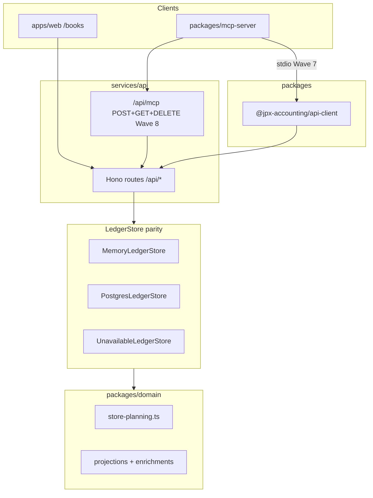

# Ledger Overview Enrichments & MCP — Program Design

**Date:** 2026-08-09 · **Status:** Approved (design only — no implementation until stability wave lands)
**Companion artifact:** one comprehensive implementation plan (phased waves), to be authored after this spec
**Grounding:** repo analysis of `/books`, contracts, stores, projections, evidence model, demo `/mcp` stub, and regulatory/UX/MCP research with cited sources below

---

## 1. Executive summary

This program delivers three tightly related capabilities on the existing append-only hash-chained ledger spine:

1. **Ledger overview UX** — voucher-grouped journal with in-place or drawer detail (Mode A default, Mode B user-selectable), URL-addressable mode preference, and accessibility-first disclosure semantics. **Wave 1** ships grouping and existing fields only; enrichment panels are honest absent/disabled slots until later waves.
2. **Enrichment platform** — **Wave 2** post-post enrichment work items; **Wave 3** multi-attachment UI + external references; **Wave 4** soft tags; **Wave 5** additive `lineId` + typed line enrichments + list projection framework; **Waves 6a–6e** workflow verticals with co-shipped lists. All post-post mutations append events via work items or bounded human direct actions — **never** a second `PostedToLedger`.
3. **First-party MCP server** — thin adapter in `packages/mcp-server`; **Wave 7** stdio pilot; **Wave 8** Streamable HTTP at `/api/mcp` (POST + GET [+ optional DELETE]); candidate/proposal tools only; Azure SAS for files.

**Rollout order:** 0 stability → 1 ledger UX → 2 work-item foundation → 3 attachments + external refs → 4 soft tags → 5 lineId + typed enrichments → 6a–6e verticals → 7 MCP stdio → 8 MCP HTTP.

**Prerequisite:** current dirty stability wave lands with `pnpm check` + E2E green before Wave 1.

**Non-negotiable invariants** (from [`AGENTS.md`](../../AGENTS.md)): append-only ledger truth; review queue is the **only** path to `PostedToLedger`; AI/MCP suggest, never mutate; store parity including `UnavailableLedgerStore`; contracts first; i18n parity (`en.json` ↔ `sv.json`).

---

## 2. Scope

### 2.1 In scope

| Area                            | Wave  | Deliverable                                                                                                                               |
| ------------------------------- | ----- | ----------------------------------------------------------------------------------------------------------------------------------------- |
| **Ledger UX**                   | 1     | Voucher grouping; Mode A/B; URL + local mode preference; shared detail shell; existing journal + evidence fields; a11y; desktop + Pixel 7 |
| **Post-post work items**        | 2     | Contracts, statuses, propose/confirm/reject API + planner; append-only guards; 3-store parity; human confirmation UI shell                |
| **Attachments + external refs** | 3     | List all `evidenceIds`; structured external refs; blob vs URL UI                                                                          |
| **Soft tags**                   | 4     | Append-only tag events; direct human path; work-item path for AI/MCP                                                                      |
| **Line enrichments**            | 5     | Additive `lineId`; typed line enrichments; list projection framework (no user lists yet)                                                  |
| **Workflow verticals**          | 6a–6e | Registry + enrichments + derived list per vertical                                                                                        |
| **MCP**                         | 7–8   | stdio pilot; Streamable HTTP; retire demo `/mcp`                                                                                          |
| **Ledger UX (activation)**      | 3+    | Enrichment slots/filters activate as each data wave lands                                                                                 |

### 2.2 Non-goals (explicit)

- **No AI auto-posting or MCP approve/direct-post tools** — human review mandatory for every `PostedToLedger`; post-post changes never re-enter `applyReviewDecision`.
- **No second `PostedToLedger`** for enrichments, tags, or references.
- **No MCP direct mutation tools** — no direct soft-tag, external-link, or confirm tools on MCP.
- **No mutable secondary ledger** — registries never hold independent money balances.
- **No SIE `#OBJEKT` / `#ANTAL` export or historical backfill** in initial waves.
- **No unattended M2M posting.**
- **No base64 file transfer in MCP.**
- **No implementation during Wave 0.**

### 2.3 Deferred (bounded)

| Item                                            | After                                    |
| ----------------------------------------------- | ---------------------------------------- |
| SIE `#OBJEKT` / `#ANTAL` emission and import    | Wave 6d inventory foundation             |
| Historical enrichment backfill                  | Separate ops wave                        |
| Valued inventory (6e)                           | Wave 6d                                  |
| Period-scoped suppliers view                    | Adjacent                                 |
| Full trial balance uncapped UI                  | Adjacent                                 |
| Breaking removal of `JournalEntryProjection.id` | Explicit cleanup after `lineId` adoption |
| Accountant multi-seat                           | Out of program                           |
| `EvidenceClassified`                            | Reserved; not in program                 |

---

## 3. Current repository baseline (verified facts)

### 3.1 `/books` today

- **Route:** `BooksScreen` with nuqs `?view=` tabs: `journal | general-ledger | trial-balance | suppliers | close`.
- **Journal:** flat one-row-per-line table; no voucher grouping or expansion.
- **General ledger:** native `<details>/<summary>` — not yet ARIA-aligned.
- **Trial balance:** period movement; **six** non-zero accounts via `summarizeBalances`.
- **Suppliers:** snapshot aggregates; not period-scoped.
- **Evidence join (UI gap):** `buildVoucherLookup` → **first evidence only** (`VoucherLink`). Domain supports multi-attachment packets.

### 3.2 Evidence and attachments (domain exists; UI incomplete)

- **`evidencePacketSchema`:** `evidenceIds: string[]`.
- **`POST /api/evidence/compose`** and **`EvidenceRelinked`** live.
- **Gap:** journal UI lists first evidence only; no structured external-reference model.

### 3.3 Projections and contracts

- **`JournalEntryProjection`:** required `id`, `voucherId`, account fields, `debit`, `credit`, `bookedAt` — omits `vatCode`, `deductible`, `lineId`.
- **`id` today:** `journal_${index}` — **remains required**; `lineId` additive in **Wave 5**.
- **Line sources:** `PostedToLedger`, `VoucherImported` only.

### 3.4 Platform gaps

- No enrichment work items, tags, workflow registries, or derived lists.
- No stable `lineId` in posted payloads.
- Demo **`POST /mcp`** — echo stub; retired in Wave 8.
- **Stability wave in flight** — Wave 0 gate.

---

## 4. Resolved decisions (owner-approved)

1. One design spec + one implementation plan (phased waves 0 → 8, 6a–6e).
2. **Wave order:** 0 stability → 1 ledger UX → **2 work-item foundation** → 3 attachments + external refs → 4 soft tags → 5 lineId + typed enrichments + list framework → 6a–6e verticals → 7 MCP stdio → 8 MCP HTTP.
3. Ledger UX: Mode A default; Mode B drawer/sheet; shared detail; `?ledgerMode=` + localStorage.
4. **Wave 1** UI-only over existing data; enrichment slots disabled until their waves; `lineId` display begins **Wave 5**.
5. **Two enrichment gates:** pre-post via open review → frozen in or alongside first `PostedToLedger`; post-post via **Wave 2 work items** (or bounded human direct paths in Waves 3–4) → append-only events, **never** `applyReviewDecision`.
6. **Bounded human direct paths:** soft tags (Wave 4) and external links (Wave 3) — explicit confirmation, server-derived actor, Zod validation; AI/MCP/external-origin always use Wave 2 work items; MCP gets no direct mutation tools.
7. Workflow verticals 6a → 6b → 6c → 6d → (6e optional); each co-ships registry + enrichments + list.
8. MCP: proposal tools only; Streamable HTTP Wave 8; retires demo `/mcp`.
9. Every `LedgerStore` change: **MemoryLedgerStore**, **PostgresLedgerStore**, **UnavailableLedgerStore**.
10. Every UI wave (1, 3, 4, 5, 6a–6e): `/books` visual regression + human diff review; en/sv i18n parity.

---

## 5. Architecture

### 5.1 Layer model



### 5.2 Architecture units and interfaces

| Unit                                       | Path                                                                 | Wave | Responsibility                                                       |
| ------------------------------------------ | -------------------------------------------------------------------- | ---- | -------------------------------------------------------------------- |
| **Contracts**                              | `packages/contracts/src/index.ts`                                    | 2+   | Work items, events, projections, MCP I/O                             |
| **Domain planning**                        | `packages/domain/src/store-planning.ts`                              | 2+   | `planPrePostEnrichment()`, `planPostPostEnrichmentConfirm()`; guards |
| **Domain projections**                     | `projections.ts`, `enrichment-projections.ts`, `list-projections.ts` | 5+   | Replay; list framework (5); vertical builders (6a–e)                 |
| **Memory / Postgres / Unavailable stores** | `store.ts`, `persistence-postgres`, `runtime.ts`                     | 2+   | Parity on every interface change                                     |
| **API**                                    | `app.ts`, route modules                                              | 2+   | Work items (2); external refs (3); tags (4); verticals (6)           |
| **Web**                                    | `lib/ledger/`, `components/books/ledger-*`                           | 1+   | Mode A/B; confirmation shell (2); slot activation (3+)               |
| **MCP**                                    | `packages/mcp-server/`                                               | 7–8  | Tool adapter; no ledger logic                                        |

### 5.3 Integration principles

- **Contracts first:** atomic with Memory + Postgres + **UnavailableLedgerStore** (CONVENTIONS rule 6).
- **Two write gates:**

| Gate          | When                     | Mechanism                                                       | Emits                                                                    |
| ------------- | ------------------------ | --------------------------------------------------------------- | ------------------------------------------------------------------------ |
| **Pre-post**  | Open review (not posted) | `applyReviewDecision` on approve                                | `PostedToLedger` (+ enrichments frozen in posting batch)                 |
| **Post-post** | Already posted           | Work item confirm (Wave 2+) or bounded human direct (Waves 3–4) | Append-only enrichment/reference/tag events — **never** `PostedToLedger` |

- **Why split:** posted reviews cannot be re-approved; `applyReviewDecision` is invalid post-post.
- **MCP:** candidates only; no confirm/approve/direct-mutation tools.
- **Wave dependencies:** Wave 3 and Wave 4 **require Wave 2**; Wave 5 **requires Wave 2**; Waves 6a–e **require Wave 5**; Waves 7–8 require API routes from prior waves they call.

---

## 6. Enrichment gates, work items, and human direct paths

### 6.1 Pre-post enrichment (open review only)

**Entry:** voucher pending review; no `PostedToLedger` yet.

**Flow:**

1. User or MCP attaches enrichment intent to the **open review task**.
2. Review UI validates required workflow fields (Waves 6a–e when workflow selected).
3. On **`applyReviewDecision(approve)`**, planner emits `PostedToLedger` with lines (carrying `lineId` from **Wave 5** onward) and/or companion enrichment events in the **same transactional batch**.
4. Choices **frozen** at posting — immutable history.

**Guards:** reject pre-post proposals for posted vouchers (409 → post-post work item). MCP `submit_review_proposal` only for open reviews.

### 6.2 Post-post enrichment work items (Wave 2 foundation)

**Entry:** voucher has `PostedToLedger` or `VoucherImported`.

**Ships in Wave 2** (before tags, external refs, or lineId):

| Deliverable | Detail                                                                                      |
| ----------- | ------------------------------------------------------------------------------------------- |
| Contracts   | `EnrichmentWorkItem`, statuses, proposal shapes                                             |
| API         | `POST /api/enrichment-work-items`, `GET …/:id`, `POST …/:id/confirm`, `POST …/:id/reject`   |
| Planner     | `planPostPostEnrichmentConfirm()` — append-only events; **hard guard: no `PostedToLedger`** |
| Stores      | Memory + Postgres + Unavailable parity                                                      |
| UI shell    | Human confirmation surface (queue/deep link); slots activate as Waves 3–5 add event types   |
| Tests       | Guard test: confirm never emits `PostedToLedger`; idempotency; 3-store conformance          |

**Work item model:**

```ts
EnrichmentWorkItem {
  id: string;
  organizationId: string;
  workspaceId: string;
  targetKind: "voucher" | "line";   // line targets active from Wave 5 when lineId exists
  targetId: string;
  proposedChange: EnrichmentProposal;
  status: "pending_confirmation" | "confirmed" | "rejected" | "superseded";
  source: "ui" | "mcp" | "advisor";
  idempotencyKey: string;
  createdAt: string;
  createdBy: string;               // server-derived
  confirmedAt?: string;
  confirmedBy?: string;
  resultingEventIds?: string[];
  supersededByWorkItemId?: string;
}
```

**Planner guards:**

- Validates target is posted; for `targetKind: "line"`, requires `lineId` (Wave 5+).
- Appends allowed event types for confirmed proposals (extended in Waves 3–5).
- **MUST NOT** emit `PostedToLedger`, `ReviewApproved`, or call `applyReviewDecision`.
- Idempotent confirm returns existing `resultingEventIds`.

**MCP / advisor / external-origin:** always `POST /api/enrichment-work-items` → human **UI-only** confirm.

### 6.3 Bounded direct human mutation (Waves 3 and 4)

Parallel policies for **human-originated in-app** changes on posted vouchers. AI/MCP/external-origin **always** use §6.2 work items.

#### 6.3.1 Soft tags (Wave 4)

| Field            | Policy                                                     |
| ---------------- | ---------------------------------------------------------- |
| **API**          | `POST /api/vouchers/:id/tags` (add/remove)                 |
| **Confirmation** | Explicit in-app confirmation dialog before submit          |
| **Actor**        | Server-derived from JWT; client `actorId` stripped         |
| **Validation**   | Tag ids/names from tag registry; bounded count per request |
| **Events**       | Append-only `VoucherTagsAdded` / `VoucherTagsRemoved`      |
| **MCP**          | **No tool** — proposals via work item only                 |
| **Pre-post**     | Inline on open review → frozen at posting                  |

#### 6.3.2 External references (Wave 3)

| Field               | Policy                                                                                                               |
| ------------------- | -------------------------------------------------------------------------------------------------------------------- |
| **API**             | `POST /api/vouchers/:id/external-references` (link); `POST …/external-references/:refId/unlink` (append-only remove) |
| **Confirmation**    | Explicit in-app confirmation before submit                                                                           |
| **Actor**           | Server-derived from JWT                                                                                              |
| **URL validation**  | Zod `z.string().url()`; **allowlisted protocols: `https:` only** (no `http:`, `javascript:`, etc.)                   |
| **Server behavior** | **No server fetch, preview, or HEAD probe** of user URLs (SSRF prevention)                                           |
| **Events**          | Append-only `ExternalReferenceLinked` / `ExternalReferenceRemoved`                                                   |
| **MCP**             | **No tool** — proposals via work item only                                                                           |
| **UI**              | Render link with `rel="noopener noreferrer"`; external badge distinct from blob evidence                             |

**MCP excluded tools (all waves):** `apply_voucher_tags`, `apply_external_reference`, `confirm_enrichment_work_item`, `approve_review`, `post_voucher`, `direct_post`.

### 6.4 Correction and supersession

| Scenario                            | Mechanism                                                                        |
| ----------------------------------- | -------------------------------------------------------------------------------- |
| Wrong soft tag (posted)             | §6.3.1 direct append **or** §6.2 work item (AI/MCP)                              |
| Wrong external link (posted)        | §6.3.2 direct unlink+link **or** §6.2 work item (AI/MCP)                         |
| Wrong hard line enrichment (posted) | §6.2 work item → `LineEnrichmentSuperseded` + `LineEnrichmentRecorded` (Wave 5+) |
| Wrong posting **amount**            | `CorrectionPosted` / period-close — never MCP                                    |
| AI/MCP proposal                     | Stops at `pending_confirmation` work item                                        |

**Never:** PATCH event payload, UPDATE hash, or delete enrichment rows.

---

## 7. Ledger UX design

### 7.1 Information architecture within `/books`

| Tab            | Change                                                      |
| -------------- | ----------------------------------------------------------- |
| **Journal**    | Wave 1: voucher overview Modes A/B; slots activate per wave |
| **Other tabs** | Incremental; unchanged in Wave 1                            |

**URL state (nuqs):**

| Param                                   | Active   | Purpose                                                           |
| --------------------------------------- | -------- | ----------------------------------------------------------------- |
| `view`, `period`, `supplier`, `account` | existing | Tab, period, filters                                              |
| `ledgerMode`                            | Wave 1   | `inline` \| `drawer`; localStorage `jpx.accounting.ledgerMode.v1` |
| `voucher`                               | Wave 1   | Deep-link expand / drawer                                         |
| `q`                                     | Wave 1   | Description, supplier, voucher number; extended Wave 4+ for tags  |
| `tag`                                   | Wave 4+  | Tag filter                                                        |
| `workflow`                              | Wave 6a+ | Workflow filter                                                   |

### 7.2 Wave 1 scope (honest)

**In Wave 1:**

- Voucher-grouped rows; Mode A/B; shared `LedgerVoucherDetail`.
- Collapsed/expanded: posting lines; voucher metadata; blob list from full `evidenceIds[]`; provenance from existing events.
- Disabled slots for work-item confirm UI (Wave 2 shell — inert until 2), external refs (3), tags (4), lineId (5), workflows (6).
- a11y, i18n, `/books` visual regression (desktop + Pixel 7).

**Disabled slots (honest empty states):**

| Slot                        | Activates |
| --------------------------- | --------- |
| Work-item confirmation      | Wave 2    |
| External reference links    | Wave 3    |
| Soft tags + tag filter      | Wave 4    |
| `lineId` column             | Wave 5    |
| VAT / deductibility columns | Wave 5    |
| Workflow badges             | Wave 6a–e |

### 7.3–7.5 Mode A, Mode B, mobile

Unchanged interaction grammar: ARIA disclosure; Mode B drawer/sheet with `useDialogFocusTrap`; Pixel 7 dock clearance and `activateControl` in E2E.

### 7.6 Error states

Core lines always visible; disabled slots show localized unavailable copy; external URLs render only — never server-fetched.

---

## 8. Data model

### 8.1 Canonical truth

Append-only `ledger.events` hash chain. [Bokföringslagen 5 kap. 5–7 §§; 7 kap. 2 §](https://www.riksdagen.se/sv/dokument-lagar/dokument/svensk-forfattningssamling/bokforingslag-1999-1078).

### 8.2 Stable posting line IDs (Wave 5)

At `PostedToLedger` / `VoucherImported`, each line carries `lineId: createId('ln')`.

```ts
JournalEntryProjection {
  id: string;           // REQUIRED — kept for all clients
  lineId?: string;      // ADDITIVE Wave 5+
  voucherId: string;
  // ... accountNumber, debit, credit, bookedAt, optional vatCode, deductible
}
```

- UI shows `lineId` only when present.
- When `lineId` present, new code SHOULD use it as semantic key; `id` remains required alias until deferred breaking cleanup.
- Legacy replay: `legacy_${eventId}_${index}` at projection only — never backwritten.

### 8.3 Soft tags vs hard typed workflows

| Dimension          | Soft tags (Wave 4)   | Hard workflows (Wave 5 + 6a–e)      |
| ------------------ | -------------------- | ----------------------------------- |
| Post-post human UI | §6.3.1 direct append | §6.2 work item only                 |
| Post-post AI/MCP   | §6.2 work item       | §6.2 work item                      |
| Registry           | Tag dictionary       | Per-vertical (names/lifecycle only) |

### 8.4 Attachments and external references (Wave 3)

**Domain already has:** `evidenceIds[]`, `composeEvidence`, `EvidenceRelinked`.

**Wave 3 deliverables (depends on Wave 2):**

| Gap                    | Action                                                                                                     |
| ---------------------- | ---------------------------------------------------------------------------------------------------------- |
| UI first-evidence only | List **all** `evidenceIds` on journal/detail                                                               |
| No external URL model  | `ExternalReferenceLinked` / `ExternalReferenceRemoved` events + §6.3.2 direct human API                    |
| AI/MCP external links  | §6.2 work item → confirm                                                                                   |
| Packet audit           | `EvidencePacketAmended` **only if** `EvidenceRelinked` + compose insufficient for ordered membership audit |

Reference UX: [Fortnox verifikation attachment list](https://support.fortnox.se/produkthjalp/bokforing/bokforing-verifikationer).

### 8.5 Event vocabulary (additions by wave)

| Event                                                  | Wave | Gate                                    |
| ------------------------------------------------------ | ---- | --------------------------------------- |
| (work item persistence)                                | 2    | API/storage only; confirm appends below |
| `ExternalReferenceLinked` / `ExternalReferenceRemoved` | 3    | §6.3.2 direct human or §6.2 work item   |
| `VoucherTagsAdded` / `VoucherTagsRemoved`              | 4    | §6.3.1 direct human or §6.2 work item   |
| `LineEnrichmentRecorded` / `LineEnrichmentSuperseded`  | 5    | §6.2 work item or pre-post batch        |
| Registry events                                        | 6a–e | Vertical planners                       |
| `EvidencePacketAmended`                                | 3    | Optional                                |

### 8.6 Projections and lists

**Wave 5 — framework only:** `list-projections.ts` exports pure builders + typed row schemas; **no user-facing list routes**.

**Waves 6a–e — co-shipped lists:**

| Wave | List                                     |
| ---- | ---------------------------------------- |
| 6a   | Projects + activity counts               |
| 6b   | Open invoices (derived), payment history |
| 6c   | Trips + expense totals                   |
| 6d   | SKU movement history                     |
| 6e   | Valued movements (optional)              |

**SIE:** `#OBJEKT` / `#ANTAL` deferred ([SIE 5](https://sie.se/)); `lineId` is future mapping anchor.

---

## 9. MCP server design

### 9.1 Package layout

```
packages/mcp-server/
  src/index.ts          # stdio (Wave 7)
  src/http-adapter.ts   # Streamable HTTP (Wave 8)
  src/tools/
  threat-model.md
```

### 9.2 Transport

| Wave  | Transport                                                                                                    | Mount          |
| ----- | ------------------------------------------------------------------------------------------------------------ | -------------- |
| **7** | [stdio](https://modelcontextprotocol.io/specification/2025-06-18/basic/transports#stdio)                     | Local CLI      |
| **8** | [Streamable HTTP](https://modelcontextprotocol.io/specification/2025-06-18/basic/transports#streamable-http) | **`/api/mcp`** |

Retire demo `POST /mcp` in Wave 8.

### 9.3 Streamable HTTP at `/api/mcp`

| Method     | Role                                                                                             |
| ---------- | ------------------------------------------------------------------------------------------------ |
| **POST**   | Client → server JSON-RPC; session init when no `Mcp-Session-Id`                                  |
| **GET**    | Server → client SSE (`text/event-stream`); requires `Mcp-Session-Id`; `Last-Event-ID` resumption |
| **DELETE** | Optional session termination (if SDK supports)                                                   |

**Session:** server issues `Mcp-Session-Id`; client sends on POST/GET; bounded TTL.

**Security:**

| Control            | Requirement                                                                                                                                                      |
| ------------------ | ---------------------------------------------------------------------------------------------------------------------------------------------------------------- |
| **JWT**            | Same stack as `/api/*`; normal mode JWKS required at **boot** (fail-closed)                                                                                      |
| **`/ready`**       | Preserves **existing** runtime checks — `ledger`, `ai`, `blob`, `docintel` / peripheral posture — **not** redefined as an auth probe; MCP inherits API readiness |
| **Origin**         | Mandatory validation against `ACCOUNTING_CORS_ORIGINS` (or dev allowlist)                                                                                        |
| **DNS rebinding**  | Host + Origin together; explicit host allowlist on MCP route                                                                                                     |
| **Rate limit**     | JWT-subject keyed on POST                                                                                                                                        |
| **OAuth metadata** | [RFC 9728](https://www.rfc-editor.org/rfc/rfc9728.html)                                                                                                          |

### 9.4 Tools

**Proposal only:** `initialize_upload`, `register_evidence`, `compose_evidence_packet`, `extract_evidence`, `submit_enrichment_proposal` → `POST /api/enrichment-work-items`, `submit_review_proposal`, `get_review_deep_link`.

**Read (bounded):** `get_evidence`, `list_reviews`, `get_journal`, `get_trial_balance`, `get_integrity`, `query_knowledge`.

**Excluded:** all confirm/approve/post/direct-mutation tools (§6.3).

---

## 10. Workflow verticals (Waves 6a–6e)

Each requires **Wave 5** (lineId + typed enrichment framework). Independently shippable: registry + pre-post review fields + post-post work items + line enrichments + **list endpoint + UI** + i18n + visual regression.

### 10.1 Projects (6a) · 10.2 Invoice+payment (6b) · 10.3 Trips (6c) · 10.4 Quantity inventory (6d) · 10.5 Valued inventory (6e, optional)

As prior spec: registry, enrichments, derived lists; open invoice amounts derived from lines + allocations.

---

## 11. Data flows

### 11.1 Read — ledger overview (Wave 1+)

```
GET /api/reports/journal → buildJournal → merge voucher + evidenceIds[]
  → groupByVoucher → Mode A/B (slots per wave)
```

### 11.2 Pre-post (open review)

```
proposal → applyReviewDecision(approve) → PostedToLedger batch — frozen; no re-approval
```

### 11.3 Post-post — work item (Wave 2+)

```
submit_enrichment_proposal → POST /api/enrichment-work-items
  → human UI confirm → planPostPostEnrichmentConfirm → append events
  → GUARD: no PostedToLedger
```

### 11.4 Post-post — direct human soft tags (Wave 4)

```
UI confirm → POST /api/vouchers/:id/tags → append tag events (no MCP equivalent)
```

### 11.5 Post-post — direct human external refs (Wave 3)

```
UI confirm → POST /api/vouchers/:id/external-references
  → Zod https-only URL → append ExternalReferenceLinked (no fetch/preview)
unlink → append ExternalReferenceRemoved
```

### 11.6 MCP capture (open review only)

```
upload pipeline → submit_review_proposal → human approve → PostedToLedger
```

---

## 12. Rollout waves

**Wave 0 gates all work.** Each wave independently implementable within its dependencies.

| Wave   | Name                                        | Depends on         | Deliverables                                                                                                                | Gate                                                                                                   |
| ------ | ------------------------------------------- | ------------------ | --------------------------------------------------------------------------------------------------------------------------- | ------------------------------------------------------------------------------------------------------ |
| **0**  | Stability prerequisite                      | —                  | Land in-flight fixes                                                                                                        | `pnpm check`; E2E green                                                                                |
| **1**  | Ledger UX A/B                               | 0                  | Grouping; Modes A/B; URL/local pref; shared detail shell; **existing data only**; disabled slots; a11y; i18n; visual        | E2E; axe; mobile clearance; visual diff reviewed                                                       |
| **2**  | Post-post work-item foundation              | 0, 1               | Contracts; statuses; propose/confirm/reject API + planner; append-only guards; 3-store parity; confirmation UI shell; tests | Guard: no `PostedToLedger`; conformance; i18n; a11y; focused visual diff reviewed (confirmation shell) |
| **3**  | Multi-attachment UI + external refs         | **2**              | All `evidenceIds` in UI; external ref events; §6.3.2 direct human API; work item for AI/MCP; blob vs URL UI                 | Integration Postgres; i18n; visual                                                                     |
| **4**  | Append-only soft tags                       | **2**              | Tag events; §6.3.1 direct human API; work item for AI/MCP; tag filter UI                                                    | 3-store parity; tag E2E; i18n; visual                                                                  |
| **5**  | lineId + typed enrichments + list framework | **2**              | Additive `lineId`; line enrichment events; supersession; list projection **framework only**; `lineId` UI                    | Conformance; no list routes; i18n; visual                                                              |
| **6a** | Projects vertical                           | **5**              | Registry + enrichments + project list                                                                                       | Vertical tests; i18n; visual                                                                           |
| **6b** | Invoice+payment vertical                    | **5**              | Registry + enrichments + AR/AP lists                                                                                        | Derived amount tests; i18n; visual                                                                     |
| **6c** | Trips vertical                              | **5**              | Registry + enrichments + trip list                                                                                          | i18n; visual                                                                                           |
| **6d** | Quantity inventory vertical                 | **5**              | SKU registry + movements + list                                                                                             | i18n; visual                                                                                           |
| **6e** | Valued inventory (optional)                 | **6d**             | Unit cost on movements                                                                                                      | i18n; visual                                                                                           |
| **7**  | MCP stdio                                   | **2** (API routes) | `packages/mcp-server` pilot; proposal tools                                                                                 | Tool tests; threat-model.md                                                                            |
| **8**  | MCP Streamable HTTP                         | **7**              | `/api/mcp` POST+GET[+DELETE]; OAuth; Origin/DNS guards; retire demo `/mcp`                                                  | Session/SSE tests; security review                                                                     |

**Contract/store sequence (data waves):** contracts → domain → Memory + Postgres + Unavailable → migration → API → api-client → web → integration + E2E.

**UI visual gate:** Wave 1 and Waves 3–6 extend `tests/e2e/visual-regression.spec.ts` for `/books`; Wave 2 adds focused shots of the user-visible confirmation shell only; human reviews every diff per [`scripts/visual-baselines.md`](../../scripts/visual-baselines.md).

---

## 13. Migration and backward compatibility

| Change                          | Strategy                              |
| ------------------------------- | ------------------------------------- |
| **`JournalEntryProjection.id`** | Stays required                        |
| **`lineId`**                    | Additive Wave 5; UI gated on presence |
| **`id` alias cleanup**          | Explicitly deferred                   |
| Legacy events without `lineId`  | Deterministic legacy projection ids   |
| Demo `/mcp`                     | Removed Wave 8                        |

---

## 14. Security, privacy, and compliance

- **Auth:** JWKS fail-closed at normal-mode boot; JWT on all `/api/*` including `/api/mcp`.
- **`/ready`:** existing checks (`ledger`, `ai`, `blob`, `docintel`, peripheral posture) — unchanged semantics; not an auth probe.
- **External URLs:** https-only; no server fetch (SSRF).
- **Article 50:** AI/MCP proposals labeled; confirm UI-only.
- **Actor attribution:** server-derived; client `actorId` stripped.

---

## 15. Testing and acceptance criteria (per wave)

### Wave 0

- [ ] `pnpm check`; E2E green

### Wave 1 — Ledger UX

- [ ] Grouping; Mode A/B; URL/localStorage; deep-link `?voucher=`
- [ ] Expanded detail lists all packet `evidenceIds` from snapshot (not first-only join)
- [ ] Existing fields only; disabled slots; no fake enrichments/`lineId`
- [ ] i18n en/sv parity; `/books` visual regression reviewed

### Wave 2 — Work-item foundation

- [ ] Propose/confirm/reject API; planner append-only guards
- [ ] **Test proves confirm never emits `PostedToLedger`**
- [ ] Memory + Postgres + **UnavailableLedgerStore** parity
- [ ] Human confirmation UI shell (inert event types OK)
- [ ] i18n en/sv parity for shell strings; confirmation shell keyboard/focus semantics (a11y)
- [ ] Focused visual regression on user-visible confirmation shell surfaces; human diff reviewed before re-baseline

### Wave 3 — Attachments + external refs (requires Wave 2)

- [ ] All `evidenceIds` listed; blob vs external badge
- [ ] §6.3.2 direct human link/unlink: https-only Zod; no server fetch
- [ ] AI/MCP external proposal → work item → UI confirm
- [ ] MCP has no external-ref mutation tool
- [ ] i18n; visual regression reviewed

### Wave 4 — Soft tags (requires Wave 2)

- [ ] §6.3.1 direct human tag append with confirmation
- [ ] AI/MCP tag proposal → work item → UI confirm
- [ ] MCP has no tag mutation tool; `?tag=` filter active
- [ ] 3-store parity; i18n; visual regression reviewed

### Wave 5 — lineId + typed enrichments (requires Wave 2)

- [ ] `lineId` on new postings; optional on projection; **`id` still required**
- [ ] Line-target work items active; supersession replay correct
- [ ] List framework exports builders; **no user-facing list routes**
- [ ] i18n; visual regression reviewed

### Waves 6a–6e (each requires Wave 5)

- [ ] Registry + enrichments + co-shipped list; derived totals correct
- [ ] Post-post via work item; no second posting; no post-post `applyReviewDecision`
- [ ] i18n; visual regression reviewed

### Wave 7 — MCP stdio

- [ ] Proposal tools only; excluded tools absent; idempotency stable

### Wave 8 — MCP HTTP

- [ ] `POST /api/mcp` session init; `GET /api/mcp` SSE + `Last-Event-ID`; optional `DELETE`
- [ ] Origin validation; DNS rebinding / Host allowlist tests
- [ ] JWT + rate limit; demo `/mcp` removed; RFC 9728 metadata
- [ ] No confirm/direct-mutation tools on MCP

---

## 16. Repository seams likely touched

| Wave | Key paths                                                                                            |
| ---- | ---------------------------------------------------------------------------------------------------- |
| 2    | `contracts`, `store-planning.ts`, `routes/enrichment-work-items.ts`, 3 stores, confirmation UI shell |
| 3    | `routes/voucher-external-references.ts`, ledger detail attachments, journal multi-evidence           |
| 4    | `routes/voucher-tags.ts`, tag registry, tag filter UI                                                |
| 5    | `projections.ts`, `enrichment-projections.ts`, `list-projections.ts`, `lineId` in posting payloads   |
| 6a–e | Vertical registry modules, list routes, list views                                                   |
| 7–8  | `packages/mcp-server/**`, `routes/mcp.ts`; retire demo `/mcp`                                        |

---

## 17. Risks and trade-offs

| Risk                                  | Mitigation                                            |
| ------------------------------------- | ----------------------------------------------------- |
| Work-item before enrichments (Wave 2) | Shell + guards first; event types added incrementally |
| Two-gate + dual direct paths          | §6.2–6.4 single policy; tests per path                |
| `id` / `lineId` coexistence           | Additive `lineId`; deferred `id` cleanup              |
| MCP HTTP security                     | Origin + Host + DNS rebinding tests                   |

---

## 18. Authoritative sources

| Topic                           | Source                                                                                                     |
| ------------------------------- | ---------------------------------------------------------------------------------------------------------- |
| MCP 2025-06-18                  | https://modelcontextprotocol.io/specification/2025-06-18/                                                  |
| MCP Streamable HTTP             | https://modelcontextprotocol.io/specification/2025-06-18/basic/transports#streamable-http                  |
| RFC 9728                        | https://www.rfc-editor.org/rfc/rfc9728.html                                                                |
| WAI-ARIA disclosure / accordion | https://www.w3.org/WAI/ARIA/apg/patterns/disclosure/ · https://www.w3.org/WAI/ARIA/apg/patterns/accordion/ |
| Bokföringslagen                 | https://www.riksdagen.se/sv/dokument-lagar/dokument/svensk-forfattningssamling/bokforingslag-1999-1078     |
| SIE 5 (`#OBJEKT`, `#ANTAL`)     | https://sie.se/                                                                                            |
| Fortnox verifikation UX         | https://support.fortnox.se/produkthjalp/bokforing/bokforing-verifikationer                                 |
| JPx invariants                  | [`AGENTS.md`](../../AGENTS.md), [`docs/CONVENTIONS.md`](../../CONVENTIONS.md)                              |
| Visual baselines                | [`scripts/visual-baselines.md`](../../scripts/visual-baselines.md)                                         |

---

## 19. Related documents

- Implementation plan: `docs/superpowers/plans/2026-08-09-ledger-overview-enrichments-mcp-plan.md`
- Advisory pivot: [`2026-07-03-advisory-pivot-design.md`](2026-07-03-advisory-pivot-design.md)
- Demo MCP retirement: [`2026-08-06-repo-health-consolidation-plan.md`](../plans/2026-08-06-repo-health-consolidation-plan.md)

---

_End of design specification._
